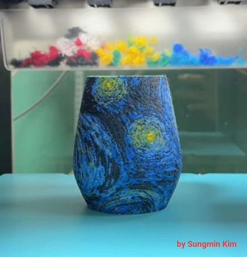

# Awesome Snapmaker List

A curated list of awesome Snapmaker resources, mods, and guides.

Maintained by [Maintainers](https://github.com/shurushetr/awesome-snapmaker/graphs/contributors).

---

## 🌐 Interactive Website

**This list is best viewed on our interactive web interface with search and filters: [View Website](https://awesome-sm-list.xyz)**

---

## Table of Contents
- [ARTISAN](#artisan)
- [J1/J1s](#j1/j1s)
- [RAY](#ray)
- [SM_2.0](#sm_20)
- [U1](#u1)
- [UNIVERSAL](#universal)

---

## ARTISAN

### CNC

#### [CNC With Snapmaker ARTISAN](https://miwicnc.gitbook.io/miwicnc)
> Practical CNC workflows, clear explanations, and shared experience — written so you can start where you are and go deeper when you want.
> 
> What began as a small side project became something that needed structure. This documentation reflects that change:
> from personal notes → to a practical, tested, and evolving reference for desktop CNC machining.
> 
> This work was partially sponsored by Snapmaker.

**Content Author:** Michael Winkler | **Added:** 2026-03-10

**Tags:** BEGINNER, FREE, SM_2.0, ARTISAN, CNC, ARTICLE, CREATE, UNOFFICIAL, Education

---

#### [CNC self-impelled vacuum dust shoe (no external vacuum required)](https://forum.snapmaker.com/t/cnc-self-impelled-vacuum-dust-shoe-no-external-vacuum-required/24972)
> Great design of a vacuumless dust removal shoe.

**Content Author:** gil.a.ramirez | **Added:** 2026-03-09

**Tags:** BEGINNER, PAID, SM_2.0, ARTISAN, CNC, MODS, UNOFFICIAL, Dust Removal

---

#### [Kiri:Moto](https://grid.space/kiri/)
> 3DP/Laser/CNC slicer in browser. It has some unique features, like slicing the model in layers for laser cutting

**Content Author:** GridSpace | **Added:** 2026-03-09

**Tags:** BEGINNER, FREE, SM_2.0, ARTISAN, U1, J1/J1s, RAY, FDM, LASER, CNC, CREATE, ONLINE TOOL, UNOFFICIAL, Alternative Slicer

---

#### [Autodesk Fusion360](https://www.autodesk.com/products/fusion-360/personal-form)
> CAD system. CNC toolpath generating. 3D Modeling.

**Content Author:** Autodesk | **Added:** 2026-03-09

**Tags:** INTERMEDIATE, FREEMIUM, SM_2.0, ARTISAN, U1, J1/J1s, RAY, UNIVERSAL, FDM, LASER, CNC, ROTARY, COMBINED, CREATE, DOWNLOAD, UNOFFICIAL, Modeling Software, CAD

---

#### [FreeCAD](https://www.freecad.org/downloads.php)
> Free CAD system. Can be used for toolpath generation with postprocessors.

**Content Author:** FreeCAD | **Added:** 2026-03-09

**Tags:** INTERMEDIATE, FREE, SM_2.0, ARTISAN, U1, J1/J1s, RAY, UNIVERSAL, FDM, LASER, CNC, COMBINED, CREATE, DOWNLOAD, UNOFFICIAL, CAD, Modeling Software

---

#### [CNC WOOD Feed & Speed Calculator](https://www.cnccookbook.com/feeds-speeds-cnc-wood-cutting/)
> Cookbook with Guide and Easy Tips. The author passed away, and a group of fans is trying to preserve the legacy.

**Content Author:** Community | **Added:** 2026-03-09

**Tags:** BEGINNER, FREE, SM_2.0, ARTISAN, CNC, ROTARY, CREATE, DOWNLOAD, ONLINE TOOL, UNOFFICIAL

---

#### [Learn G-Code for 3D Printing](https://www.cnckitchen.com/blog/g-code-basics-for-3d-printing)
> A good introduction to G-Code by CNC Kitchen YouTube channel.

**Content Author:** CNC Kitchen | **Added:** 2026-03-09

**Tags:** BEGINNER, FREE, SM_2.0, ARTISAN, U1, J1/J1s, RAY, FDM, LASER, CNC, ARTICLE, CREATE, VIDEO, UNOFFICIAL, G-Code

---

#### [Collet ER11](https://www.maritool.com/Collets-And-Sleeves-ER-Collets-ER11-Collets/c21_56_60/index.html)
> If you want to use 1/4 bits get a different collet. (not affiliated)

**Content Author:** Community | **Added:** 2026-03-09

**Tags:** BEGINNER, FREE, SM_2.0, ARTISAN, CNC, MODS, SHOP, UNOFFICIAL, Parts

---

#### [CNC Plastic cutting bits](https://www.amanatool.com/products/cnc-router-bits/plastic-cutting-cnc-router-bits.html)
> Plastic Cutting Router Bits - Industrial, ZrN & Spektra Coated by Amana Tool. (not affiliated)

**Content Author:** Community | **Added:** 2026-03-09

**Tags:** BEGINNER, FREE, SM_2.0, ARTISAN, CNC, SHOP, UNOFFICIAL, Tooling

---

#### [Lakeshore Carbide](https://www.lakeshorecarbide.com/)
> Good source of metalwork quality bits. (not affiliated)

**Content Author:** Community | **Added:** 2026-03-09

**Tags:** BEGINNER, FREE, SM_2.0, ARTISAN, CNC, SHOP, UNOFFICIAL, Tooling

---

#### [Edge of Arlington Saw & Tool](https://www.eoasaw.com/)
> Good source of metalwork quality bits. (not affiliated)

**Content Author:** Community | **Added:** 2026-03-09

**Tags:** BEGINNER, FREE, SM_2.0, ARTISAN, CNC, SHOP, UNOFFICIAL, Tooling

---

#### [IDC Woodcraft](https://idcwoodcraft.com/)
> Good source of woodwork quality bits. (not affiliated). Thanks to Robert Reade from FB group.

**Content Author:** Community | **Added:** 2026-03-09

**Tags:** BEGINNER, FREE, SM_2.0, ARTISAN, CNC, SHOP, UNOFFICIAL, Tooling

---

#### [Precise Bits](https://www.precisebits.com/)
> Amazing store with ability to pick bits for your application. Has calculators and guides for bits. (not affiliated).

**Content Author:** Community | **Added:** 2026-03-09

**Tags:** BEGINNER, FREE, SM_2.0, ARTISAN, CNC, SHOP, UNOFFICIAL, Tooling

---

#### [Ocooch Hardwoods](https://ocoochhardwoods.com/)
> Good source of quality precut wood for your projects. (not affiliated)

**Content Author:** Community | **Added:** 2026-03-09

**Tags:** BEGINNER, FREE, SM_2.0, ARTISAN, RAY, LASER, CNC, SHOP, UNOFFICIAL, Material Source

---

#### [Collection of CNC Settings (Feeds and Rates)](https://awesome-sm-list.xyz/)
> | Material | Operation | Tool | Tool RPM | Feed rate   (mm/min) | Stepdown   (mm)| Notes | Source |
> | --- | --- | :---:  | --- | :---:  | :---:  | --- | --- |
> | Clear Acrylic | Milling | Standard 1.5mm 1 flute bit from Snapmaker | 12000 | 1000 | 0.5 | In plastic you are better off moving fast and taking small cuts otherwise you will get that melted blob of doom | [Facebook post](https://www.facebook.com/groups/371401856611467/user/100027477288104/)|
> |||||||||

**Content Author:** Community | **Added:** 2026-03-09

**Tags:** BEGINNER, FREE, SM_2.0, ARTISAN, CNC, ARTICLE, CREATE, UNOFFICIAL

---

#### [SnapRemote](https://github.com/mrtayguney/snapremote-server)
> SnapRemote is a Node.js server that creates an interface to connect Snapmaker devices. It also serves a web client to control your device remotely. You can run this server on a Raspberry Pi within the same local network as your Snapmaker.

**Content Author:** mrtayguney | **Added:** 2026-03-09

**Tags:** INTERMEDIATE, FREE, SM_2.0, ARTISAN, FDM, LASER, CNC, DOWNLOAD, MODS, UNOFFICIAL, Remote Monitoring

---

#### [Snapmaker Luban](https://forum.snapmaker.com/t/snapmaker-luban-downloads-and-updates/4949)
> Topic with Luban, the 3 in 1 software updates posted

**Content Author:** Snapmaker | **Added:** 2026-03-08

**Tags:** BEGINNER, FREE, SM_2.0, ARTISAN, J1/J1s, RAY, FDM, LASER, CNC, ROTARY, COMBINED, FIRMWARE, OFFICIAL

---

#### [Snapmaker Luban WIKI](https://wiki.snapmaker.com/en/Snapmaker_Luban)
> Wikipedia section dedicated to Luban

**Content Author:** Snapmaker | **Added:** 2026-03-08

**Tags:** BEGINNER, FREE, SM_2.0, ARTISAN, J1/J1s, RAY, FDM, LASER, CNC, ROTARY, COMBINED, ARTICLE, OFFICIAL

---

#### [Snapmaker Forum](forum.snapmaker.com)
> Official Community from Snapmaker

**Content Author:** Snapmaker | **Added:** 2026-03-08

**Tags:** BEGINNER, FREE, SM_2.0, ARTISAN, U1, J1/J1s, RAY, UNIVERSAL, FDM, LASER, CNC, ROTARY, COMBINED, DISCUSSION, OFFICIAL, Official Communities

---

#### [Snapmaker Discord server](https://discord.com/invite/EQHM67MJBh?utm_source=Awesome_Github_List&utm_medium=publication)
> Created by community members. Supported by Snapmaker.

**Content Author:** Snapmaker | **Added:** 2026-03-08

**Tags:** BEGINNER, FREE, SM_2.0, ARTISAN, U1, J1/J1s, RAY, UNIVERSAL, FDM, LASER, CNC, ROTARY, COMBINED, DISCUSSION, OFFICIAL, Official Communities

---

#### [Snapmaker Sub Reddit](https://www.reddit.com/r/snapmaker/)
> Redditors gather here.

**Content Author:** Snapmaker | **Added:** 2026-03-08

**Tags:** BEGINNER, FREE, SM_2.0, ARTISAN, U1, J1/J1s, RAY, UNIVERSAL, FDM, LASER, CNC, ROTARY, COMBINED, DISCUSSION, OFFICIAL, Official Communities

---

#### [Snapmaker Artisan Owners](https://www.facebook.com/groups/591569232338285)
> Facebook group of Artisan owners.

**Content Author:** Snapmaker | **Added:** 2026-03-08

**Tags:** BEGINNER, FREE, ARTISAN, FDM, LASER, CNC, ROTARY, COMBINED, DISCUSSION, OFFICIAL, Official Communities

---

#### [Rotary Module with Fusion360: It works! (good enough)](https://forum.snapmaker.com/t/rotary-module-with-fusion360-it-works-good-enough/24367)
> Writeup by @brvdboss on how to setup Fusion360 with Rotary Module.

**Content Author:** brvdboss | **Added:** 2026-03-08

**Tags:** INTERMEDIATE, FREE, SM_2.0, ARTISAN, CNC, ROTARY, DISCUSSION, ARTICLE, UNOFFICIAL

---

#### [Shadow board or tool cutouts - Ultimate guide](https://www.youtube.com/watch?v=Wcxh1lLltAE)
> Ultimate guide - this is the proper way of making the tool organizers known as shadow boards. Can also be used with CNC.

**Content Author:** Scott Prints | **Added:** 2026-03-08

**Tags:** BEGINNER, FREE, SM_2.0, ARTISAN, RAY, LASER, CNC, VIDEO, UNOFFICIAL

---

#### [STL2PNG heightmap (depth map) generator](https://fenrus75.github.io/FenrusCNCtools/javascript/stl2png.html)
> This website lets you convert STL files to PNG height images. You can use them for Laser or CNC jobs.

**Content Author:** fenrus75 | **Added:** 2026-03-08

**Tags:** BEGINNER, FREE, SM_2.0, ARTISAN, RAY, LASER, CNC, CREATE, DOWNLOAD, ONLINE TOOL, UNOFFICIAL

---

#### [CNC routing arbitrary circles](https://forum.snapmaker.com/t/cnc-routing-arbitrary-circles/32055)
> If you have issues with milling simple circles on CNC take a look at this thread.

**Content Author:** Community | **Added:** 2026-03-08

**Tags:** BEGINNER, FREE, SM_2.0, ARTISAN, CNC, DISCUSSION, REPAIR, UNOFFICIAL

---

### COMBINED

#### [Autodesk Fusion360](https://www.autodesk.com/products/fusion-360/personal-form)
> CAD system. CNC toolpath generating. 3D Modeling.

**Content Author:** Autodesk | **Added:** 2026-03-09

**Tags:** INTERMEDIATE, FREEMIUM, SM_2.0, ARTISAN, U1, J1/J1s, RAY, UNIVERSAL, FDM, LASER, CNC, ROTARY, COMBINED, CREATE, DOWNLOAD, UNOFFICIAL, Modeling Software, CAD

---

#### [FreeCAD](https://www.freecad.org/downloads.php)
> Free CAD system. Can be used for toolpath generation with postprocessors.

**Content Author:** FreeCAD | **Added:** 2026-03-09

**Tags:** INTERMEDIATE, FREE, SM_2.0, ARTISAN, U1, J1/J1s, RAY, UNIVERSAL, FDM, LASER, CNC, COMBINED, CREATE, DOWNLOAD, UNOFFICIAL, CAD, Modeling Software

---

#### [Snapmaker Luban](https://forum.snapmaker.com/t/snapmaker-luban-downloads-and-updates/4949)
> Topic with Luban, the 3 in 1 software updates posted

**Content Author:** Snapmaker | **Added:** 2026-03-08

**Tags:** BEGINNER, FREE, SM_2.0, ARTISAN, J1/J1s, RAY, FDM, LASER, CNC, ROTARY, COMBINED, FIRMWARE, OFFICIAL

---

#### [Snapmaker Luban WIKI](https://wiki.snapmaker.com/en/Snapmaker_Luban)
> Wikipedia section dedicated to Luban

**Content Author:** Snapmaker | **Added:** 2026-03-08

**Tags:** BEGINNER, FREE, SM_2.0, ARTISAN, J1/J1s, RAY, FDM, LASER, CNC, ROTARY, COMBINED, ARTICLE, OFFICIAL

---

#### [Snapmaker Forum](forum.snapmaker.com)
> Official Community from Snapmaker

**Content Author:** Snapmaker | **Added:** 2026-03-08

**Tags:** BEGINNER, FREE, SM_2.0, ARTISAN, U1, J1/J1s, RAY, UNIVERSAL, FDM, LASER, CNC, ROTARY, COMBINED, DISCUSSION, OFFICIAL, Official Communities

---

#### [Snapmaker Discord server](https://discord.com/invite/EQHM67MJBh?utm_source=Awesome_Github_List&utm_medium=publication)
> Created by community members. Supported by Snapmaker.

**Content Author:** Snapmaker | **Added:** 2026-03-08

**Tags:** BEGINNER, FREE, SM_2.0, ARTISAN, U1, J1/J1s, RAY, UNIVERSAL, FDM, LASER, CNC, ROTARY, COMBINED, DISCUSSION, OFFICIAL, Official Communities

---

#### [Snapmaker Sub Reddit](https://www.reddit.com/r/snapmaker/)
> Redditors gather here.

**Content Author:** Snapmaker | **Added:** 2026-03-08

**Tags:** BEGINNER, FREE, SM_2.0, ARTISAN, U1, J1/J1s, RAY, UNIVERSAL, FDM, LASER, CNC, ROTARY, COMBINED, DISCUSSION, OFFICIAL, Official Communities

---

#### [Snapmaker Artisan Owners](https://www.facebook.com/groups/591569232338285)
> Facebook group of Artisan owners.

**Content Author:** Snapmaker | **Added:** 2026-03-08

**Tags:** BEGINNER, FREE, ARTISAN, FDM, LASER, CNC, ROTARY, COMBINED, DISCUSSION, OFFICIAL, Official Communities

---

#### [SM2Uploader](https://github.com/macdylan/sm2uploader)
> A command-line tool for sending the files to Snapmaker machines via network connection. Can act as Octoprint to emulate upload for Cura/PrusaSlicer/SuperSlicer/ideaMaker. Use it with NC and CNC files on Snapmaker 2 A150/250/350, J1, Artisan.

**Content Author:** macdylan | **Added:** 2026-03-08

**Tags:** INTERMEDIATE, FREE, SM_2.0, ARTISAN, J1/J1s, COMBINED, DOWNLOAD, UNOFFICIAL, Connectivity

---

#### [How to setup sm2uploader with slicers](https://forum.snapmaker.com/t/great-sharing-prusaslicer-profiles-by-dylan-and-mcgybeer/28796/133)
> Guide to setup SM2Upload tool with slicers for seamless integration.

**Content Author:** macdylan | **Added:** 2026-03-08

**Tags:** INTERMEDIATE, FREE, SM_2.0, ARTISAN, J1/J1s, COMBINED, ARTICLE, UNOFFICIAL, Connectivity

---

#### [How to add sm2uploader to context menu of Windows 11](https://forum.snapmaker.com/t/upload-files-to-any-snapmaker-with-right-click-menu-windows-11-guide/33041)
> Send files to your machine using "Send To" context menu in Windows 11.

**Content Author:** nweolu | **Added:** 2026-03-08

**Tags:** INTERMEDIATE, FREE, SM_2.0, ARTISAN, J1/J1s, COMBINED, ARTICLE, UNOFFICIAL, Connectivity

---

#### [Snapmaker ARTISAN - SPECS](https://www.snapmaker.com/snapmaker-artisan/specs)
> Specifications for Snapmaker Artisan

**Content Author:** Snapmaker | **Added:** 2026-03-07

**Tags:** BEGINNER, FREE, ARTISAN, COMBINED, ARTICLE, OFFICIAL

---

#### [Snapmaker ARTISAN - WIKI](https://wiki.snapmaker.com/en/snapmaker_artisan)
> Wiki for Artisan by Snapmaker Team

**Content Author:** Snapmaker | **Added:** 2026-03-07

**Tags:** BEGINNER, FREE, ARTISAN, COMBINED, ARTICLE, OFFICIAL

---

#### [Snapmaker Artisan Firmware Updates and Downloads](https://forum.snapmaker.com/t/snapmaker-artisan-firmware-updates-and-downloads/29975)
> Official forum thread where stable firmware releases are posted.

**Content Author:** Snapmaker | **Added:** 2026-03-07

**Tags:** BEGINNER, FREE, ARTISAN, COMBINED, FIRMWARE, OFFICIAL

---

#### [Discussion of Snapmaker Artisan Firmware Updates](https://forum.snapmaker.com/t/discussion-of-snapmaker-artisan-firmware-updates/29974)
> Dedicated discussion topic to stable firmware updates.

**Content Author:** Snapmaker | **Added:** 2026-03-07

**Tags:** BEGINNER, FREE, ARTISAN, COMBINED, DISCUSSION, OFFICIAL

---

### FDM

#### [Add Color Gradient to and 3MF file!](https://studioymr.com/colorizer/)
> Browser-based editor that lets you design multicolor gradients directly from 3MF files.
> The gradients are generated using a layer-based alpha system per color.
> Instead of mixing filament colors physically, the gradients emerge through fine layer structures - your eye blends the colors when looking at the print.
> Current features include:
> • optical and geometric gradient types
> • multipart gradient (one object splitted to different plates
> • alpha tracks per color
> • curated color themes (trend colors, design classics, color theory)
> • dominant color extraction from images
> • filament palettes for Bambu Lab, Polymaker and eSUN
> Everything runs directly in the browser and all data stays local on your device.

**Content Author:** Martin Lihs | **Added:** 2026-03-20

**Tags:** INTERMEDIATE, FREE, SM_2.0, ARTISAN, U1, J1/J1s, UNIVERSAL, FDM, ONLINE TOOL, UNOFFICIAL, Multi-color print, gradient, coloring

---

#### [STL Search Engine YEGGI - search for STLs across World Wide Web](https://www.yeggi.com)
> Longest operating STL Indexer

**Content Author:** Sebastian Karpp | **Added:** 2026-03-11

**Tags:** BEGINNER, FREE, SM_2.0, ARTISAN, U1, J1/J1s, FDM, DOWNLOAD, ONLINE TOOL, UNOFFICIAL, Search

---

#### [Filament Management System - 3D Filament Profile Database](https://3dfilamentprofiles.com/)
> Track, compare, and look up your 3D printing filaments with our comprehensive database. Join thousands of makers sharing their data and managing their filament inventories.

**Content Author:** MarksMakerSpace | **Added:** 2026-03-10

**Tags:** BEGINNER, FREE, SM_2.0, ARTISAN, U1, J1/J1s, FDM, ONLINE TOOL, UNOFFICIAL, Filament

---

#### [Gridfinity Generator](https://gridfinitygenerator.com)
> Gridfinity Generator, based on the [Gridfinity project](https://gridfinity.xyz/), started as a weekend experiment that grew into something bigger. It's free for everyone to use, and if you'd like to support the work and help me keep improving it, you can subscribe to unlock more saved models.

**Content Author:** Marcus Svensson | **Added:** 2026-03-10

**Tags:** BEGINNER, FREEMIUM, SM_2.0, ARTISAN, U1, J1/J1s, FDM, DOWNLOAD, ONLINE TOOL, UNOFFICIAL, Gridfinity Generator

---

#### [Gridfinity generator](https://gridfinity.perplexinglabs.com)
> This Gridfinity generator supports different specs and is very customizable. These models are made possible by the Gridfinity Extended project. If you're missing a feature, there are sometimes more features supported by the project than are exposed here, and it might be worth checking out the OpenScad source.

**Content Author:** ostat | **Added:** 2026-03-10

**Tags:** BEGINNER, FREE, SM_2.0, ARTISAN, U1, J1/J1s, FDM, DOWNLOAD, ONLINE TOOL, UNOFFICIAL, Gridfinity, Generator

---

#### [Gridfinity Layout Tool](https://gridfinitylayouttool.com)
> Everything you need to generate a gridfinity (by Zach Freedman) layout with bins and base plates.
> 
> - **Layout Planner** — Drag-and-drop bin placement with multi-layer support
> - **3D Preview** — Isometric visualization of your drawer layout
> - **Bin Designer** — Parametric 3D bin generator with STL export
> - **Print List** — Optimized print list with filament, time, and cost estimates
> - **Inspiration Gallery** — Browse curated example layouts across workshop, kitchen, office, hobby, and personal themes
> - **Cloud Sharing** — Share layouts via link with optional real-time collaboration
> - **PWA** — Installable, works offline

**Content Author:** Andy Aragon | **Added:** 2026-03-10

**Tags:** BEGINNER, FREE, SM_2.0, ARTISAN, U1, J1/J1s, FDM, ONLINE TOOL, UNOFFICIAL, Gridfinity, Generator

---

#### [Snapmaker2Slic3rPostProcessor](https://github.com/macdylan/Snapmaker2Slic3rPostProcessor)
> A Snapmaker G-Code Post Processor for PrusaSlicer and SuperSlicer to create compatible files for Snapmaker Touchscreen. Like thumbnail of the print on the screen. Supports PrusaSlicer and SuperSlicer with Snapmaker 2 A150/250/350, J1, Artisan.

**Content Author:** macdylan | **Added:** 2026-03-09

**Tags:** BEGINNER, FREE, SM_2.0, ARTISAN, J1/J1s, FDM, DOWNLOAD, UNOFFICIAL, Post Processor, G-Code

---

#### [Dual Extruder and Prusaslicer](https://forum.snapmaker.com/t/dual-extruder-and-prusaslicer/29792/)
> Forum thread dedicated to setting up a dual extruder with PrusaSlicer.

**Content Author:** Slynold | **Added:** 2026-03-09

**Tags:** BEGINNER, FREE, SM_2.0, ARTISAN, FDM, ARTICLE, DISCUSSION, UNOFFICIAL

---

#### [Teaching Tech 3D Printer Calibration](https://teachingtechyt.github.io/calibration.html)
> The go to for proper calibration. Use CAUTION.

**Content Author:** TeachingTech | **Added:** 2026-03-09

**Tags:** INTERMEDIATE, FREE, SM_2.0, ARTISAN, U1, J1/J1s, FDM, ARTICLE, ONLINE TOOL, UNOFFICIAL, Calibration

---

#### [Ellis' Print Tuning Guide](https://ellis3dp.com/Print-Tuning-Guide/)
> Another wonderful resource for calibration, using a different approach.

**Content Author:** Ellis | **Added:** 2026-03-09

**Tags:** INTERMEDIATE, FREE, SM_2.0, ARTISAN, U1, J1/J1s, FDM, ARTICLE, ONLINE TOOL, UNOFFICIAL, Calibration

---

#### [Calibration shapes](https://github.com/5axes/Calibration-Shapes)
> Collection of test shapes with Cura plugin to really dial in your printer. You can use STLs out of Cura too.

**Content Author:** 5axes | **Added:** 2026-03-09

**Tags:** BEGINNER, FREE, SM_2.0, ARTISAN, U1, J1/J1s, FDM, DOWNLOAD, UNOFFICIAL, Calibration

---

#### [Retraction Calibration Tool](http://retractioncalibration.com/)
> Tool to dial in your retraction.

**Content Author:** Karl Johnson | **Added:** 2026-03-09

**Tags:** BEGINNER, FREE, SM_2.0, ARTISAN, U1, J1/J1s, FDM, DOWNLOAD, UNOFFICIAL, Calibration

---

#### [Kiri:Moto](https://grid.space/kiri/)
> 3DP/Laser/CNC slicer in browser. It has some unique features, like slicing the model in layers for laser cutting

**Content Author:** GridSpace | **Added:** 2026-03-09

**Tags:** BEGINNER, FREE, SM_2.0, ARTISAN, U1, J1/J1s, RAY, FDM, LASER, CNC, CREATE, ONLINE TOOL, UNOFFICIAL, Alternative Slicer

---

#### [Autodesk Fusion360](https://www.autodesk.com/products/fusion-360/personal-form)
> CAD system. CNC toolpath generating. 3D Modeling.

**Content Author:** Autodesk | **Added:** 2026-03-09

**Tags:** INTERMEDIATE, FREEMIUM, SM_2.0, ARTISAN, U1, J1/J1s, RAY, UNIVERSAL, FDM, LASER, CNC, ROTARY, COMBINED, CREATE, DOWNLOAD, UNOFFICIAL, Modeling Software, CAD

---

#### [FreeCAD](https://www.freecad.org/downloads.php)
> Free CAD system. Can be used for toolpath generation with postprocessors.

**Content Author:** FreeCAD | **Added:** 2026-03-09

**Tags:** INTERMEDIATE, FREE, SM_2.0, ARTISAN, U1, J1/J1s, RAY, UNIVERSAL, FDM, LASER, CNC, COMBINED, CREATE, DOWNLOAD, UNOFFICIAL, CAD, Modeling Software

---

#### [Learn G-Code for 3D Printing](https://www.cnckitchen.com/blog/g-code-basics-for-3d-printing)
> A good introduction to G-Code by CNC Kitchen YouTube channel.

**Content Author:** CNC Kitchen | **Added:** 2026-03-09

**Tags:** BEGINNER, FREE, SM_2.0, ARTISAN, U1, J1/J1s, RAY, FDM, LASER, CNC, ARTICLE, CREATE, VIDEO, UNOFFICIAL, G-Code

---

#### [Online G-Code simulators & Visualizers](https://all3dp.com/2/gcode-viewer-3d-printer-simulator-best-tools/)
> An article by All3DP reviewing different tools.

**Content Author:** All3DP | **Added:** 2026-03-09

**Tags:** BEGINNER, FREE, SM_2.0, ARTISAN, U1, J1/J1s, FDM, CREATE, ONLINE TOOL, UNOFFICIAL, G-Code

---

#### [NCViewer](https://ncviewer.com/)
> This G-Code preview tool is recommended by Snapmaker for troubleshooting toolpath issues.

**Content Author:** Toolpath Labs Inc | **Added:** 2026-03-09

**Tags:** BEGINNER, FREE, SM_2.0, ARTISAN, U1, J1/J1s, FDM, CREATE, ONLINE TOOL, UNOFFICIAL

---

#### [Fire extinguisher for your safety](https://www.whambamsystems.com/pages/the-cloud)
> Passive fire extinguisher that sits very close to your work area and is activated by flame.

**Content Author:** whambamsystems.com | **Added:** 2026-03-09

**Tags:** BEGINNER, FREE, SM_2.0, ARTISAN, U1, J1/J1s, RAY, UNIVERSAL, FDM, LASER, SHOP, UNOFFICIAL

---

#### [Pick Filament by Color](https://filamentcolors.xyz/)
> Awesome website with color database for every filament in existance.

**Content Author:** Community | **Added:** 2026-03-09

**Tags:** BEGINNER, FREE, SM_2.0, ARTISAN, U1, J1/J1s, FDM, ONLINE TOOL, SHOP, UNOFFICIAL, Material Source

---

#### [Collection of 3D Printing Settings and Profiles](https://awesome-sm-list.xyz/)
> | Supported   printers | Slicer | Support for Dual extruder (DE)   Single extruder (SE) | Author | Profiles download link | Link to publication post | Notes |
> | --- | --- | :---:  | --- | --- | --- | --- |
> |Snapmaker 2.0 A350|Ulltimaker Cura|SE|[@Kaouthia](https://github.com/Kaouthia)|[GitHub](https://github.com/Kaouthia/Snapmaker-2)|N/A||
> |Snapmaker 2.0 A350   Snapmaker 2.0 A250|PrusaSlicer|SE|[@mrworf](https://forum.snapmaker.com/u/MrWorf)|[GitHub](https://github.com/mrworf/snapmaker-prusa)|N/A||
> |Snapmaker 2.0 A350|PrusaSlicer|SE|[Snapmaker Team](https://forum.snapmaker.com/u/Edwin)|[Google Drive](https://drive.google.com/open?id=1xfBgXZzwjKaeZ3iqscdpe2xosgFV03G0)|[Snapmaker Forum](https://forum.snapmaker.com/t/prusa-slicer-profile/5657/7)||
> |Snapmaker J1/J1s|PrusaSlicer|N/A|[@leandrolima-nyc ](https://github.com/leandrolima-nyc)|[GitHub](https://github.com/leandrolima-nyc/SnapmakerJ1)|N/A||
> |Snapmaker 2.0 A250|PrusaSLicer|DE|[@takeota](https://forum.snapmaker.com/u/takeota)|[Snapmaker Forum](https://forum.snapmaker.com/uploads/short-url/dRORxfm5l4wQNFRicH3umRi72HV.zip)|[Posted at Snapmaker Forum](https://forum.snapmaker.com/t/dual-extruder-and-prusaslicer/29792/62)|This is for A250, but Dual Extruder settings are easy to adopt for A350|
> |Snapmaker 2.0   Snapmaker J1/J1s   Snapmaker Artisan|OrcaSlicer & PrusaSlicer|SE DE Qswap|[@MacDylan](https://forum.snapmaker.com/u/macdylan)|Profiles are built into the OrcaSlicer and PrusaSlicer starting Jan. 2024. No extra steps needed.|N/A|[GitHub (archived)](https://github.com/macdylan/3dp-configs/blob/main/README-en.md)   [Additional description translated in Chinese](https://github.com/macdylan/3dp-configs/)|
> |Snapmaker 2.0   Snapmaker J1/J1s   Snapmaker Artisan |Cura||Snapmaker Official|[Cura Plugin Link](https://wiki.snapmaker.com/en/Snapmaker_Luban/cura_plugin)|||
> ||||||||

**Content Author:** Community | **Added:** 2026-03-09

**Tags:** BEGINNER, FREE, SM_2.0, ARTISAN, U1, J1/J1s, FDM, ARTICLE, CREATE, UNOFFICIAL

---

#### [Terrain To STL](https://github.com/ModelRift/terrain-to-3d/)
> This is a simple browser-based editor which creates printable 3D terrain models (.stl) from just latitude and longitude input.

**Content Author:** ModelRift | **Added:** 2026-03-09

**Tags:** BEGINNER, FREE, SM_2.0, ARTISAN, U1, J1/J1s, FDM, CREATE, ONLINE TOOL, UNOFFICIAL, Generator

---

#### [How To Get Glass Smooth 3D Prints](https://www.youtube.com/watch?v=QXvbwcXXaNE)
> Want to get glass smooth 3D prints without sanding or post-processing? In this video, I’ll show you exactly how to calibrate your ironing settings in Bambu Studio to achieve flawless top surfaces that look more like injection-molded parts than 3D prints.

**Content Author:** Planet 3DP | **Added:** 2026-03-09

**Tags:** BEGINNER, FREE, SM_2.0, ARTISAN, U1, J1/J1s, FDM, CREATE, VIDEO, UNOFFICIAL, Calibration

---

#### [Printing Transparent PETG Objects with Orca Slicer](https://www.printables.com/model/1278125-how-to-print-glass-with-orca-3mf)
> A description of the method to tune your printer to print almost transparent objects with clear PETG.

**Content Author:** Rygar1432 | **Added:** 2026-03-09

**Tags:** INTERMEDIATE, FREE, SM_2.0, ARTISAN, U1, J1/J1s, FDM, ARTICLE, CREATE, UNOFFICIAL, Calibration

---

#### [Basics of 3D Printing](https://www.prusa3d.com/page/basics-of-3d-printing-with-josef-prusa_490/)
> If you are new to 3D printing, read this quick but packed with knowledge book while your first printer is being delivered to you.

**Content Author:** Josef Průša | **Added:** 2026-03-09

**Tags:** BEGINNER, FREE, SM_2.0, ARTISAN, U1, J1/J1s, FDM, ARTICLE, CREATE, UNOFFICIAL, Education

---

#### [SnapRemote](https://github.com/mrtayguney/snapremote-server)
> SnapRemote is a Node.js server that creates an interface to connect Snapmaker devices. It also serves a web client to control your device remotely. You can run this server on a Raspberry Pi within the same local network as your Snapmaker.

**Content Author:** mrtayguney | **Added:** 2026-03-09

**Tags:** INTERMEDIATE, FREE, SM_2.0, ARTISAN, FDM, LASER, CNC, DOWNLOAD, MODS, UNOFFICIAL, Remote Monitoring

---

#### [Snapmaker Luban](https://forum.snapmaker.com/t/snapmaker-luban-downloads-and-updates/4949)
> Topic with Luban, the 3 in 1 software updates posted

**Content Author:** Snapmaker | **Added:** 2026-03-08

**Tags:** BEGINNER, FREE, SM_2.0, ARTISAN, J1/J1s, RAY, FDM, LASER, CNC, ROTARY, COMBINED, FIRMWARE, OFFICIAL

---

#### [Snapmaker Luban WIKI](https://wiki.snapmaker.com/en/Snapmaker_Luban)
> Wikipedia section dedicated to Luban

**Content Author:** Snapmaker | **Added:** 2026-03-08

**Tags:** BEGINNER, FREE, SM_2.0, ARTISAN, J1/J1s, RAY, FDM, LASER, CNC, ROTARY, COMBINED, ARTICLE, OFFICIAL

---

#### [Snapmaker Forum](forum.snapmaker.com)
> Official Community from Snapmaker

**Content Author:** Snapmaker | **Added:** 2026-03-08

**Tags:** BEGINNER, FREE, SM_2.0, ARTISAN, U1, J1/J1s, RAY, UNIVERSAL, FDM, LASER, CNC, ROTARY, COMBINED, DISCUSSION, OFFICIAL, Official Communities

---

#### [Snapmaker Discord server](https://discord.com/invite/EQHM67MJBh?utm_source=Awesome_Github_List&utm_medium=publication)
> Created by community members. Supported by Snapmaker.

**Content Author:** Snapmaker | **Added:** 2026-03-08

**Tags:** BEGINNER, FREE, SM_2.0, ARTISAN, U1, J1/J1s, RAY, UNIVERSAL, FDM, LASER, CNC, ROTARY, COMBINED, DISCUSSION, OFFICIAL, Official Communities

---

#### [Snapmaker Sub Reddit](https://www.reddit.com/r/snapmaker/)
> Redditors gather here.

**Content Author:** Snapmaker | **Added:** 2026-03-08

**Tags:** BEGINNER, FREE, SM_2.0, ARTISAN, U1, J1/J1s, RAY, UNIVERSAL, FDM, LASER, CNC, ROTARY, COMBINED, DISCUSSION, OFFICIAL, Official Communities

---

#### [Snapmaker Artisan Owners](https://www.facebook.com/groups/591569232338285)
> Facebook group of Artisan owners.

**Content Author:** Snapmaker | **Added:** 2026-03-08

**Tags:** BEGINNER, FREE, ARTISAN, FDM, LASER, CNC, ROTARY, COMBINED, DISCUSSION, OFFICIAL, Official Communities

---

#### [Watertight outdoor enclosure generator](https://bruceborrett.github.io/easy-enclosure/)
> EasyEnclosure is an open-source 3D modeling software tailored specifically for designing 3D-printable enclosures.

**Content Author:** bruceborrett | **Added:** 2026-03-08

**Tags:** BEGINNER, FREE, SM_2.0, ARTISAN, U1, J1/J1s, FDM, CREATE, DOWNLOAD, ONLINE TOOL, UNOFFICIAL, WATER TIGHT, ENCLOSURE

---

#### [Dildo generator](http://dildo-generator.com/)
> To make molds, lined with wax and pour silicone dildos or other objects.

**Content Author:** IkarosKappler | **Added:** 2026-03-08

**Tags:** BEGINNER, FREE, SM_2.0, ARTISAN, U1, J1/J1s, FDM, CREATE, DOWNLOAD, ONLINE TOOL, UNOFFICIAL

---

#### [Lithophanes](https://lithophanemaker.com/)
> All you need for lithophanes in one place.

**Content Author:** Community | **Added:** 2026-03-08

**Tags:** BEGINNER, FREE, SM_2.0, ARTISAN, U1, J1/J1s, FDM, CREATE, DOWNLOAD, ONLINE TOOL, UNOFFICIAL

---

#### [ItsLitho](https://itslitho.com/)
> Another lithophane generator.

**Content Author:** ItsLitho | **Added:** 2026-03-08

**Tags:** BEGINNER, FREE, SM_2.0, ARTISAN, U1, J1/J1s, FDM, CREATE, DOWNLOAD, ONLINE TOOL, UNOFFICIAL

---

#### [Full control G-Code](http://fullcontrolgcode.com/)
> This is not for the faint of heart. God level 3d models generator.

**Content Author:** AndyGlx | **Added:** 2026-03-08

**Tags:** BEGINNER, FREE, SM_2.0, ARTISAN, U1, J1/J1s, FDM, CREATE, DOWNLOAD, ONLINE TOOL, UNOFFICIAL

---

#### [Tray generator](https://deckinabox.sgenoud.com/)
> Make up any tray in a few minutes with or without lids.

**Content Author:** sgenoud | **Added:** 2026-03-08

**Tags:** BEGINNER, FREE, SM_2.0, ARTISAN, U1, J1/J1s, FDM, CREATE, DOWNLOAD, ONLINE TOOL, UNOFFICIAL

---

#### [Cookie Cutter Generator](https://app.cookiecad.com/)
> Turn an image into a cookie cutter by uploading it.

**Content Author:** Cookiecad LLC | **Added:** 2026-03-08

**Tags:** BEGINNER, FREE, SM_2.0, ARTISAN, U1, J1/J1s, FDM, CREATE, DOWNLOAD, ONLINE TOOL, UNOFFICIAL

---

#### [Numerical Dial Generator and more](https://www.oliverboorman.biz/projects/tools/dial.php)
> This interactive generator produces an image of a numerical dial, based on your settings and requirements. They have more generators related to dials.

**Content Author:** Oliver Boorman | **Added:** 2026-03-08

**Tags:** BEGINNER, FREE, SM_2.0, ARTISAN, RAY, FDM, LASER, CREATE, DOWNLOAD, ONLINE TOOL, UNOFFICIAL

---

#### [GUIDE: Resuming a failed 3D print](https://www.cnckitchen.com/blog/guide-resuming-a-failed-3d-print)
> A way to save your 3d print. Printer got clogged and printed air for a while or the model got loose - it can be saved.

**Content Author:** CNC Kitchen | **Added:** 2026-03-08

**Tags:** BEGINNER, FREE, SM_2.0, ARTISAN, U1, J1/J1s, FDM, ARTICLE, CREATE, REPAIR, VIDEO, UNOFFICIAL

---

#### [Troubleshooting articles related to Dual Extruder issues](https://wiki.snapmaker.com/t/dual%20extrusion)
> Collection of articles for troubleshooting Dual extruder issues.

**Content Author:** Snapmaker | **Added:** 2026-03-08

**Tags:** BEGINNER, FREE, SM_2.0, ARTISAN, FDM, ARTICLE, REPAIR, UNOFFICIAL

---

#### [DIY Fumes Filtration system - BentoBox](https://www.printables.com/model/272525-bentobox-v20-carbon-filter-for-bambu-lab-x1c-enclo)
> BentoBox - Closedloop, combines a HEPA filter and an activated carbon filter.

**Content Author:** thrutheframe | **Added:** 2026-03-08

**Tags:** BEGINNER, FREE, SM_2.0, ARTISAN, FDM, MODS, UNOFFICIAL, Enclosure, Fumes, Filtration

---

#### [DIY Fumes Filtration system - NeverMore](https://github.com/nevermore3d/Nevermore_Micro)
> NeverMore - Opensource closedloop activated carbon filtration system. Also check out other sizes in the same repository.

**Content Author:** nevermore3d | **Added:** 2026-03-08

**Tags:** BEGINNER, FREE, SM_2.0, ARTISAN, U1, J1/J1s, FDM, MODS, UNOFFICIAL, Enclosure, Fumes, Filtration

---

#### [DIY Fumes Filtration system - 3D Printer Enclosure Air Filter](https://www.printables.com/model/445976-3d-printer-enclosure-air-filter)
> 3D Printer Enclosure Air Filter - Largest filtration media size - 400 hours of print with one filter, advanced module for efficient filtration.

**Content Author:** Indeterminate Design | **Added:** 2026-03-08

**Tags:** BEGINNER, FREE, SM_2.0, ARTISAN, FDM, MODS, UNOFFICIAL, Enclosure, Fumes, Filtration

---

#### [Klicky probe for DUAL Extruder](https://www.printables.com/model/918381-klicky-abl-probe-for-snapmaker-dual-extrusion-modu)
> Klicky probe for DUAL EXTRUDER!!! Level on anything, simple, no firmware changes.

**Content Author:** theDude | **Added:** 2026-03-08

**Tags:** INTERMEDIATE, FREE, SM_2.0, ARTISAN, FDM, MODS, UNOFFICIAL, Bed Leveling

---

#### [3D Printing tips&tricks from Snapmaker](https://support.snapmaker.com/hc/en-us/sections/360008076253-3D-Printing)
> Snapmaker Academy - resource full of tips and tricks related to 3D printing.

**Content Author:** Snapmaker | **Added:** 2026-03-07

**Tags:** BEGINNER, FREE, SM_2.0, ARTISAN, U1, UNIVERSAL, FDM, ARTICLE, OFFICIAL, Academy

---

### LASER

#### [Add airassist to your 10W laser](https://www.facebook.com/groups/snapmaker/posts/1694540740964232/)
> A facebook post that shows an implementation of internal air assist with external air pump, cheap and effective mod to make your laser path clean.

**Content Author:** Raagnarix | **Added:** 2026-03-09

**Tags:** BEGINNER, FREE, SM_2.0, ARTISAN, LASER, MODS, UNOFFICIAL

---

#### [Laser Calibration Tool](https://github.com/daniel-starke/LaserCalibrationTool)
> Laser calibration pattern generator.

**Content Author:** daniel-starke | **Added:** 2026-03-09

**Tags:** BEGINNER, FREE, SM_2.0, ARTISAN, RAY, LASER, ONLINE TOOL, UNOFFICIAL

---

#### [Kiri:Moto](https://grid.space/kiri/)
> 3DP/Laser/CNC slicer in browser. It has some unique features, like slicing the model in layers for laser cutting

**Content Author:** GridSpace | **Added:** 2026-03-09

**Tags:** BEGINNER, FREE, SM_2.0, ARTISAN, U1, J1/J1s, RAY, FDM, LASER, CNC, CREATE, ONLINE TOOL, UNOFFICIAL, Alternative Slicer

---

#### [Lightburn](https://lightburnsoftware.com/pages/trial-version-try-before-you-buy)
> Ultimate solution for all your laser needs. Guides available in this list. Worth every penny.

**Content Author:** Lightburn team | **Added:** 2026-03-09

**Tags:** BEGINNER, FREE, SM_2.0, ARTISAN, RAY, LASER, DOWNLOAD, UNOFFICIAL, Software

---

#### [1-Touch Laser Photo](https://ulsinc.com/support/1-touch-laser.html)
> 1-Touch Laser Photo - effortless to use tool to convert photos to good-quality engravings.

**Content Author:** Universal Laser Systems | **Added:** 2026-03-09

**Tags:** BEGINNER, FREEMIUM, SM_2.0, ARTISAN, RAY, LASER, DOWNLOAD, UNOFFICIAL, Software

---

#### [Autodesk Fusion360](https://www.autodesk.com/products/fusion-360/personal-form)
> CAD system. CNC toolpath generating. 3D Modeling.

**Content Author:** Autodesk | **Added:** 2026-03-09

**Tags:** INTERMEDIATE, FREEMIUM, SM_2.0, ARTISAN, U1, J1/J1s, RAY, UNIVERSAL, FDM, LASER, CNC, ROTARY, COMBINED, CREATE, DOWNLOAD, UNOFFICIAL, Modeling Software, CAD

---

#### [FreeCAD](https://www.freecad.org/downloads.php)
> Free CAD system. Can be used for toolpath generation with postprocessors.

**Content Author:** FreeCAD | **Added:** 2026-03-09

**Tags:** INTERMEDIATE, FREE, SM_2.0, ARTISAN, U1, J1/J1s, RAY, UNIVERSAL, FDM, LASER, CNC, COMBINED, CREATE, DOWNLOAD, UNOFFICIAL, CAD, Modeling Software

---

#### [Learn G-Code for 3D Printing](https://www.cnckitchen.com/blog/g-code-basics-for-3d-printing)
> A good introduction to G-Code by CNC Kitchen YouTube channel.

**Content Author:** CNC Kitchen | **Added:** 2026-03-09

**Tags:** BEGINNER, FREE, SM_2.0, ARTISAN, U1, J1/J1s, RAY, FDM, LASER, CNC, ARTICLE, CREATE, VIDEO, UNOFFICIAL, G-Code

---

#### [Potrace](https://potrace.sourceforge.net/)
> Genious and free little tool for transforming bitmaps into vector graphics.

**Content Author:** Peter Selinger | **Added:** 2026-03-09

**Tags:** BEGINNER, FREE, SM_2.0, ARTISAN, RAY, LASER, CREATE, DOWNLOAD, UNOFFICIAL

---

#### [Tiled ZoeDepth, v3.ipynb](https://colab.research.google.com/drive/1Wi-1Ji_fhcoGpK-drT4dVrl5AjfVUQ5M#scrollTo=cQclg8UkclFu)
> Another genious and free tool for generating depth maps from 2d images, useful for CNC, 3D Printing and Laser engraving!

**Content Author:** BillFSmith | **Added:** 2026-03-09

**Tags:** BEGINNER, FREE, SM_2.0, ARTISAN, RAY, LASER, CREATE, ONLINE TOOL, UNOFFICIAL

---

#### [Laser 40w Fan](https://github.com/shurushetr/awesome-snapmaker/blob/main/images/Snapmaker_Parts/Laser_40W/40w_Laser_Fan.jpg)
> Detailed disassembly and analisys of internal componetns by @Geared - Standard 6025 fan, 24v DC, 0.34A.

**Content Author:** Geared | **Added:** 2026-03-09

**Tags:** BEGINNER, FREE, SM_2.0, ARTISAN, RAY, LASER, DOWNLOAD, MODS, REPAIR, UNOFFICIAL

---

#### [10W Laser Toolhead CAD model](https://www.printables.com/model/1097903-snapmaker-10w-laser-toolhead)
> Fusion360 Model of the 10W Laser Head

**Content Author:** nivekmai | **Added:** 2026-03-09

**Tags:** BEGINNER, FREE, SM_2.0, ARTISAN, LASER, DOWNLOAD, MODS, REPAIR, UNOFFICIAL

---

#### [Antenna that sticks to top cover](https://s.click.aliexpress.com/e/_DeWSkup)
> In case you print a custom cover for air assist. Look for P/N - TX2400-FPC-2509.

**Content Author:** Florian Wick | **Added:** 2026-03-09

**Tags:** BEGINNER, FREE, SM_2.0, ARTISAN, LASER, MODS, REPAIR, SHOP, UNOFFICIAL, Parts

---

#### [Fire extinguisher for your safety](https://www.whambamsystems.com/pages/the-cloud)
> Passive fire extinguisher that sits very close to your work area and is activated by flame.

**Content Author:** whambamsystems.com | **Added:** 2026-03-09

**Tags:** BEGINNER, FREE, SM_2.0, ARTISAN, U1, J1/J1s, RAY, UNIVERSAL, FDM, LASER, SHOP, UNOFFICIAL

---

#### [Ocooch Hardwoods](https://ocoochhardwoods.com/)
> Good source of quality precut wood for your projects. (not affiliated)

**Content Author:** Community | **Added:** 2026-03-09

**Tags:** BEGINNER, FREE, SM_2.0, ARTISAN, RAY, LASER, CNC, SHOP, UNOFFICIAL, Material Source

---

#### [Laser Engraving and Cutting with the 10W Laser Module.](https://support.snapmaker.com/hc/en-us/articles/8072478934935-The-Definitive-Guide-to-Laser-Engraving-and-Cutting-with-the-10W-High-Power-Laser-Module-)
> The Definitive Guide

**Content Author:** Snapmaker | **Added:** 2026-03-09

**Tags:** BEGINNER, FREE, SM_2.0, ARTISAN, LASER, ARTICLE, CREATE, OFFICIAL, Settings

---

#### [Collection of Laser settings recommended by Community Members](n/a)
> Air assist is recommended for any laser module you use. Some mods are listed in here.
> 
> | Material | Laser Module | Operation | Thickness   (mm) | Method | Work Speed   (mm/min) | Power   (%) | Notes | Source |
> | --- | :---: | --- | :---:  | --- | :---:  | :---:  | --- | --- |
> |Lightburn Profiles Official|All|||||||[Official Wiki Article](https://wiki.snapmaker.com/en/general/manual/use_ray_with_lightburn_guide)|
> | Acrilic Clear | 10W | Engrave | N/A | Fill   Line interval 0.25mm | 500 | 100 | Place sheet of paper on top of acrylic | [Facebook post](https://www.facebook.com/groups/snapmaker/posts/1794963157588656)
> | Acrilic Clear | 10W | Dot-filled Engraving | N/A | Fill   Dot interval 0.14mm | 5ms/dot | 30 | Put liquid chalk on top (either marker or spray) | [Snapmaker forum](https://forum.snapmaker.com/t/10w-laser-clear-acrylic-engraved-logo-with-light-base/26105)
> | Stainless Steal | 10W | Engrave | N/A | Fill   Line interval 0.1mm | 450 | 100 | Clean steel surface | [Marking SS with 10W laser](https://forum.snapmaker.com/t/marking-ss-with-10w-laser/25577)|
> | YETTI cups | 10W | Engrave | N/A | Fill   Line interval 0.07 | 3500 | 40 | Quick rub with a magic eraser and then I use a chrome polish on a drill buffer to make it pop. Wash in the sink after| [Facebook post](https://www.facebook.com/groups/snapmaker/posts/1797922073959431/) |
> | Rubber Stamps | 10W | Engrave | N/A | Fill   Line interval 0.15 | 880 | 100 | 1 pass | [Facebook comment by Darien Kruss](https://www.facebook.com/groups/snapmaker/posts/1851724585245846/) |
> | Rubber Stamps | 10W | Cut | N/A | On the line| 400 | 100 | 4 pass   z-step 1.00 mm | [Facebook comment by Darien Kruss](https://www.facebook.com/groups/snapmaker/posts/1851724585245846/) |
> |[Synthetic leather](https://www.jpplus.com/saddle-collection-sheet)| 1.6W | Engrave | N/A | Fill   Dot interval 0.1mm | Jog 1500   Dwell time 3ms/dot | 70 | 10W module was too strong for this | [Forum post by Shamuscg](https://forum.snapmaker.com/t/laser-settings-for-saddles-collection-laser-safe-synthetic-leather/34590?u=shamuscg) |
> | Maple Wood | 10W | Engrave | N/A | Fill   Dot   Fill interval 0.1 | Jog - 3000   Dwell - 4mm/dot | 50 | Lots of great notes in the FB post| [Facebook post by Alex Jennings](https://www.facebook.com/groups/snapmaker/posts/2114673665617602/) |
> ||||||||||

**Content Author:** Community | **Added:** 2026-03-09

**Tags:** BEGINNER, FREE, SM_2.0, ARTISAN, RAY, LASER, ARTICLE, CREATE, UNOFFICIAL

---

#### [SnapRemote](https://github.com/mrtayguney/snapremote-server)
> SnapRemote is a Node.js server that creates an interface to connect Snapmaker devices. It also serves a web client to control your device remotely. You can run this server on a Raspberry Pi within the same local network as your Snapmaker.

**Content Author:** mrtayguney | **Added:** 2026-03-09

**Tags:** INTERMEDIATE, FREE, SM_2.0, ARTISAN, FDM, LASER, CNC, DOWNLOAD, MODS, UNOFFICIAL, Remote Monitoring

---

#### [VTracer - create SVG vector out of images](https://www.visioncortex.org/vtracer/)
> Online tools allow you to create nice SVG files from raster images.

**Content Author:** visioncortex | **Added:** 2026-03-09

**Tags:** BEGINNER, FREE, SM_2.0, ARTISAN, RAY, LASER, CREATE, ONLINE TOOL, UNOFFICIAL

---

#### [Snapmaker Luban](https://forum.snapmaker.com/t/snapmaker-luban-downloads-and-updates/4949)
> Topic with Luban, the 3 in 1 software updates posted

**Content Author:** Snapmaker | **Added:** 2026-03-08

**Tags:** BEGINNER, FREE, SM_2.0, ARTISAN, J1/J1s, RAY, FDM, LASER, CNC, ROTARY, COMBINED, FIRMWARE, OFFICIAL

---

#### [Snapmaker Luban WIKI](https://wiki.snapmaker.com/en/Snapmaker_Luban)
> Wikipedia section dedicated to Luban

**Content Author:** Snapmaker | **Added:** 2026-03-08

**Tags:** BEGINNER, FREE, SM_2.0, ARTISAN, J1/J1s, RAY, FDM, LASER, CNC, ROTARY, COMBINED, ARTICLE, OFFICIAL

---

#### [Snapmaker Forum](forum.snapmaker.com)
> Official Community from Snapmaker

**Content Author:** Snapmaker | **Added:** 2026-03-08

**Tags:** BEGINNER, FREE, SM_2.0, ARTISAN, U1, J1/J1s, RAY, UNIVERSAL, FDM, LASER, CNC, ROTARY, COMBINED, DISCUSSION, OFFICIAL, Official Communities

---

#### [Snapmaker Discord server](https://discord.com/invite/EQHM67MJBh?utm_source=Awesome_Github_List&utm_medium=publication)
> Created by community members. Supported by Snapmaker.

**Content Author:** Snapmaker | **Added:** 2026-03-08

**Tags:** BEGINNER, FREE, SM_2.0, ARTISAN, U1, J1/J1s, RAY, UNIVERSAL, FDM, LASER, CNC, ROTARY, COMBINED, DISCUSSION, OFFICIAL, Official Communities

---

#### [Snapmaker Sub Reddit](https://www.reddit.com/r/snapmaker/)
> Redditors gather here.

**Content Author:** Snapmaker | **Added:** 2026-03-08

**Tags:** BEGINNER, FREE, SM_2.0, ARTISAN, U1, J1/J1s, RAY, UNIVERSAL, FDM, LASER, CNC, ROTARY, COMBINED, DISCUSSION, OFFICIAL, Official Communities

---

#### [Snapmaker Artisan Owners](https://www.facebook.com/groups/591569232338285)
> Facebook group of Artisan owners.

**Content Author:** Snapmaker | **Added:** 2026-03-08

**Tags:** BEGINNER, FREE, ARTISAN, FDM, LASER, CNC, ROTARY, COMBINED, DISCUSSION, OFFICIAL, Official Communities

---

#### [Safety first - what plastic is safe to work with](https://laserengravingtips.com/what-plastics-are-safe-to-laser-cut/)
> What plastic is safe to work with - also how to test plastic for chlorine.

**Content Author:** laserengravingtips | **Added:** 2026-03-08

**Tags:** BEGINNER, FREE, SM_2.0, ARTISAN, RAY, LASER, ARTICLE, UNOFFICIAL, safety

---

#### [Lightburn Full Control Guide](https://forum.snapmaker.com/t/full-lightburn-control-guide/27638)
> Writeup by @Skreelink on how to make Lightburn talk to Snapmaker 2.0.

**Content Author:** Skreelink | **Added:** 2026-03-08

**Tags:** BEGINNER, FREE, SM_2.0, ARTISAN, LASER, DISCUSSION, ARTICLE, UNOFFICIAL

---

#### [Laser on Ceramics (tiles): How to Make It Not Only Black on White](https://support.snapmaker.com/hc/en-us/articles/9589024708759-Laser-on-Ceramics-How-to-Make-It-Not-Only-Black-on-White)
> An awesome tutorial written by community member @Eugene Fedorov and posted on Snapmaker website.

**Content Author:** Eugene Fedorov | **Added:** 2026-03-08

**Tags:** BEGINNER, FREE, SM_2.0, ARTISAN, RAY, LASER, ARTICLE, CREATE, UNOFFICIAL

---

#### [Guide: Easier Titanium Coverage for Tile](https://forum.snapmaker.com/t/guide-easier-titanium-coverage-for-tile/30863)
> Huge time saving tip from

**Content Author:** Skreelink | **Added:** 2026-03-08

**Tags:** BEGINNER, FREE, SM_2.0, ARTISAN, RAY, LASER, DISCUSSION, ARTICLE, CREATE, UNOFFICIAL

---

#### [Shadow board or tool cutouts - Ultimate guide](https://www.youtube.com/watch?v=Wcxh1lLltAE)
> Ultimate guide - this is the proper way of making the tool organizers known as shadow boards. Can also be used with CNC.

**Content Author:** Scott Prints | **Added:** 2026-03-08

**Tags:** BEGINNER, FREE, SM_2.0, ARTISAN, RAY, LASER, CNC, VIDEO, UNOFFICIAL

---

#### [Better Round logos on tapered glasses | Laser engraving rotary](https://www.youtube.com/watch?v=SV3Zfqnhyag)
> Method for laser engraving a round logo on a cylindrical or tapered glass, mug, tumbler, etc. I go over what to look out for and the free software I used to alter the image to better fit on a tapered glass.

**Content Author:** Buster Beagle 3D | **Added:** 2026-03-08

**Tags:** BEGINNER, FREE, SM_2.0, ARTISAN, RAY, LASER, VIDEO, CREATE, UNOFFICIAL

---

#### [Guide: Luban - how to use layers](https://github.com/shurushetr/awesome-snapmaker/blob/main/files/pdf/Luban_Layer_Tutorial_by_David_Key.pdf)
> How to use layers - good tutorial on how to use multi-process functionality of Luban.

**Content Author:** David Key | **Added:** 2026-03-08

**Tags:** BEGINNER, FREE, SM_2.0, ARTISAN, RAY, LASER, ARTICLE, CREATE, UNOFFICIAL, LUBAN

---

#### [STL2PNG heightmap (depth map) generator](https://fenrus75.github.io/FenrusCNCtools/javascript/stl2png.html)
> This website lets you convert STL files to PNG height images. You can use them for Laser or CNC jobs.

**Content Author:** fenrus75 | **Added:** 2026-03-08

**Tags:** BEGINNER, FREE, SM_2.0, ARTISAN, RAY, LASER, CNC, CREATE, DOWNLOAD, ONLINE TOOL, UNOFFICIAL

---

#### [Create boxes and more! - One site to rule them all](https://boxes.hackerspace-bamberg.de/)
> One site to rule them all - amazing online vector generator for designing boxes, shelves, bins, patterns and much more for laser cutting.

**Content Author:** florianfesti | **Added:** 2026-03-08

**Tags:** BEGINNER, FREE, SM_2.0, ARTISAN, RAY, LASER, CREATE, DOWNLOAD, ONLINE TOOL, UNOFFICIAL

---

#### [Keychaines, Name-Snowflakes, Connected Text and more](https://cuttle.xyz/templates)
> There are a bunch of customizable templates for laser cutting/engraving. Some are free for personal use, and some are pro only.

**Content Author:** The Cuttle team | **Added:** 2026-03-08

**Tags:** BEGINNER, FREEMIUM, SM_2.0, ARTISAN, RAY, LASER, CREATE, DOWNLOAD, ONLINE TOOL, UNOFFICIAL

---

#### [Stencil Generator](https://www.stencilcreator.org/)
> The interface on this website can support you to generate a multi-layer stencil from an input image. Handy for all kinds of lasering projects.

**Content Author:** StencilCreator.org | **Added:** 2026-03-08

**Tags:** BEGINNER, FREE, SM_2.0, ARTISAN, RAY, LASER, CREATE, DOWNLOAD, ONLINE TOOL, UNOFFICIAL

---

#### [Treasure trove of templates generators](https://www.blocklayer.com/calculatordirectory)
> A huge number of various calculators and template generators that you can export in SVG. Diameter Tape, Compass, Spirals, Bolt Patterns and much much more.

**Content Author:** Greg Tarrant | **Added:** 2026-03-08

**Tags:** BEGINNER, FREE, SM_2.0, ARTISAN, RAY, LASER, CREATE, DOWNLOAD, ONLINE TOOL, UNOFFICIAL

---

#### [Snowflakes generator](https://github.com/bleeptrack/fr0zen-system-laser)
> Made by Bleeptrack - Fr0zenSystem is a little snowflake generator. This version is optimized to be used with laser cutters but might also be used with pen or cutter plotters. The idea is to cut out two different layers that in combination form a nice snowflake shape.

**Content Author:** Bleeptrack | **Added:** 2026-03-08

**Tags:** BEGINNER, FREE, SM_2.0, ARTISAN, RAY, LASER, CREATE, DOWNLOAD, ONLINE TOOL, UNOFFICIAL, PLOTTER with CNC

---

#### [Numerical Dial Generator and more](https://www.oliverboorman.biz/projects/tools/dial.php)
> This interactive generator produces an image of a numerical dial, based on your settings and requirements. They have more generators related to dials.

**Content Author:** Oliver Boorman | **Added:** 2026-03-08

**Tags:** BEGINNER, FREE, SM_2.0, ARTISAN, RAY, FDM, LASER, CREATE, DOWNLOAD, ONLINE TOOL, UNOFFICIAL

---

#### [Paper box generator](https://deckinabox.sgenoud.com/)
> Ever wanted to cut a foldable box?

**Content Author:** Steve Genoud | **Added:** 2026-03-08

**Tags:** BEGINNER, FREE, SM_2.0, ARTISAN, RAY, LASER, CREATE, DOWNLOAD, ONLINE TOOL, UNOFFICIAL, CARDBOARD

---

#### [Slopes - Wave pattern generator](https://tinkersynth.com/slopes)
> Get an SVG with wave pattern. Also has 8bit cat...

**Content Author:** Josh Comeau | **Added:** 2026-03-08

**Tags:** BEGINNER, FREE, SM_2.0, ARTISAN, RAY, LASER, CREATE, DOWNLOAD, ONLINE TOOL, UNOFFICIAL

---

### ROTARY

#### [Autodesk Fusion360](https://www.autodesk.com/products/fusion-360/personal-form)
> CAD system. CNC toolpath generating. 3D Modeling.

**Content Author:** Autodesk | **Added:** 2026-03-09

**Tags:** INTERMEDIATE, FREEMIUM, SM_2.0, ARTISAN, U1, J1/J1s, RAY, UNIVERSAL, FDM, LASER, CNC, ROTARY, COMBINED, CREATE, DOWNLOAD, UNOFFICIAL, Modeling Software, CAD

---

#### [CNC WOOD Feed & Speed Calculator](https://www.cnccookbook.com/feeds-speeds-cnc-wood-cutting/)
> Cookbook with Guide and Easy Tips. The author passed away, and a group of fans is trying to preserve the legacy.

**Content Author:** Community | **Added:** 2026-03-09

**Tags:** BEGINNER, FREE, SM_2.0, ARTISAN, CNC, ROTARY, CREATE, DOWNLOAD, ONLINE TOOL, UNOFFICIAL

---

#### [Snapmaker 2.0 & Artisan Rotary Module](https://grabcad.com/library/snapmaker-2-0-artisan-rotary-module-slimtechcnc-1)
> Thanks to Christopher Kalada for creating the model.

**Content Author:** Christopher Kalada | **Added:** 2026-03-09

**Tags:** BEGINNER, FREE, SM_2.0, ARTISAN, ROTARY, DOWNLOAD, MODS, REPAIR, UNOFFICIAL, Files

---

#### [Snapmaker Luban](https://forum.snapmaker.com/t/snapmaker-luban-downloads-and-updates/4949)
> Topic with Luban, the 3 in 1 software updates posted

**Content Author:** Snapmaker | **Added:** 2026-03-08

**Tags:** BEGINNER, FREE, SM_2.0, ARTISAN, J1/J1s, RAY, FDM, LASER, CNC, ROTARY, COMBINED, FIRMWARE, OFFICIAL

---

#### [Snapmaker Luban WIKI](https://wiki.snapmaker.com/en/Snapmaker_Luban)
> Wikipedia section dedicated to Luban

**Content Author:** Snapmaker | **Added:** 2026-03-08

**Tags:** BEGINNER, FREE, SM_2.0, ARTISAN, J1/J1s, RAY, FDM, LASER, CNC, ROTARY, COMBINED, ARTICLE, OFFICIAL

---

#### [Snapmaker Forum](forum.snapmaker.com)
> Official Community from Snapmaker

**Content Author:** Snapmaker | **Added:** 2026-03-08

**Tags:** BEGINNER, FREE, SM_2.0, ARTISAN, U1, J1/J1s, RAY, UNIVERSAL, FDM, LASER, CNC, ROTARY, COMBINED, DISCUSSION, OFFICIAL, Official Communities

---

#### [Snapmaker Discord server](https://discord.com/invite/EQHM67MJBh?utm_source=Awesome_Github_List&utm_medium=publication)
> Created by community members. Supported by Snapmaker.

**Content Author:** Snapmaker | **Added:** 2026-03-08

**Tags:** BEGINNER, FREE, SM_2.0, ARTISAN, U1, J1/J1s, RAY, UNIVERSAL, FDM, LASER, CNC, ROTARY, COMBINED, DISCUSSION, OFFICIAL, Official Communities

---

#### [Snapmaker Sub Reddit](https://www.reddit.com/r/snapmaker/)
> Redditors gather here.

**Content Author:** Snapmaker | **Added:** 2026-03-08

**Tags:** BEGINNER, FREE, SM_2.0, ARTISAN, U1, J1/J1s, RAY, UNIVERSAL, FDM, LASER, CNC, ROTARY, COMBINED, DISCUSSION, OFFICIAL, Official Communities

---

#### [Snapmaker Artisan Owners](https://www.facebook.com/groups/591569232338285)
> Facebook group of Artisan owners.

**Content Author:** Snapmaker | **Added:** 2026-03-08

**Tags:** BEGINNER, FREE, ARTISAN, FDM, LASER, CNC, ROTARY, COMBINED, DISCUSSION, OFFICIAL, Official Communities

---

#### [Rotary Module with Fusion360: It works! (good enough)](https://forum.snapmaker.com/t/rotary-module-with-fusion360-it-works-good-enough/24367)
> Writeup by @brvdboss on how to setup Fusion360 with Rotary Module.

**Content Author:** brvdboss | **Added:** 2026-03-08

**Tags:** INTERMEDIATE, FREE, SM_2.0, ARTISAN, CNC, ROTARY, DISCUSSION, ARTICLE, UNOFFICIAL

---

## J1/J1s

### CNC

#### [Kiri:Moto](https://grid.space/kiri/)
> 3DP/Laser/CNC slicer in browser. It has some unique features, like slicing the model in layers for laser cutting

**Content Author:** GridSpace | **Added:** 2026-03-09

**Tags:** BEGINNER, FREE, SM_2.0, ARTISAN, U1, J1/J1s, RAY, FDM, LASER, CNC, CREATE, ONLINE TOOL, UNOFFICIAL, Alternative Slicer

---

#### [Autodesk Fusion360](https://www.autodesk.com/products/fusion-360/personal-form)
> CAD system. CNC toolpath generating. 3D Modeling.

**Content Author:** Autodesk | **Added:** 2026-03-09

**Tags:** INTERMEDIATE, FREEMIUM, SM_2.0, ARTISAN, U1, J1/J1s, RAY, UNIVERSAL, FDM, LASER, CNC, ROTARY, COMBINED, CREATE, DOWNLOAD, UNOFFICIAL, Modeling Software, CAD

---

#### [FreeCAD](https://www.freecad.org/downloads.php)
> Free CAD system. Can be used for toolpath generation with postprocessors.

**Content Author:** FreeCAD | **Added:** 2026-03-09

**Tags:** INTERMEDIATE, FREE, SM_2.0, ARTISAN, U1, J1/J1s, RAY, UNIVERSAL, FDM, LASER, CNC, COMBINED, CREATE, DOWNLOAD, UNOFFICIAL, CAD, Modeling Software

---

#### [Learn G-Code for 3D Printing](https://www.cnckitchen.com/blog/g-code-basics-for-3d-printing)
> A good introduction to G-Code by CNC Kitchen YouTube channel.

**Content Author:** CNC Kitchen | **Added:** 2026-03-09

**Tags:** BEGINNER, FREE, SM_2.0, ARTISAN, U1, J1/J1s, RAY, FDM, LASER, CNC, ARTICLE, CREATE, VIDEO, UNOFFICIAL, G-Code

---

#### [Snapmaker Luban](https://forum.snapmaker.com/t/snapmaker-luban-downloads-and-updates/4949)
> Topic with Luban, the 3 in 1 software updates posted

**Content Author:** Snapmaker | **Added:** 2026-03-08

**Tags:** BEGINNER, FREE, SM_2.0, ARTISAN, J1/J1s, RAY, FDM, LASER, CNC, ROTARY, COMBINED, FIRMWARE, OFFICIAL

---

#### [Snapmaker Luban WIKI](https://wiki.snapmaker.com/en/Snapmaker_Luban)
> Wikipedia section dedicated to Luban

**Content Author:** Snapmaker | **Added:** 2026-03-08

**Tags:** BEGINNER, FREE, SM_2.0, ARTISAN, J1/J1s, RAY, FDM, LASER, CNC, ROTARY, COMBINED, ARTICLE, OFFICIAL

---

#### [Snapmaker Forum](forum.snapmaker.com)
> Official Community from Snapmaker

**Content Author:** Snapmaker | **Added:** 2026-03-08

**Tags:** BEGINNER, FREE, SM_2.0, ARTISAN, U1, J1/J1s, RAY, UNIVERSAL, FDM, LASER, CNC, ROTARY, COMBINED, DISCUSSION, OFFICIAL, Official Communities

---

#### [Snapmaker Discord server](https://discord.com/invite/EQHM67MJBh?utm_source=Awesome_Github_List&utm_medium=publication)
> Created by community members. Supported by Snapmaker.

**Content Author:** Snapmaker | **Added:** 2026-03-08

**Tags:** BEGINNER, FREE, SM_2.0, ARTISAN, U1, J1/J1s, RAY, UNIVERSAL, FDM, LASER, CNC, ROTARY, COMBINED, DISCUSSION, OFFICIAL, Official Communities

---

#### [Snapmaker Sub Reddit](https://www.reddit.com/r/snapmaker/)
> Redditors gather here.

**Content Author:** Snapmaker | **Added:** 2026-03-08

**Tags:** BEGINNER, FREE, SM_2.0, ARTISAN, U1, J1/J1s, RAY, UNIVERSAL, FDM, LASER, CNC, ROTARY, COMBINED, DISCUSSION, OFFICIAL, Official Communities

---

### COMBINED

#### [Autodesk Fusion360](https://www.autodesk.com/products/fusion-360/personal-form)
> CAD system. CNC toolpath generating. 3D Modeling.

**Content Author:** Autodesk | **Added:** 2026-03-09

**Tags:** INTERMEDIATE, FREEMIUM, SM_2.0, ARTISAN, U1, J1/J1s, RAY, UNIVERSAL, FDM, LASER, CNC, ROTARY, COMBINED, CREATE, DOWNLOAD, UNOFFICIAL, Modeling Software, CAD

---

#### [FreeCAD](https://www.freecad.org/downloads.php)
> Free CAD system. Can be used for toolpath generation with postprocessors.

**Content Author:** FreeCAD | **Added:** 2026-03-09

**Tags:** INTERMEDIATE, FREE, SM_2.0, ARTISAN, U1, J1/J1s, RAY, UNIVERSAL, FDM, LASER, CNC, COMBINED, CREATE, DOWNLOAD, UNOFFICIAL, CAD, Modeling Software

---

#### [Snapmaker Luban](https://forum.snapmaker.com/t/snapmaker-luban-downloads-and-updates/4949)
> Topic with Luban, the 3 in 1 software updates posted

**Content Author:** Snapmaker | **Added:** 2026-03-08

**Tags:** BEGINNER, FREE, SM_2.0, ARTISAN, J1/J1s, RAY, FDM, LASER, CNC, ROTARY, COMBINED, FIRMWARE, OFFICIAL

---

#### [Snapmaker Luban WIKI](https://wiki.snapmaker.com/en/Snapmaker_Luban)
> Wikipedia section dedicated to Luban

**Content Author:** Snapmaker | **Added:** 2026-03-08

**Tags:** BEGINNER, FREE, SM_2.0, ARTISAN, J1/J1s, RAY, FDM, LASER, CNC, ROTARY, COMBINED, ARTICLE, OFFICIAL

---

#### [Snapmaker Forum](forum.snapmaker.com)
> Official Community from Snapmaker

**Content Author:** Snapmaker | **Added:** 2026-03-08

**Tags:** BEGINNER, FREE, SM_2.0, ARTISAN, U1, J1/J1s, RAY, UNIVERSAL, FDM, LASER, CNC, ROTARY, COMBINED, DISCUSSION, OFFICIAL, Official Communities

---

#### [Snapmaker Discord server](https://discord.com/invite/EQHM67MJBh?utm_source=Awesome_Github_List&utm_medium=publication)
> Created by community members. Supported by Snapmaker.

**Content Author:** Snapmaker | **Added:** 2026-03-08

**Tags:** BEGINNER, FREE, SM_2.0, ARTISAN, U1, J1/J1s, RAY, UNIVERSAL, FDM, LASER, CNC, ROTARY, COMBINED, DISCUSSION, OFFICIAL, Official Communities

---

#### [Snapmaker Sub Reddit](https://www.reddit.com/r/snapmaker/)
> Redditors gather here.

**Content Author:** Snapmaker | **Added:** 2026-03-08

**Tags:** BEGINNER, FREE, SM_2.0, ARTISAN, U1, J1/J1s, RAY, UNIVERSAL, FDM, LASER, CNC, ROTARY, COMBINED, DISCUSSION, OFFICIAL, Official Communities

---

#### [SM2Uploader](https://github.com/macdylan/sm2uploader)
> A command-line tool for sending the files to Snapmaker machines via network connection. Can act as Octoprint to emulate upload for Cura/PrusaSlicer/SuperSlicer/ideaMaker. Use it with NC and CNC files on Snapmaker 2 A150/250/350, J1, Artisan.

**Content Author:** macdylan | **Added:** 2026-03-08

**Tags:** INTERMEDIATE, FREE, SM_2.0, ARTISAN, J1/J1s, COMBINED, DOWNLOAD, UNOFFICIAL, Connectivity

---

#### [How to setup sm2uploader with slicers](https://forum.snapmaker.com/t/great-sharing-prusaslicer-profiles-by-dylan-and-mcgybeer/28796/133)
> Guide to setup SM2Upload tool with slicers for seamless integration.

**Content Author:** macdylan | **Added:** 2026-03-08

**Tags:** INTERMEDIATE, FREE, SM_2.0, ARTISAN, J1/J1s, COMBINED, ARTICLE, UNOFFICIAL, Connectivity

---

#### [How to add sm2uploader to context menu of Windows 11](https://forum.snapmaker.com/t/upload-files-to-any-snapmaker-with-right-click-menu-windows-11-guide/33041)
> Send files to your machine using "Send To" context menu in Windows 11.

**Content Author:** nweolu | **Added:** 2026-03-08

**Tags:** INTERMEDIATE, FREE, SM_2.0, ARTISAN, J1/J1s, COMBINED, ARTICLE, UNOFFICIAL, Connectivity

---

### FDM

#### [Add Color Gradient to and 3MF file!](https://studioymr.com/colorizer/)
> Browser-based editor that lets you design multicolor gradients directly from 3MF files.
> The gradients are generated using a layer-based alpha system per color.
> Instead of mixing filament colors physically, the gradients emerge through fine layer structures - your eye blends the colors when looking at the print.
> Current features include:
> • optical and geometric gradient types
> • multipart gradient (one object splitted to different plates
> • alpha tracks per color
> • curated color themes (trend colors, design classics, color theory)
> • dominant color extraction from images
> • filament palettes for Bambu Lab, Polymaker and eSUN
> Everything runs directly in the browser and all data stays local on your device.

**Content Author:** Martin Lihs | **Added:** 2026-03-20

**Tags:** INTERMEDIATE, FREE, SM_2.0, ARTISAN, U1, J1/J1s, UNIVERSAL, FDM, ONLINE TOOL, UNOFFICIAL, Multi-color print, gradient, coloring

---

#### [STL Search Engine YEGGI - search for STLs across World Wide Web](https://www.yeggi.com)
> Longest operating STL Indexer

**Content Author:** Sebastian Karpp | **Added:** 2026-03-11

**Tags:** BEGINNER, FREE, SM_2.0, ARTISAN, U1, J1/J1s, FDM, DOWNLOAD, ONLINE TOOL, UNOFFICIAL, Search

---

#### [Filament Management System - 3D Filament Profile Database](https://3dfilamentprofiles.com/)
> Track, compare, and look up your 3D printing filaments with our comprehensive database. Join thousands of makers sharing their data and managing their filament inventories.

**Content Author:** MarksMakerSpace | **Added:** 2026-03-10

**Tags:** BEGINNER, FREE, SM_2.0, ARTISAN, U1, J1/J1s, FDM, ONLINE TOOL, UNOFFICIAL, Filament

---

#### [Gridfinity Generator](https://gridfinitygenerator.com)
> Gridfinity Generator, based on the [Gridfinity project](https://gridfinity.xyz/), started as a weekend experiment that grew into something bigger. It's free for everyone to use, and if you'd like to support the work and help me keep improving it, you can subscribe to unlock more saved models.

**Content Author:** Marcus Svensson | **Added:** 2026-03-10

**Tags:** BEGINNER, FREEMIUM, SM_2.0, ARTISAN, U1, J1/J1s, FDM, DOWNLOAD, ONLINE TOOL, UNOFFICIAL, Gridfinity Generator

---

#### [Gridfinity generator](https://gridfinity.perplexinglabs.com)
> This Gridfinity generator supports different specs and is very customizable. These models are made possible by the Gridfinity Extended project. If you're missing a feature, there are sometimes more features supported by the project than are exposed here, and it might be worth checking out the OpenScad source.

**Content Author:** ostat | **Added:** 2026-03-10

**Tags:** BEGINNER, FREE, SM_2.0, ARTISAN, U1, J1/J1s, FDM, DOWNLOAD, ONLINE TOOL, UNOFFICIAL, Gridfinity, Generator

---

#### [Gridfinity Layout Tool](https://gridfinitylayouttool.com)
> Everything you need to generate a gridfinity (by Zach Freedman) layout with bins and base plates.
> 
> - **Layout Planner** — Drag-and-drop bin placement with multi-layer support
> - **3D Preview** — Isometric visualization of your drawer layout
> - **Bin Designer** — Parametric 3D bin generator with STL export
> - **Print List** — Optimized print list with filament, time, and cost estimates
> - **Inspiration Gallery** — Browse curated example layouts across workshop, kitchen, office, hobby, and personal themes
> - **Cloud Sharing** — Share layouts via link with optional real-time collaboration
> - **PWA** — Installable, works offline

**Content Author:** Andy Aragon | **Added:** 2026-03-10

**Tags:** BEGINNER, FREE, SM_2.0, ARTISAN, U1, J1/J1s, FDM, ONLINE TOOL, UNOFFICIAL, Gridfinity, Generator

---

#### [Snapmaker2Slic3rPostProcessor](https://github.com/macdylan/Snapmaker2Slic3rPostProcessor)
> A Snapmaker G-Code Post Processor for PrusaSlicer and SuperSlicer to create compatible files for Snapmaker Touchscreen. Like thumbnail of the print on the screen. Supports PrusaSlicer and SuperSlicer with Snapmaker 2 A150/250/350, J1, Artisan.

**Content Author:** macdylan | **Added:** 2026-03-09

**Tags:** BEGINNER, FREE, SM_2.0, ARTISAN, J1/J1s, FDM, DOWNLOAD, UNOFFICIAL, Post Processor, G-Code

---

#### [Teaching Tech 3D Printer Calibration](https://teachingtechyt.github.io/calibration.html)
> The go to for proper calibration. Use CAUTION.

**Content Author:** TeachingTech | **Added:** 2026-03-09

**Tags:** INTERMEDIATE, FREE, SM_2.0, ARTISAN, U1, J1/J1s, FDM, ARTICLE, ONLINE TOOL, UNOFFICIAL, Calibration

---

#### [Ellis' Print Tuning Guide](https://ellis3dp.com/Print-Tuning-Guide/)
> Another wonderful resource for calibration, using a different approach.

**Content Author:** Ellis | **Added:** 2026-03-09

**Tags:** INTERMEDIATE, FREE, SM_2.0, ARTISAN, U1, J1/J1s, FDM, ARTICLE, ONLINE TOOL, UNOFFICIAL, Calibration

---

#### [Calibration shapes](https://github.com/5axes/Calibration-Shapes)
> Collection of test shapes with Cura plugin to really dial in your printer. You can use STLs out of Cura too.

**Content Author:** 5axes | **Added:** 2026-03-09

**Tags:** BEGINNER, FREE, SM_2.0, ARTISAN, U1, J1/J1s, FDM, DOWNLOAD, UNOFFICIAL, Calibration

---

#### [Retraction Calibration Tool](http://retractioncalibration.com/)
> Tool to dial in your retraction.

**Content Author:** Karl Johnson | **Added:** 2026-03-09

**Tags:** BEGINNER, FREE, SM_2.0, ARTISAN, U1, J1/J1s, FDM, DOWNLOAD, UNOFFICIAL, Calibration

---

#### [Kiri:Moto](https://grid.space/kiri/)
> 3DP/Laser/CNC slicer in browser. It has some unique features, like slicing the model in layers for laser cutting

**Content Author:** GridSpace | **Added:** 2026-03-09

**Tags:** BEGINNER, FREE, SM_2.0, ARTISAN, U1, J1/J1s, RAY, FDM, LASER, CNC, CREATE, ONLINE TOOL, UNOFFICIAL, Alternative Slicer

---

#### [Autodesk Fusion360](https://www.autodesk.com/products/fusion-360/personal-form)
> CAD system. CNC toolpath generating. 3D Modeling.

**Content Author:** Autodesk | **Added:** 2026-03-09

**Tags:** INTERMEDIATE, FREEMIUM, SM_2.0, ARTISAN, U1, J1/J1s, RAY, UNIVERSAL, FDM, LASER, CNC, ROTARY, COMBINED, CREATE, DOWNLOAD, UNOFFICIAL, Modeling Software, CAD

---

#### [FreeCAD](https://www.freecad.org/downloads.php)
> Free CAD system. Can be used for toolpath generation with postprocessors.

**Content Author:** FreeCAD | **Added:** 2026-03-09

**Tags:** INTERMEDIATE, FREE, SM_2.0, ARTISAN, U1, J1/J1s, RAY, UNIVERSAL, FDM, LASER, CNC, COMBINED, CREATE, DOWNLOAD, UNOFFICIAL, CAD, Modeling Software

---

#### [Learn G-Code for 3D Printing](https://www.cnckitchen.com/blog/g-code-basics-for-3d-printing)
> A good introduction to G-Code by CNC Kitchen YouTube channel.

**Content Author:** CNC Kitchen | **Added:** 2026-03-09

**Tags:** BEGINNER, FREE, SM_2.0, ARTISAN, U1, J1/J1s, RAY, FDM, LASER, CNC, ARTICLE, CREATE, VIDEO, UNOFFICIAL, G-Code

---

#### [Online G-Code simulators & Visualizers](https://all3dp.com/2/gcode-viewer-3d-printer-simulator-best-tools/)
> An article by All3DP reviewing different tools.

**Content Author:** All3DP | **Added:** 2026-03-09

**Tags:** BEGINNER, FREE, SM_2.0, ARTISAN, U1, J1/J1s, FDM, CREATE, ONLINE TOOL, UNOFFICIAL, G-Code

---

#### [NCViewer](https://ncviewer.com/)
> This G-Code preview tool is recommended by Snapmaker for troubleshooting toolpath issues.

**Content Author:** Toolpath Labs Inc | **Added:** 2026-03-09

**Tags:** BEGINNER, FREE, SM_2.0, ARTISAN, U1, J1/J1s, FDM, CREATE, ONLINE TOOL, UNOFFICIAL

---

#### [Fire extinguisher for your safety](https://www.whambamsystems.com/pages/the-cloud)
> Passive fire extinguisher that sits very close to your work area and is activated by flame.

**Content Author:** whambamsystems.com | **Added:** 2026-03-09

**Tags:** BEGINNER, FREE, SM_2.0, ARTISAN, U1, J1/J1s, RAY, UNIVERSAL, FDM, LASER, SHOP, UNOFFICIAL

---

#### [Pick Filament by Color](https://filamentcolors.xyz/)
> Awesome website with color database for every filament in existance.

**Content Author:** Community | **Added:** 2026-03-09

**Tags:** BEGINNER, FREE, SM_2.0, ARTISAN, U1, J1/J1s, FDM, ONLINE TOOL, SHOP, UNOFFICIAL, Material Source

---

#### [Collection of 3D Printing Settings and Profiles](https://awesome-sm-list.xyz/)
> | Supported   printers | Slicer | Support for Dual extruder (DE)   Single extruder (SE) | Author | Profiles download link | Link to publication post | Notes |
> | --- | --- | :---:  | --- | --- | --- | --- |
> |Snapmaker 2.0 A350|Ulltimaker Cura|SE|[@Kaouthia](https://github.com/Kaouthia)|[GitHub](https://github.com/Kaouthia/Snapmaker-2)|N/A||
> |Snapmaker 2.0 A350   Snapmaker 2.0 A250|PrusaSlicer|SE|[@mrworf](https://forum.snapmaker.com/u/MrWorf)|[GitHub](https://github.com/mrworf/snapmaker-prusa)|N/A||
> |Snapmaker 2.0 A350|PrusaSlicer|SE|[Snapmaker Team](https://forum.snapmaker.com/u/Edwin)|[Google Drive](https://drive.google.com/open?id=1xfBgXZzwjKaeZ3iqscdpe2xosgFV03G0)|[Snapmaker Forum](https://forum.snapmaker.com/t/prusa-slicer-profile/5657/7)||
> |Snapmaker J1/J1s|PrusaSlicer|N/A|[@leandrolima-nyc ](https://github.com/leandrolima-nyc)|[GitHub](https://github.com/leandrolima-nyc/SnapmakerJ1)|N/A||
> |Snapmaker 2.0 A250|PrusaSLicer|DE|[@takeota](https://forum.snapmaker.com/u/takeota)|[Snapmaker Forum](https://forum.snapmaker.com/uploads/short-url/dRORxfm5l4wQNFRicH3umRi72HV.zip)|[Posted at Snapmaker Forum](https://forum.snapmaker.com/t/dual-extruder-and-prusaslicer/29792/62)|This is for A250, but Dual Extruder settings are easy to adopt for A350|
> |Snapmaker 2.0   Snapmaker J1/J1s   Snapmaker Artisan|OrcaSlicer & PrusaSlicer|SE DE Qswap|[@MacDylan](https://forum.snapmaker.com/u/macdylan)|Profiles are built into the OrcaSlicer and PrusaSlicer starting Jan. 2024. No extra steps needed.|N/A|[GitHub (archived)](https://github.com/macdylan/3dp-configs/blob/main/README-en.md)   [Additional description translated in Chinese](https://github.com/macdylan/3dp-configs/)|
> |Snapmaker 2.0   Snapmaker J1/J1s   Snapmaker Artisan |Cura||Snapmaker Official|[Cura Plugin Link](https://wiki.snapmaker.com/en/Snapmaker_Luban/cura_plugin)|||
> ||||||||

**Content Author:** Community | **Added:** 2026-03-09

**Tags:** BEGINNER, FREE, SM_2.0, ARTISAN, U1, J1/J1s, FDM, ARTICLE, CREATE, UNOFFICIAL

---

#### [Terrain To STL](https://github.com/ModelRift/terrain-to-3d/)
> This is a simple browser-based editor which creates printable 3D terrain models (.stl) from just latitude and longitude input.

**Content Author:** ModelRift | **Added:** 2026-03-09

**Tags:** BEGINNER, FREE, SM_2.0, ARTISAN, U1, J1/J1s, FDM, CREATE, ONLINE TOOL, UNOFFICIAL, Generator

---

#### [How To Get Glass Smooth 3D Prints](https://www.youtube.com/watch?v=QXvbwcXXaNE)
> Want to get glass smooth 3D prints without sanding or post-processing? In this video, I’ll show you exactly how to calibrate your ironing settings in Bambu Studio to achieve flawless top surfaces that look more like injection-molded parts than 3D prints.

**Content Author:** Planet 3DP | **Added:** 2026-03-09

**Tags:** BEGINNER, FREE, SM_2.0, ARTISAN, U1, J1/J1s, FDM, CREATE, VIDEO, UNOFFICIAL, Calibration

---

#### [Printing Transparent PETG Objects with Orca Slicer](https://www.printables.com/model/1278125-how-to-print-glass-with-orca-3mf)
> A description of the method to tune your printer to print almost transparent objects with clear PETG.

**Content Author:** Rygar1432 | **Added:** 2026-03-09

**Tags:** INTERMEDIATE, FREE, SM_2.0, ARTISAN, U1, J1/J1s, FDM, ARTICLE, CREATE, UNOFFICIAL, Calibration

---

#### [Basics of 3D Printing](https://www.prusa3d.com/page/basics-of-3d-printing-with-josef-prusa_490/)
> If you are new to 3D printing, read this quick but packed with knowledge book while your first printer is being delivered to you.

**Content Author:** Josef Průša | **Added:** 2026-03-09

**Tags:** BEGINNER, FREE, SM_2.0, ARTISAN, U1, J1/J1s, FDM, ARTICLE, CREATE, UNOFFICIAL, Education

---

#### [Snapmaker J1/J1s Specification](https://www.snapmaker.com/en-US/j1s-idex-3d-printer/specs)
> All the specs in one place

**Content Author:** Snapmaker | **Added:** 2026-03-08

**Tags:** BEGINNER, FREE, J1/J1s, FDM, ARTICLE, OFFICIAL

---

#### [Snapmaker J1/J1s WIKI](https://wiki.snapmaker.com/en/snapmaker_j1)
> Official Wikipedia

**Content Author:** Snapmaker | **Added:** 2026-03-08

**Tags:** BEGINNER, FREE, J1/J1s, FDM, ARTICLE, OFFICIAL

---

#### [Snapmaker J1/J1s Firmware forum topic](https://forum.snapmaker.com/t/snapmaker-j1-j1s-firmware-updates-and-downloads/29972)
> Official forum thread where stable firmware releases are posted.

**Content Author:** Snapmaker | **Added:** 2026-03-08

**Tags:** BEGINNER, FREE, J1/J1s, FDM, FIRMWARE, OFFICIAL

---

#### [Discussion of Snapmaker J1/J1s Firmware Updates](https://forum.snapmaker.com/t/discussion-of-snapmaker-j1-j1s-firmware-updates/29973)
> Dedicated discussion topic to stable firmware updates.

**Content Author:** Snapmaker | **Added:** 2026-03-08

**Tags:** BEGINNER, FREE, J1/J1s, FDM, DISCUSSION, FIRMWARE, OFFICIAL

---

#### [Snapmaker Luban](https://forum.snapmaker.com/t/snapmaker-luban-downloads-and-updates/4949)
> Topic with Luban, the 3 in 1 software updates posted

**Content Author:** Snapmaker | **Added:** 2026-03-08

**Tags:** BEGINNER, FREE, SM_2.0, ARTISAN, J1/J1s, RAY, FDM, LASER, CNC, ROTARY, COMBINED, FIRMWARE, OFFICIAL

---

#### [Snapmaker Luban WIKI](https://wiki.snapmaker.com/en/Snapmaker_Luban)
> Wikipedia section dedicated to Luban

**Content Author:** Snapmaker | **Added:** 2026-03-08

**Tags:** BEGINNER, FREE, SM_2.0, ARTISAN, J1/J1s, RAY, FDM, LASER, CNC, ROTARY, COMBINED, ARTICLE, OFFICIAL

---

#### [Snapmaker Forum](forum.snapmaker.com)
> Official Community from Snapmaker

**Content Author:** Snapmaker | **Added:** 2026-03-08

**Tags:** BEGINNER, FREE, SM_2.0, ARTISAN, U1, J1/J1s, RAY, UNIVERSAL, FDM, LASER, CNC, ROTARY, COMBINED, DISCUSSION, OFFICIAL, Official Communities

---

#### [Snapmaker Discord server](https://discord.com/invite/EQHM67MJBh?utm_source=Awesome_Github_List&utm_medium=publication)
> Created by community members. Supported by Snapmaker.

**Content Author:** Snapmaker | **Added:** 2026-03-08

**Tags:** BEGINNER, FREE, SM_2.0, ARTISAN, U1, J1/J1s, RAY, UNIVERSAL, FDM, LASER, CNC, ROTARY, COMBINED, DISCUSSION, OFFICIAL, Official Communities

---

#### [Snapmaker Sub Reddit](https://www.reddit.com/r/snapmaker/)
> Redditors gather here.

**Content Author:** Snapmaker | **Added:** 2026-03-08

**Tags:** BEGINNER, FREE, SM_2.0, ARTISAN, U1, J1/J1s, RAY, UNIVERSAL, FDM, LASER, CNC, ROTARY, COMBINED, DISCUSSION, OFFICIAL, Official Communities

---

#### [Snapmaker J1 Owners](https://www.facebook.com/groups/snapmakerj1)
> Facebook group of Snapmaker J1 owners.

**Content Author:** Snapmaker | **Added:** 2026-03-08

**Tags:** BEGINNER, FREE, J1/J1s, FDM, DISCUSSION, OFFICIAL, Official Communities

---

#### [Watertight outdoor enclosure generator](https://bruceborrett.github.io/easy-enclosure/)
> EasyEnclosure is an open-source 3D modeling software tailored specifically for designing 3D-printable enclosures.

**Content Author:** bruceborrett | **Added:** 2026-03-08

**Tags:** BEGINNER, FREE, SM_2.0, ARTISAN, U1, J1/J1s, FDM, CREATE, DOWNLOAD, ONLINE TOOL, UNOFFICIAL, WATER TIGHT, ENCLOSURE

---

#### [Dildo generator](http://dildo-generator.com/)
> To make molds, lined with wax and pour silicone dildos or other objects.

**Content Author:** IkarosKappler | **Added:** 2026-03-08

**Tags:** BEGINNER, FREE, SM_2.0, ARTISAN, U1, J1/J1s, FDM, CREATE, DOWNLOAD, ONLINE TOOL, UNOFFICIAL

---

#### [Lithophanes](https://lithophanemaker.com/)
> All you need for lithophanes in one place.

**Content Author:** Community | **Added:** 2026-03-08

**Tags:** BEGINNER, FREE, SM_2.0, ARTISAN, U1, J1/J1s, FDM, CREATE, DOWNLOAD, ONLINE TOOL, UNOFFICIAL

---

#### [ItsLitho](https://itslitho.com/)
> Another lithophane generator.

**Content Author:** ItsLitho | **Added:** 2026-03-08

**Tags:** BEGINNER, FREE, SM_2.0, ARTISAN, U1, J1/J1s, FDM, CREATE, DOWNLOAD, ONLINE TOOL, UNOFFICIAL

---

#### [Full control G-Code](http://fullcontrolgcode.com/)
> This is not for the faint of heart. God level 3d models generator.

**Content Author:** AndyGlx | **Added:** 2026-03-08

**Tags:** BEGINNER, FREE, SM_2.0, ARTISAN, U1, J1/J1s, FDM, CREATE, DOWNLOAD, ONLINE TOOL, UNOFFICIAL

---

#### [Tray generator](https://deckinabox.sgenoud.com/)
> Make up any tray in a few minutes with or without lids.

**Content Author:** sgenoud | **Added:** 2026-03-08

**Tags:** BEGINNER, FREE, SM_2.0, ARTISAN, U1, J1/J1s, FDM, CREATE, DOWNLOAD, ONLINE TOOL, UNOFFICIAL

---

#### [Cookie Cutter Generator](https://app.cookiecad.com/)
> Turn an image into a cookie cutter by uploading it.

**Content Author:** Cookiecad LLC | **Added:** 2026-03-08

**Tags:** BEGINNER, FREE, SM_2.0, ARTISAN, U1, J1/J1s, FDM, CREATE, DOWNLOAD, ONLINE TOOL, UNOFFICIAL

---

#### [GUIDE: Resuming a failed 3D print](https://www.cnckitchen.com/blog/guide-resuming-a-failed-3d-print)
> A way to save your 3d print. Printer got clogged and printed air for a while or the model got loose - it can be saved.

**Content Author:** CNC Kitchen | **Added:** 2026-03-08

**Tags:** BEGINNER, FREE, SM_2.0, ARTISAN, U1, J1/J1s, FDM, ARTICLE, CREATE, REPAIR, VIDEO, UNOFFICIAL

---

#### [DIY Fumes Filtration system - NeverMore](https://github.com/nevermore3d/Nevermore_Micro)
> NeverMore - Opensource closedloop activated carbon filtration system. Also check out other sizes in the same repository.

**Content Author:** nevermore3d | **Added:** 2026-03-08

**Tags:** BEGINNER, FREE, SM_2.0, ARTISAN, U1, J1/J1s, FDM, MODS, UNOFFICIAL, Enclosure, Fumes, Filtration

---

#### [J1/J1s nozzle & heatbreak upgrade - anti clogging solution](https://forum.snapmaker.com/t/findings-and-solution-for-the-snapmaker-j1-clogging-problem/30472/190)
> Anti-clogging solution gathered by Stephen M.

**Content Author:** StephenM | **Added:** 2026-03-08

**Tags:** BEGINNER, FREE, J1/J1s, FDM, MODS, UNOFFICIAL, Clogs

---

### LASER

#### [Kiri:Moto](https://grid.space/kiri/)
> 3DP/Laser/CNC slicer in browser. It has some unique features, like slicing the model in layers for laser cutting

**Content Author:** GridSpace | **Added:** 2026-03-09

**Tags:** BEGINNER, FREE, SM_2.0, ARTISAN, U1, J1/J1s, RAY, FDM, LASER, CNC, CREATE, ONLINE TOOL, UNOFFICIAL, Alternative Slicer

---

#### [Autodesk Fusion360](https://www.autodesk.com/products/fusion-360/personal-form)
> CAD system. CNC toolpath generating. 3D Modeling.

**Content Author:** Autodesk | **Added:** 2026-03-09

**Tags:** INTERMEDIATE, FREEMIUM, SM_2.0, ARTISAN, U1, J1/J1s, RAY, UNIVERSAL, FDM, LASER, CNC, ROTARY, COMBINED, CREATE, DOWNLOAD, UNOFFICIAL, Modeling Software, CAD

---

#### [FreeCAD](https://www.freecad.org/downloads.php)
> Free CAD system. Can be used for toolpath generation with postprocessors.

**Content Author:** FreeCAD | **Added:** 2026-03-09

**Tags:** INTERMEDIATE, FREE, SM_2.0, ARTISAN, U1, J1/J1s, RAY, UNIVERSAL, FDM, LASER, CNC, COMBINED, CREATE, DOWNLOAD, UNOFFICIAL, CAD, Modeling Software

---

#### [Learn G-Code for 3D Printing](https://www.cnckitchen.com/blog/g-code-basics-for-3d-printing)
> A good introduction to G-Code by CNC Kitchen YouTube channel.

**Content Author:** CNC Kitchen | **Added:** 2026-03-09

**Tags:** BEGINNER, FREE, SM_2.0, ARTISAN, U1, J1/J1s, RAY, FDM, LASER, CNC, ARTICLE, CREATE, VIDEO, UNOFFICIAL, G-Code

---

#### [Fire extinguisher for your safety](https://www.whambamsystems.com/pages/the-cloud)
> Passive fire extinguisher that sits very close to your work area and is activated by flame.

**Content Author:** whambamsystems.com | **Added:** 2026-03-09

**Tags:** BEGINNER, FREE, SM_2.0, ARTISAN, U1, J1/J1s, RAY, UNIVERSAL, FDM, LASER, SHOP, UNOFFICIAL

---

#### [Snapmaker Luban](https://forum.snapmaker.com/t/snapmaker-luban-downloads-and-updates/4949)
> Topic with Luban, the 3 in 1 software updates posted

**Content Author:** Snapmaker | **Added:** 2026-03-08

**Tags:** BEGINNER, FREE, SM_2.0, ARTISAN, J1/J1s, RAY, FDM, LASER, CNC, ROTARY, COMBINED, FIRMWARE, OFFICIAL

---

#### [Snapmaker Luban WIKI](https://wiki.snapmaker.com/en/Snapmaker_Luban)
> Wikipedia section dedicated to Luban

**Content Author:** Snapmaker | **Added:** 2026-03-08

**Tags:** BEGINNER, FREE, SM_2.0, ARTISAN, J1/J1s, RAY, FDM, LASER, CNC, ROTARY, COMBINED, ARTICLE, OFFICIAL

---

#### [Snapmaker Forum](forum.snapmaker.com)
> Official Community from Snapmaker

**Content Author:** Snapmaker | **Added:** 2026-03-08

**Tags:** BEGINNER, FREE, SM_2.0, ARTISAN, U1, J1/J1s, RAY, UNIVERSAL, FDM, LASER, CNC, ROTARY, COMBINED, DISCUSSION, OFFICIAL, Official Communities

---

#### [Snapmaker Discord server](https://discord.com/invite/EQHM67MJBh?utm_source=Awesome_Github_List&utm_medium=publication)
> Created by community members. Supported by Snapmaker.

**Content Author:** Snapmaker | **Added:** 2026-03-08

**Tags:** BEGINNER, FREE, SM_2.0, ARTISAN, U1, J1/J1s, RAY, UNIVERSAL, FDM, LASER, CNC, ROTARY, COMBINED, DISCUSSION, OFFICIAL, Official Communities

---

#### [Snapmaker Sub Reddit](https://www.reddit.com/r/snapmaker/)
> Redditors gather here.

**Content Author:** Snapmaker | **Added:** 2026-03-08

**Tags:** BEGINNER, FREE, SM_2.0, ARTISAN, U1, J1/J1s, RAY, UNIVERSAL, FDM, LASER, CNC, ROTARY, COMBINED, DISCUSSION, OFFICIAL, Official Communities

---

### ROTARY

#### [Autodesk Fusion360](https://www.autodesk.com/products/fusion-360/personal-form)
> CAD system. CNC toolpath generating. 3D Modeling.

**Content Author:** Autodesk | **Added:** 2026-03-09

**Tags:** INTERMEDIATE, FREEMIUM, SM_2.0, ARTISAN, U1, J1/J1s, RAY, UNIVERSAL, FDM, LASER, CNC, ROTARY, COMBINED, CREATE, DOWNLOAD, UNOFFICIAL, Modeling Software, CAD

---

#### [Snapmaker Luban](https://forum.snapmaker.com/t/snapmaker-luban-downloads-and-updates/4949)
> Topic with Luban, the 3 in 1 software updates posted

**Content Author:** Snapmaker | **Added:** 2026-03-08

**Tags:** BEGINNER, FREE, SM_2.0, ARTISAN, J1/J1s, RAY, FDM, LASER, CNC, ROTARY, COMBINED, FIRMWARE, OFFICIAL

---

#### [Snapmaker Luban WIKI](https://wiki.snapmaker.com/en/Snapmaker_Luban)
> Wikipedia section dedicated to Luban

**Content Author:** Snapmaker | **Added:** 2026-03-08

**Tags:** BEGINNER, FREE, SM_2.0, ARTISAN, J1/J1s, RAY, FDM, LASER, CNC, ROTARY, COMBINED, ARTICLE, OFFICIAL

---

#### [Snapmaker Forum](forum.snapmaker.com)
> Official Community from Snapmaker

**Content Author:** Snapmaker | **Added:** 2026-03-08

**Tags:** BEGINNER, FREE, SM_2.0, ARTISAN, U1, J1/J1s, RAY, UNIVERSAL, FDM, LASER, CNC, ROTARY, COMBINED, DISCUSSION, OFFICIAL, Official Communities

---

#### [Snapmaker Discord server](https://discord.com/invite/EQHM67MJBh?utm_source=Awesome_Github_List&utm_medium=publication)
> Created by community members. Supported by Snapmaker.

**Content Author:** Snapmaker | **Added:** 2026-03-08

**Tags:** BEGINNER, FREE, SM_2.0, ARTISAN, U1, J1/J1s, RAY, UNIVERSAL, FDM, LASER, CNC, ROTARY, COMBINED, DISCUSSION, OFFICIAL, Official Communities

---

#### [Snapmaker Sub Reddit](https://www.reddit.com/r/snapmaker/)
> Redditors gather here.

**Content Author:** Snapmaker | **Added:** 2026-03-08

**Tags:** BEGINNER, FREE, SM_2.0, ARTISAN, U1, J1/J1s, RAY, UNIVERSAL, FDM, LASER, CNC, ROTARY, COMBINED, DISCUSSION, OFFICIAL, Official Communities

---

## RAY

### CNC

#### [Kiri:Moto](https://grid.space/kiri/)
> 3DP/Laser/CNC slicer in browser. It has some unique features, like slicing the model in layers for laser cutting

**Content Author:** GridSpace | **Added:** 2026-03-09

**Tags:** BEGINNER, FREE, SM_2.0, ARTISAN, U1, J1/J1s, RAY, FDM, LASER, CNC, CREATE, ONLINE TOOL, UNOFFICIAL, Alternative Slicer

---

#### [Autodesk Fusion360](https://www.autodesk.com/products/fusion-360/personal-form)
> CAD system. CNC toolpath generating. 3D Modeling.

**Content Author:** Autodesk | **Added:** 2026-03-09

**Tags:** INTERMEDIATE, FREEMIUM, SM_2.0, ARTISAN, U1, J1/J1s, RAY, UNIVERSAL, FDM, LASER, CNC, ROTARY, COMBINED, CREATE, DOWNLOAD, UNOFFICIAL, Modeling Software, CAD

---

#### [FreeCAD](https://www.freecad.org/downloads.php)
> Free CAD system. Can be used for toolpath generation with postprocessors.

**Content Author:** FreeCAD | **Added:** 2026-03-09

**Tags:** INTERMEDIATE, FREE, SM_2.0, ARTISAN, U1, J1/J1s, RAY, UNIVERSAL, FDM, LASER, CNC, COMBINED, CREATE, DOWNLOAD, UNOFFICIAL, CAD, Modeling Software

---

#### [Learn G-Code for 3D Printing](https://www.cnckitchen.com/blog/g-code-basics-for-3d-printing)
> A good introduction to G-Code by CNC Kitchen YouTube channel.

**Content Author:** CNC Kitchen | **Added:** 2026-03-09

**Tags:** BEGINNER, FREE, SM_2.0, ARTISAN, U1, J1/J1s, RAY, FDM, LASER, CNC, ARTICLE, CREATE, VIDEO, UNOFFICIAL, G-Code

---

#### [Ocooch Hardwoods](https://ocoochhardwoods.com/)
> Good source of quality precut wood for your projects. (not affiliated)

**Content Author:** Community | **Added:** 2026-03-09

**Tags:** BEGINNER, FREE, SM_2.0, ARTISAN, RAY, LASER, CNC, SHOP, UNOFFICIAL, Material Source

---

#### [Snapmaker Luban](https://forum.snapmaker.com/t/snapmaker-luban-downloads-and-updates/4949)
> Topic with Luban, the 3 in 1 software updates posted

**Content Author:** Snapmaker | **Added:** 2026-03-08

**Tags:** BEGINNER, FREE, SM_2.0, ARTISAN, J1/J1s, RAY, FDM, LASER, CNC, ROTARY, COMBINED, FIRMWARE, OFFICIAL

---

#### [Snapmaker Luban WIKI](https://wiki.snapmaker.com/en/Snapmaker_Luban)
> Wikipedia section dedicated to Luban

**Content Author:** Snapmaker | **Added:** 2026-03-08

**Tags:** BEGINNER, FREE, SM_2.0, ARTISAN, J1/J1s, RAY, FDM, LASER, CNC, ROTARY, COMBINED, ARTICLE, OFFICIAL

---

#### [Snapmaker Forum](forum.snapmaker.com)
> Official Community from Snapmaker

**Content Author:** Snapmaker | **Added:** 2026-03-08

**Tags:** BEGINNER, FREE, SM_2.0, ARTISAN, U1, J1/J1s, RAY, UNIVERSAL, FDM, LASER, CNC, ROTARY, COMBINED, DISCUSSION, OFFICIAL, Official Communities

---

#### [Snapmaker Discord server](https://discord.com/invite/EQHM67MJBh?utm_source=Awesome_Github_List&utm_medium=publication)
> Created by community members. Supported by Snapmaker.

**Content Author:** Snapmaker | **Added:** 2026-03-08

**Tags:** BEGINNER, FREE, SM_2.0, ARTISAN, U1, J1/J1s, RAY, UNIVERSAL, FDM, LASER, CNC, ROTARY, COMBINED, DISCUSSION, OFFICIAL, Official Communities

---

#### [Snapmaker Sub Reddit](https://www.reddit.com/r/snapmaker/)
> Redditors gather here.

**Content Author:** Snapmaker | **Added:** 2026-03-08

**Tags:** BEGINNER, FREE, SM_2.0, ARTISAN, U1, J1/J1s, RAY, UNIVERSAL, FDM, LASER, CNC, ROTARY, COMBINED, DISCUSSION, OFFICIAL, Official Communities

---

#### [Shadow board or tool cutouts - Ultimate guide](https://www.youtube.com/watch?v=Wcxh1lLltAE)
> Ultimate guide - this is the proper way of making the tool organizers known as shadow boards. Can also be used with CNC.

**Content Author:** Scott Prints | **Added:** 2026-03-08

**Tags:** BEGINNER, FREE, SM_2.0, ARTISAN, RAY, LASER, CNC, VIDEO, UNOFFICIAL

---

#### [STL2PNG heightmap (depth map) generator](https://fenrus75.github.io/FenrusCNCtools/javascript/stl2png.html)
> This website lets you convert STL files to PNG height images. You can use them for Laser or CNC jobs.

**Content Author:** fenrus75 | **Added:** 2026-03-08

**Tags:** BEGINNER, FREE, SM_2.0, ARTISAN, RAY, LASER, CNC, CREATE, DOWNLOAD, ONLINE TOOL, UNOFFICIAL

---

### COMBINED

#### [Autodesk Fusion360](https://www.autodesk.com/products/fusion-360/personal-form)
> CAD system. CNC toolpath generating. 3D Modeling.

**Content Author:** Autodesk | **Added:** 2026-03-09

**Tags:** INTERMEDIATE, FREEMIUM, SM_2.0, ARTISAN, U1, J1/J1s, RAY, UNIVERSAL, FDM, LASER, CNC, ROTARY, COMBINED, CREATE, DOWNLOAD, UNOFFICIAL, Modeling Software, CAD

---

#### [FreeCAD](https://www.freecad.org/downloads.php)
> Free CAD system. Can be used for toolpath generation with postprocessors.

**Content Author:** FreeCAD | **Added:** 2026-03-09

**Tags:** INTERMEDIATE, FREE, SM_2.0, ARTISAN, U1, J1/J1s, RAY, UNIVERSAL, FDM, LASER, CNC, COMBINED, CREATE, DOWNLOAD, UNOFFICIAL, CAD, Modeling Software

---

#### [Snapmaker Luban](https://forum.snapmaker.com/t/snapmaker-luban-downloads-and-updates/4949)
> Topic with Luban, the 3 in 1 software updates posted

**Content Author:** Snapmaker | **Added:** 2026-03-08

**Tags:** BEGINNER, FREE, SM_2.0, ARTISAN, J1/J1s, RAY, FDM, LASER, CNC, ROTARY, COMBINED, FIRMWARE, OFFICIAL

---

#### [Snapmaker Luban WIKI](https://wiki.snapmaker.com/en/Snapmaker_Luban)
> Wikipedia section dedicated to Luban

**Content Author:** Snapmaker | **Added:** 2026-03-08

**Tags:** BEGINNER, FREE, SM_2.0, ARTISAN, J1/J1s, RAY, FDM, LASER, CNC, ROTARY, COMBINED, ARTICLE, OFFICIAL

---

#### [Snapmaker Forum](forum.snapmaker.com)
> Official Community from Snapmaker

**Content Author:** Snapmaker | **Added:** 2026-03-08

**Tags:** BEGINNER, FREE, SM_2.0, ARTISAN, U1, J1/J1s, RAY, UNIVERSAL, FDM, LASER, CNC, ROTARY, COMBINED, DISCUSSION, OFFICIAL, Official Communities

---

#### [Snapmaker Discord server](https://discord.com/invite/EQHM67MJBh?utm_source=Awesome_Github_List&utm_medium=publication)
> Created by community members. Supported by Snapmaker.

**Content Author:** Snapmaker | **Added:** 2026-03-08

**Tags:** BEGINNER, FREE, SM_2.0, ARTISAN, U1, J1/J1s, RAY, UNIVERSAL, FDM, LASER, CNC, ROTARY, COMBINED, DISCUSSION, OFFICIAL, Official Communities

---

#### [Snapmaker Sub Reddit](https://www.reddit.com/r/snapmaker/)
> Redditors gather here.

**Content Author:** Snapmaker | **Added:** 2026-03-08

**Tags:** BEGINNER, FREE, SM_2.0, ARTISAN, U1, J1/J1s, RAY, UNIVERSAL, FDM, LASER, CNC, ROTARY, COMBINED, DISCUSSION, OFFICIAL, Official Communities

---

### FDM

#### [Kiri:Moto](https://grid.space/kiri/)
> 3DP/Laser/CNC slicer in browser. It has some unique features, like slicing the model in layers for laser cutting

**Content Author:** GridSpace | **Added:** 2026-03-09

**Tags:** BEGINNER, FREE, SM_2.0, ARTISAN, U1, J1/J1s, RAY, FDM, LASER, CNC, CREATE, ONLINE TOOL, UNOFFICIAL, Alternative Slicer

---

#### [Autodesk Fusion360](https://www.autodesk.com/products/fusion-360/personal-form)
> CAD system. CNC toolpath generating. 3D Modeling.

**Content Author:** Autodesk | **Added:** 2026-03-09

**Tags:** INTERMEDIATE, FREEMIUM, SM_2.0, ARTISAN, U1, J1/J1s, RAY, UNIVERSAL, FDM, LASER, CNC, ROTARY, COMBINED, CREATE, DOWNLOAD, UNOFFICIAL, Modeling Software, CAD

---

#### [FreeCAD](https://www.freecad.org/downloads.php)
> Free CAD system. Can be used for toolpath generation with postprocessors.

**Content Author:** FreeCAD | **Added:** 2026-03-09

**Tags:** INTERMEDIATE, FREE, SM_2.0, ARTISAN, U1, J1/J1s, RAY, UNIVERSAL, FDM, LASER, CNC, COMBINED, CREATE, DOWNLOAD, UNOFFICIAL, CAD, Modeling Software

---

#### [Learn G-Code for 3D Printing](https://www.cnckitchen.com/blog/g-code-basics-for-3d-printing)
> A good introduction to G-Code by CNC Kitchen YouTube channel.

**Content Author:** CNC Kitchen | **Added:** 2026-03-09

**Tags:** BEGINNER, FREE, SM_2.0, ARTISAN, U1, J1/J1s, RAY, FDM, LASER, CNC, ARTICLE, CREATE, VIDEO, UNOFFICIAL, G-Code

---

#### [Fire extinguisher for your safety](https://www.whambamsystems.com/pages/the-cloud)
> Passive fire extinguisher that sits very close to your work area and is activated by flame.

**Content Author:** whambamsystems.com | **Added:** 2026-03-09

**Tags:** BEGINNER, FREE, SM_2.0, ARTISAN, U1, J1/J1s, RAY, UNIVERSAL, FDM, LASER, SHOP, UNOFFICIAL

---

#### [Snapmaker Luban](https://forum.snapmaker.com/t/snapmaker-luban-downloads-and-updates/4949)
> Topic with Luban, the 3 in 1 software updates posted

**Content Author:** Snapmaker | **Added:** 2026-03-08

**Tags:** BEGINNER, FREE, SM_2.0, ARTISAN, J1/J1s, RAY, FDM, LASER, CNC, ROTARY, COMBINED, FIRMWARE, OFFICIAL

---

#### [Snapmaker Luban WIKI](https://wiki.snapmaker.com/en/Snapmaker_Luban)
> Wikipedia section dedicated to Luban

**Content Author:** Snapmaker | **Added:** 2026-03-08

**Tags:** BEGINNER, FREE, SM_2.0, ARTISAN, J1/J1s, RAY, FDM, LASER, CNC, ROTARY, COMBINED, ARTICLE, OFFICIAL

---

#### [Snapmaker Forum](forum.snapmaker.com)
> Official Community from Snapmaker

**Content Author:** Snapmaker | **Added:** 2026-03-08

**Tags:** BEGINNER, FREE, SM_2.0, ARTISAN, U1, J1/J1s, RAY, UNIVERSAL, FDM, LASER, CNC, ROTARY, COMBINED, DISCUSSION, OFFICIAL, Official Communities

---

#### [Snapmaker Discord server](https://discord.com/invite/EQHM67MJBh?utm_source=Awesome_Github_List&utm_medium=publication)
> Created by community members. Supported by Snapmaker.

**Content Author:** Snapmaker | **Added:** 2026-03-08

**Tags:** BEGINNER, FREE, SM_2.0, ARTISAN, U1, J1/J1s, RAY, UNIVERSAL, FDM, LASER, CNC, ROTARY, COMBINED, DISCUSSION, OFFICIAL, Official Communities

---

#### [Snapmaker Sub Reddit](https://www.reddit.com/r/snapmaker/)
> Redditors gather here.

**Content Author:** Snapmaker | **Added:** 2026-03-08

**Tags:** BEGINNER, FREE, SM_2.0, ARTISAN, U1, J1/J1s, RAY, UNIVERSAL, FDM, LASER, CNC, ROTARY, COMBINED, DISCUSSION, OFFICIAL, Official Communities

---

#### [Numerical Dial Generator and more](https://www.oliverboorman.biz/projects/tools/dial.php)
> This interactive generator produces an image of a numerical dial, based on your settings and requirements. They have more generators related to dials.

**Content Author:** Oliver Boorman | **Added:** 2026-03-08

**Tags:** BEGINNER, FREE, SM_2.0, ARTISAN, RAY, FDM, LASER, CREATE, DOWNLOAD, ONLINE TOOL, UNOFFICIAL

---

### LASER

#### [Snapmaker Ray and Lightburn setup by Lightburn Team](https://forum.lightburnsoftware.com/t/snapmaker-ray-20w-40w-laser-with-lightburn-how-to-and-why/116291)
> The Snapmaker Ray series engravers use standard GRBL in the controller.
> 
> This is a departure from the previous Snapmaker devices using Marlin-based firmware. Selecting the Snapmaker profile in LightBurn will not work to connect with the new controller in the Snapmaker Ray.
> 
> The Device Profile has been added to the LightBurn 1.5+ release but the preceding versions will require that the Device Profile be imported.
> 
> To import the Device Profile for your Snapmaker Ray 20W or 40W laser engraver download the lbdev (LightBurn Device) file for your engraver.

**Content Author:** John Johnson | **Added:** 2026-03-10

**Tags:** BEGINNER, FREEMIUM, RAY, LASER, ARTICLE, DISCUSSION, DOWNLOAD, UNOFFICIAL, Lightburn, Settings

---

#### [Laser Calibration Tool](https://github.com/daniel-starke/LaserCalibrationTool)
> Laser calibration pattern generator.

**Content Author:** daniel-starke | **Added:** 2026-03-09

**Tags:** BEGINNER, FREE, SM_2.0, ARTISAN, RAY, LASER, ONLINE TOOL, UNOFFICIAL

---

#### [Kiri:Moto](https://grid.space/kiri/)
> 3DP/Laser/CNC slicer in browser. It has some unique features, like slicing the model in layers for laser cutting

**Content Author:** GridSpace | **Added:** 2026-03-09

**Tags:** BEGINNER, FREE, SM_2.0, ARTISAN, U1, J1/J1s, RAY, FDM, LASER, CNC, CREATE, ONLINE TOOL, UNOFFICIAL, Alternative Slicer

---

#### [Lightburn](https://lightburnsoftware.com/pages/trial-version-try-before-you-buy)
> Ultimate solution for all your laser needs. Guides available in this list. Worth every penny.

**Content Author:** Lightburn team | **Added:** 2026-03-09

**Tags:** BEGINNER, FREE, SM_2.0, ARTISAN, RAY, LASER, DOWNLOAD, UNOFFICIAL, Software

---

#### [1-Touch Laser Photo](https://ulsinc.com/support/1-touch-laser.html)
> 1-Touch Laser Photo - effortless to use tool to convert photos to good-quality engravings.

**Content Author:** Universal Laser Systems | **Added:** 2026-03-09

**Tags:** BEGINNER, FREEMIUM, SM_2.0, ARTISAN, RAY, LASER, DOWNLOAD, UNOFFICIAL, Software

---

#### [Autodesk Fusion360](https://www.autodesk.com/products/fusion-360/personal-form)
> CAD system. CNC toolpath generating. 3D Modeling.

**Content Author:** Autodesk | **Added:** 2026-03-09

**Tags:** INTERMEDIATE, FREEMIUM, SM_2.0, ARTISAN, U1, J1/J1s, RAY, UNIVERSAL, FDM, LASER, CNC, ROTARY, COMBINED, CREATE, DOWNLOAD, UNOFFICIAL, Modeling Software, CAD

---

#### [FreeCAD](https://www.freecad.org/downloads.php)
> Free CAD system. Can be used for toolpath generation with postprocessors.

**Content Author:** FreeCAD | **Added:** 2026-03-09

**Tags:** INTERMEDIATE, FREE, SM_2.0, ARTISAN, U1, J1/J1s, RAY, UNIVERSAL, FDM, LASER, CNC, COMBINED, CREATE, DOWNLOAD, UNOFFICIAL, CAD, Modeling Software

---

#### [Learn G-Code for 3D Printing](https://www.cnckitchen.com/blog/g-code-basics-for-3d-printing)
> A good introduction to G-Code by CNC Kitchen YouTube channel.

**Content Author:** CNC Kitchen | **Added:** 2026-03-09

**Tags:** BEGINNER, FREE, SM_2.0, ARTISAN, U1, J1/J1s, RAY, FDM, LASER, CNC, ARTICLE, CREATE, VIDEO, UNOFFICIAL, G-Code

---

#### [Potrace](https://potrace.sourceforge.net/)
> Genious and free little tool for transforming bitmaps into vector graphics.

**Content Author:** Peter Selinger | **Added:** 2026-03-09

**Tags:** BEGINNER, FREE, SM_2.0, ARTISAN, RAY, LASER, CREATE, DOWNLOAD, UNOFFICIAL

---

#### [Tiled ZoeDepth, v3.ipynb](https://colab.research.google.com/drive/1Wi-1Ji_fhcoGpK-drT4dVrl5AjfVUQ5M#scrollTo=cQclg8UkclFu)
> Another genious and free tool for generating depth maps from 2d images, useful for CNC, 3D Printing and Laser engraving!

**Content Author:** BillFSmith | **Added:** 2026-03-09

**Tags:** BEGINNER, FREE, SM_2.0, ARTISAN, RAY, LASER, CREATE, ONLINE TOOL, UNOFFICIAL

---

#### [Laser 40w Fan](https://github.com/shurushetr/awesome-snapmaker/blob/main/images/Snapmaker_Parts/Laser_40W/40w_Laser_Fan.jpg)
> Detailed disassembly and analisys of internal componetns by @Geared - Standard 6025 fan, 24v DC, 0.34A.

**Content Author:** Geared | **Added:** 2026-03-09

**Tags:** BEGINNER, FREE, SM_2.0, ARTISAN, RAY, LASER, DOWNLOAD, MODS, REPAIR, UNOFFICIAL

---

#### [Fire extinguisher for your safety](https://www.whambamsystems.com/pages/the-cloud)
> Passive fire extinguisher that sits very close to your work area and is activated by flame.

**Content Author:** whambamsystems.com | **Added:** 2026-03-09

**Tags:** BEGINNER, FREE, SM_2.0, ARTISAN, U1, J1/J1s, RAY, UNIVERSAL, FDM, LASER, SHOP, UNOFFICIAL

---

#### [Ocooch Hardwoods](https://ocoochhardwoods.com/)
> Good source of quality precut wood for your projects. (not affiliated)

**Content Author:** Community | **Added:** 2026-03-09

**Tags:** BEGINNER, FREE, SM_2.0, ARTISAN, RAY, LASER, CNC, SHOP, UNOFFICIAL, Material Source

---

#### [Collection of Laser settings recommended by Community Members](n/a)
> Air assist is recommended for any laser module you use. Some mods are listed in here.
> 
> | Material | Laser Module | Operation | Thickness   (mm) | Method | Work Speed   (mm/min) | Power   (%) | Notes | Source |
> | --- | :---: | --- | :---:  | --- | :---:  | :---:  | --- | --- |
> |Lightburn Profiles Official|All|||||||[Official Wiki Article](https://wiki.snapmaker.com/en/general/manual/use_ray_with_lightburn_guide)|
> | Acrilic Clear | 10W | Engrave | N/A | Fill   Line interval 0.25mm | 500 | 100 | Place sheet of paper on top of acrylic | [Facebook post](https://www.facebook.com/groups/snapmaker/posts/1794963157588656)
> | Acrilic Clear | 10W | Dot-filled Engraving | N/A | Fill   Dot interval 0.14mm | 5ms/dot | 30 | Put liquid chalk on top (either marker or spray) | [Snapmaker forum](https://forum.snapmaker.com/t/10w-laser-clear-acrylic-engraved-logo-with-light-base/26105)
> | Stainless Steal | 10W | Engrave | N/A | Fill   Line interval 0.1mm | 450 | 100 | Clean steel surface | [Marking SS with 10W laser](https://forum.snapmaker.com/t/marking-ss-with-10w-laser/25577)|
> | YETTI cups | 10W | Engrave | N/A | Fill   Line interval 0.07 | 3500 | 40 | Quick rub with a magic eraser and then I use a chrome polish on a drill buffer to make it pop. Wash in the sink after| [Facebook post](https://www.facebook.com/groups/snapmaker/posts/1797922073959431/) |
> | Rubber Stamps | 10W | Engrave | N/A | Fill   Line interval 0.15 | 880 | 100 | 1 pass | [Facebook comment by Darien Kruss](https://www.facebook.com/groups/snapmaker/posts/1851724585245846/) |
> | Rubber Stamps | 10W | Cut | N/A | On the line| 400 | 100 | 4 pass   z-step 1.00 mm | [Facebook comment by Darien Kruss](https://www.facebook.com/groups/snapmaker/posts/1851724585245846/) |
> |[Synthetic leather](https://www.jpplus.com/saddle-collection-sheet)| 1.6W | Engrave | N/A | Fill   Dot interval 0.1mm | Jog 1500   Dwell time 3ms/dot | 70 | 10W module was too strong for this | [Forum post by Shamuscg](https://forum.snapmaker.com/t/laser-settings-for-saddles-collection-laser-safe-synthetic-leather/34590?u=shamuscg) |
> | Maple Wood | 10W | Engrave | N/A | Fill   Dot   Fill interval 0.1 | Jog - 3000   Dwell - 4mm/dot | 50 | Lots of great notes in the FB post| [Facebook post by Alex Jennings](https://www.facebook.com/groups/snapmaker/posts/2114673665617602/) |
> ||||||||||

**Content Author:** Community | **Added:** 2026-03-09

**Tags:** BEGINNER, FREE, SM_2.0, ARTISAN, RAY, LASER, ARTICLE, CREATE, UNOFFICIAL

---

#### [VTracer - create SVG vector out of images](https://www.visioncortex.org/vtracer/)
> Online tools allow you to create nice SVG files from raster images.

**Content Author:** visioncortex | **Added:** 2026-03-09

**Tags:** BEGINNER, FREE, SM_2.0, ARTISAN, RAY, LASER, CREATE, ONLINE TOOL, UNOFFICIAL

---

#### [Snapmaker RAY Owners Facebook Group](https://www.facebook.com/groups/snapmakerray)
> Official community for owners of the Snapmaker Ray

**Content Author:** Snapmaker | **Added:** 2026-03-09

**Tags:** BEGINNER, FREE, RAY, LASER, DISCUSSION, OFFICIAL, Community

---

#### [Snapmaker RAY Specification](https://www.snapmaker.com/snapmaker-ray-20w-40w-laser-engraver-and-cutter-with-air-assist/specs)
> All the specs in one page

**Content Author:** Snapmaker | **Added:** 2026-03-08

**Tags:** BEGINNER, FREE, RAY, LASER, ARTICLE, OFFICIAL

---

#### [Snapmaker Luban](https://forum.snapmaker.com/t/snapmaker-luban-downloads-and-updates/4949)
> Topic with Luban, the 3 in 1 software updates posted

**Content Author:** Snapmaker | **Added:** 2026-03-08

**Tags:** BEGINNER, FREE, SM_2.0, ARTISAN, J1/J1s, RAY, FDM, LASER, CNC, ROTARY, COMBINED, FIRMWARE, OFFICIAL

---

#### [Snapmaker Luban WIKI](https://wiki.snapmaker.com/en/Snapmaker_Luban)
> Wikipedia section dedicated to Luban

**Content Author:** Snapmaker | **Added:** 2026-03-08

**Tags:** BEGINNER, FREE, SM_2.0, ARTISAN, J1/J1s, RAY, FDM, LASER, CNC, ROTARY, COMBINED, ARTICLE, OFFICIAL

---

#### [Snapmaker Forum](forum.snapmaker.com)
> Official Community from Snapmaker

**Content Author:** Snapmaker | **Added:** 2026-03-08

**Tags:** BEGINNER, FREE, SM_2.0, ARTISAN, U1, J1/J1s, RAY, UNIVERSAL, FDM, LASER, CNC, ROTARY, COMBINED, DISCUSSION, OFFICIAL, Official Communities

---

#### [Snapmaker Discord server](https://discord.com/invite/EQHM67MJBh?utm_source=Awesome_Github_List&utm_medium=publication)
> Created by community members. Supported by Snapmaker.

**Content Author:** Snapmaker | **Added:** 2026-03-08

**Tags:** BEGINNER, FREE, SM_2.0, ARTISAN, U1, J1/J1s, RAY, UNIVERSAL, FDM, LASER, CNC, ROTARY, COMBINED, DISCUSSION, OFFICIAL, Official Communities

---

#### [Snapmaker Sub Reddit](https://www.reddit.com/r/snapmaker/)
> Redditors gather here.

**Content Author:** Snapmaker | **Added:** 2026-03-08

**Tags:** BEGINNER, FREE, SM_2.0, ARTISAN, U1, J1/J1s, RAY, UNIVERSAL, FDM, LASER, CNC, ROTARY, COMBINED, DISCUSSION, OFFICIAL, Official Communities

---

#### [Safety first - what plastic is safe to work with](https://laserengravingtips.com/what-plastics-are-safe-to-laser-cut/)
> What plastic is safe to work with - also how to test plastic for chlorine.

**Content Author:** laserengravingtips | **Added:** 2026-03-08

**Tags:** BEGINNER, FREE, SM_2.0, ARTISAN, RAY, LASER, ARTICLE, UNOFFICIAL, safety

---

#### [Laser on Ceramics (tiles): How to Make It Not Only Black on White](https://support.snapmaker.com/hc/en-us/articles/9589024708759-Laser-on-Ceramics-How-to-Make-It-Not-Only-Black-on-White)
> An awesome tutorial written by community member @Eugene Fedorov and posted on Snapmaker website.

**Content Author:** Eugene Fedorov | **Added:** 2026-03-08

**Tags:** BEGINNER, FREE, SM_2.0, ARTISAN, RAY, LASER, ARTICLE, CREATE, UNOFFICIAL

---

#### [Guide: Easier Titanium Coverage for Tile](https://forum.snapmaker.com/t/guide-easier-titanium-coverage-for-tile/30863)
> Huge time saving tip from

**Content Author:** Skreelink | **Added:** 2026-03-08

**Tags:** BEGINNER, FREE, SM_2.0, ARTISAN, RAY, LASER, DISCUSSION, ARTICLE, CREATE, UNOFFICIAL

---

#### [Shadow board or tool cutouts - Ultimate guide](https://www.youtube.com/watch?v=Wcxh1lLltAE)
> Ultimate guide - this is the proper way of making the tool organizers known as shadow boards. Can also be used with CNC.

**Content Author:** Scott Prints | **Added:** 2026-03-08

**Tags:** BEGINNER, FREE, SM_2.0, ARTISAN, RAY, LASER, CNC, VIDEO, UNOFFICIAL

---

#### [Better Round logos on tapered glasses | Laser engraving rotary](https://www.youtube.com/watch?v=SV3Zfqnhyag)
> Method for laser engraving a round logo on a cylindrical or tapered glass, mug, tumbler, etc. I go over what to look out for and the free software I used to alter the image to better fit on a tapered glass.

**Content Author:** Buster Beagle 3D | **Added:** 2026-03-08

**Tags:** BEGINNER, FREE, SM_2.0, ARTISAN, RAY, LASER, VIDEO, CREATE, UNOFFICIAL

---

#### [Guide: Luban - how to use layers](https://github.com/shurushetr/awesome-snapmaker/blob/main/files/pdf/Luban_Layer_Tutorial_by_David_Key.pdf)
> How to use layers - good tutorial on how to use multi-process functionality of Luban.

**Content Author:** David Key | **Added:** 2026-03-08

**Tags:** BEGINNER, FREE, SM_2.0, ARTISAN, RAY, LASER, ARTICLE, CREATE, UNOFFICIAL, LUBAN

---

#### [STL2PNG heightmap (depth map) generator](https://fenrus75.github.io/FenrusCNCtools/javascript/stl2png.html)
> This website lets you convert STL files to PNG height images. You can use them for Laser or CNC jobs.

**Content Author:** fenrus75 | **Added:** 2026-03-08

**Tags:** BEGINNER, FREE, SM_2.0, ARTISAN, RAY, LASER, CNC, CREATE, DOWNLOAD, ONLINE TOOL, UNOFFICIAL

---

#### [Create boxes and more! - One site to rule them all](https://boxes.hackerspace-bamberg.de/)
> One site to rule them all - amazing online vector generator for designing boxes, shelves, bins, patterns and much more for laser cutting.

**Content Author:** florianfesti | **Added:** 2026-03-08

**Tags:** BEGINNER, FREE, SM_2.0, ARTISAN, RAY, LASER, CREATE, DOWNLOAD, ONLINE TOOL, UNOFFICIAL

---

#### [Keychaines, Name-Snowflakes, Connected Text and more](https://cuttle.xyz/templates)
> There are a bunch of customizable templates for laser cutting/engraving. Some are free for personal use, and some are pro only.

**Content Author:** The Cuttle team | **Added:** 2026-03-08

**Tags:** BEGINNER, FREEMIUM, SM_2.0, ARTISAN, RAY, LASER, CREATE, DOWNLOAD, ONLINE TOOL, UNOFFICIAL

---

#### [Stencil Generator](https://www.stencilcreator.org/)
> The interface on this website can support you to generate a multi-layer stencil from an input image. Handy for all kinds of lasering projects.

**Content Author:** StencilCreator.org | **Added:** 2026-03-08

**Tags:** BEGINNER, FREE, SM_2.0, ARTISAN, RAY, LASER, CREATE, DOWNLOAD, ONLINE TOOL, UNOFFICIAL

---

#### [Treasure trove of templates generators](https://www.blocklayer.com/calculatordirectory)
> A huge number of various calculators and template generators that you can export in SVG. Diameter Tape, Compass, Spirals, Bolt Patterns and much much more.

**Content Author:** Greg Tarrant | **Added:** 2026-03-08

**Tags:** BEGINNER, FREE, SM_2.0, ARTISAN, RAY, LASER, CREATE, DOWNLOAD, ONLINE TOOL, UNOFFICIAL

---

#### [Snowflakes generator](https://github.com/bleeptrack/fr0zen-system-laser)
> Made by Bleeptrack - Fr0zenSystem is a little snowflake generator. This version is optimized to be used with laser cutters but might also be used with pen or cutter plotters. The idea is to cut out two different layers that in combination form a nice snowflake shape.

**Content Author:** Bleeptrack | **Added:** 2026-03-08

**Tags:** BEGINNER, FREE, SM_2.0, ARTISAN, RAY, LASER, CREATE, DOWNLOAD, ONLINE TOOL, UNOFFICIAL, PLOTTER with CNC

---

#### [Numerical Dial Generator and more](https://www.oliverboorman.biz/projects/tools/dial.php)
> This interactive generator produces an image of a numerical dial, based on your settings and requirements. They have more generators related to dials.

**Content Author:** Oliver Boorman | **Added:** 2026-03-08

**Tags:** BEGINNER, FREE, SM_2.0, ARTISAN, RAY, FDM, LASER, CREATE, DOWNLOAD, ONLINE TOOL, UNOFFICIAL

---

#### [Paper box generator](https://deckinabox.sgenoud.com/)
> Ever wanted to cut a foldable box?

**Content Author:** Steve Genoud | **Added:** 2026-03-08

**Tags:** BEGINNER, FREE, SM_2.0, ARTISAN, RAY, LASER, CREATE, DOWNLOAD, ONLINE TOOL, UNOFFICIAL, CARDBOARD

---

#### [Slopes - Wave pattern generator](https://tinkersynth.com/slopes)
> Get an SVG with wave pattern. Also has 8bit cat...

**Content Author:** Josh Comeau | **Added:** 2026-03-08

**Tags:** BEGINNER, FREE, SM_2.0, ARTISAN, RAY, LASER, CREATE, DOWNLOAD, ONLINE TOOL, UNOFFICIAL

---

### ROTARY

#### [Autodesk Fusion360](https://www.autodesk.com/products/fusion-360/personal-form)
> CAD system. CNC toolpath generating. 3D Modeling.

**Content Author:** Autodesk | **Added:** 2026-03-09

**Tags:** INTERMEDIATE, FREEMIUM, SM_2.0, ARTISAN, U1, J1/J1s, RAY, UNIVERSAL, FDM, LASER, CNC, ROTARY, COMBINED, CREATE, DOWNLOAD, UNOFFICIAL, Modeling Software, CAD

---

#### [Snapmaker Luban](https://forum.snapmaker.com/t/snapmaker-luban-downloads-and-updates/4949)
> Topic with Luban, the 3 in 1 software updates posted

**Content Author:** Snapmaker | **Added:** 2026-03-08

**Tags:** BEGINNER, FREE, SM_2.0, ARTISAN, J1/J1s, RAY, FDM, LASER, CNC, ROTARY, COMBINED, FIRMWARE, OFFICIAL

---

#### [Snapmaker Luban WIKI](https://wiki.snapmaker.com/en/Snapmaker_Luban)
> Wikipedia section dedicated to Luban

**Content Author:** Snapmaker | **Added:** 2026-03-08

**Tags:** BEGINNER, FREE, SM_2.0, ARTISAN, J1/J1s, RAY, FDM, LASER, CNC, ROTARY, COMBINED, ARTICLE, OFFICIAL

---

#### [Snapmaker Forum](forum.snapmaker.com)
> Official Community from Snapmaker

**Content Author:** Snapmaker | **Added:** 2026-03-08

**Tags:** BEGINNER, FREE, SM_2.0, ARTISAN, U1, J1/J1s, RAY, UNIVERSAL, FDM, LASER, CNC, ROTARY, COMBINED, DISCUSSION, OFFICIAL, Official Communities

---

#### [Snapmaker Discord server](https://discord.com/invite/EQHM67MJBh?utm_source=Awesome_Github_List&utm_medium=publication)
> Created by community members. Supported by Snapmaker.

**Content Author:** Snapmaker | **Added:** 2026-03-08

**Tags:** BEGINNER, FREE, SM_2.0, ARTISAN, U1, J1/J1s, RAY, UNIVERSAL, FDM, LASER, CNC, ROTARY, COMBINED, DISCUSSION, OFFICIAL, Official Communities

---

#### [Snapmaker Sub Reddit](https://www.reddit.com/r/snapmaker/)
> Redditors gather here.

**Content Author:** Snapmaker | **Added:** 2026-03-08

**Tags:** BEGINNER, FREE, SM_2.0, ARTISAN, U1, J1/J1s, RAY, UNIVERSAL, FDM, LASER, CNC, ROTARY, COMBINED, DISCUSSION, OFFICIAL, Official Communities

---

## SM_2.0

### CNC

#### [CNC With Snapmaker ARTISAN](https://miwicnc.gitbook.io/miwicnc)
> Practical CNC workflows, clear explanations, and shared experience — written so you can start where you are and go deeper when you want.
> 
> What began as a small side project became something that needed structure. This documentation reflects that change:
> from personal notes → to a practical, tested, and evolving reference for desktop CNC machining.
> 
> This work was partially sponsored by Snapmaker.

**Content Author:** Michael Winkler | **Added:** 2026-03-10

**Tags:** BEGINNER, FREE, SM_2.0, ARTISAN, CNC, ARTICLE, CREATE, UNOFFICIAL, Education

---

#### [CNC self-impelled vacuum dust shoe (no external vacuum required)](https://forum.snapmaker.com/t/cnc-self-impelled-vacuum-dust-shoe-no-external-vacuum-required/24972)
> Great design of a vacuumless dust removal shoe.

**Content Author:** gil.a.ramirez | **Added:** 2026-03-09

**Tags:** BEGINNER, PAID, SM_2.0, ARTISAN, CNC, MODS, UNOFFICIAL, Dust Removal

---

#### [Snapmaker Stiffy Kit by CTZcnc](https://github.com/christopz/snapmakerstiffy)
> Make Snapmaker rigid for heavy load cnc work - Design by

**Content Author:** christopz | **Added:** 2026-03-09

**Tags:** INTERMEDIATE, FREE, SM_2.0, CNC, MODS, UNOFFICIAL

---

#### [Fusion360 Post Processor](https://github.com/nunorvoliveira/snapmaker-2.0/tree/main/Fusion%20360)
> Fusion360 postprocessor for machines in Snapmaker 2.0 family.

**Content Author:** nunorvoliveira | **Added:** 2026-03-09

**Tags:** INTERMEDIATE, FREE, SM_2.0, CNC, DOWNLOAD, UNOFFICIAL, Post Processor, Fusion360

---

#### [Snapmaker2Postprocessor for FreeCAD](https://github.com/clsergent/Snapmaker2Postprocessor)
> FreeCAD postprocessor.

**Content Author:** clsergent. | **Added:** 2026-03-09

**Tags:** BEGINNER, FREE, SM_2.0, CNC, DOWNLOAD, UNOFFICIAL, FreeCAD, Post Processor

---

#### [CNC postprocessors for Snapmaker](https://github.com/Snapmaker/snapmaker_cnc_post_process)
> Collection of developed by @whimsycwd - post processing tools.
> Support for Fusion360 / FreeCAD / ArtCAM / Aspire / Vcarve.

**Content Author:** whimsycwd | **Added:** 2026-03-09

**Tags:** INTERMEDIATE, FREE, SM_2.0, CNC, DOWNLOAD, UNOFFICIAL, Fusion360, FreeCAD, ArtCAM, Aspire, Vcarve, Post Processor

---

#### [3D Touchprobe controller for Snapmaker 2.0](https://github.com/brvdboss/3D-touchprobe-controller)
> Designed to work with a 3D touch probe on the SnapMaker 2 device and a 3D touch probe.

**Content Author:** brvdboss | **Added:** 2026-03-09

**Tags:** BEGINNER, FREE, SM_2.0, CNC, DOWNLOAD, MODS, UNOFFICIAL

---

#### [Snapmaker Command Line Tool (CLI)](https://github.com/hauti123/Snapmaker)
> Control your snapmaker via command line.

**Content Author:** hauti123 | **Added:** 2026-03-09

**Tags:** BEGINNER, FREE, SM_2.0, FDM, LASER, CNC, DOWNLOAD, UNOFFICIAL

---

#### [Gamepad Controls for Snapmaker](https://github.com/PolymerPrints/snapmaker-gamepad-control)
> Control your machine with an xbox controller.

**Content Author:** PolymerPrints | **Added:** 2026-03-09

**Tags:** INTERMEDIATE, FREE, SM_2.0, FDM, LASER, CNC, DOWNLOAD, MODS, UNOFFICIAL, G-Code

---

#### [Serial UART Connection to a Snapmaker 2.0 Controller](https://forum.snapmaker.com/t/add-a-serial-uart-connection-to-a-snapmaker-2-0-controller/34030?u=seppo)
> For adding a rotary encoder and other physical buttons, control your machine with an Xbox controller.

**Content Author:** Seppo | **Added:** 2026-03-09

**Tags:** BEGINNER, FREE, SM_2.0, FDM, LASER, CNC, DOWNLOAD, MODS, UNOFFICIAL, G-Code

---

#### [Kiri:Moto](https://grid.space/kiri/)
> 3DP/Laser/CNC slicer in browser. It has some unique features, like slicing the model in layers for laser cutting

**Content Author:** GridSpace | **Added:** 2026-03-09

**Tags:** BEGINNER, FREE, SM_2.0, ARTISAN, U1, J1/J1s, RAY, FDM, LASER, CNC, CREATE, ONLINE TOOL, UNOFFICIAL, Alternative Slicer

---

#### [Autodesk Fusion360](https://www.autodesk.com/products/fusion-360/personal-form)
> CAD system. CNC toolpath generating. 3D Modeling.

**Content Author:** Autodesk | **Added:** 2026-03-09

**Tags:** INTERMEDIATE, FREEMIUM, SM_2.0, ARTISAN, U1, J1/J1s, RAY, UNIVERSAL, FDM, LASER, CNC, ROTARY, COMBINED, CREATE, DOWNLOAD, UNOFFICIAL, Modeling Software, CAD

---

#### [FreeCAD](https://www.freecad.org/downloads.php)
> Free CAD system. Can be used for toolpath generation with postprocessors.

**Content Author:** FreeCAD | **Added:** 2026-03-09

**Tags:** INTERMEDIATE, FREE, SM_2.0, ARTISAN, U1, J1/J1s, RAY, UNIVERSAL, FDM, LASER, CNC, COMBINED, CREATE, DOWNLOAD, UNOFFICIAL, CAD, Modeling Software

---

#### [CNC WOOD Feed & Speed Calculator](https://www.cnccookbook.com/feeds-speeds-cnc-wood-cutting/)
> Cookbook with Guide and Easy Tips. The author passed away, and a group of fans is trying to preserve the legacy.

**Content Author:** Community | **Added:** 2026-03-09

**Tags:** BEGINNER, FREE, SM_2.0, ARTISAN, CNC, ROTARY, CREATE, DOWNLOAD, ONLINE TOOL, UNOFFICIAL

---

#### [Learn G-Code for 3D Printing](https://www.cnckitchen.com/blog/g-code-basics-for-3d-printing)
> A good introduction to G-Code by CNC Kitchen YouTube channel.

**Content Author:** CNC Kitchen | **Added:** 2026-03-09

**Tags:** BEGINNER, FREE, SM_2.0, ARTISAN, U1, J1/J1s, RAY, FDM, LASER, CNC, ARTICLE, CREATE, VIDEO, UNOFFICIAL, G-Code

---

#### [Snapmaker 2.0 stock pictures](https://github.com/shurushetr/awesome-snapmaker/blob/main/images/Snapmaker_Parts/SP_2.0)
> Hosted here collection of stock parts and internals of Snapmaker 2.0. You can find there measurements for hot end electrical components and other such things.

**Content Author:** Community | **Added:** 2026-03-09

**Tags:** BEGINNER, FREE, SM_2.0, FDM, LASER, CNC, DOWNLOAD, REPAIR, UNOFFICIAL

---

#### [Snapmaker 2.0 A350 Model By Stefix](https://github.com/shurushetr/awesome-snapmaker/blob/main/files/models/Snapmaker_2.5_A351_v34_v9_by_stefix.f3d)
> Created by forum member Stefix, he called his machine A351 after all the modes installed.

**Content Author:** Stefix | **Added:** 2026-03-09

**Tags:** BEGINNER, FREE, SM_2.0, FDM, LASER, CNC, DOWNLOAD, MODS, REPAIR, UNOFFICIAL, Files

---

#### [Snapmaker 2.0 A350 Model by Sebastien Deux Vagues](https://github.com/shurushetr/awesome-snapmaker/blob/main/files/models/Snapmaker_2_a350_v32_By_Sebastien_Deux_Vagues.f3d)
> Created by FB Group member Sebastien, based on model by Stefix

**Content Author:** Sebastien | **Added:** 2026-03-09

**Tags:** BEGINNER, FREE, SM_2.0, FDM, LASER, CNC, DOWNLOAD, MODS, REPAIR, UNOFFICIAL, Files

---

#### [Snapmaker 2.0 A350 Model in OnShape](https://cad.onshape.com/documents/62cf14c42bffce0a7b08acf9/w/30314df13cc0199e746100d2/e/7a6692332d9c4b7e83c673c4)
> Created by Ryan Tuscher in his video.

**Content Author:** Ryan Tuscher | **Added:** 2026-03-09

**Tags:** BEGINNER, FREE, SM_2.0, FDM, LASER, CNC, DOWNLOAD, MODS, REPAIR, UNOFFICIAL

---

#### [3D Models for A350,A250, A350T platforms and A350 Beds](https://cults3d.com/en/users/Namakemono/3d-models)
> Created by Namakemono accurate models of platform and beds.

**Content Author:** Namakemono | **Added:** 2026-03-09

**Tags:** BEGINNER, FREE, SM_2.0, FDM, LASER, CNC, DOWNLOAD, MODS, REPAIR, UNOFFICIAL, Files

---

#### [Snapmaker 2.0 A250T - Fusion360 model](https://grabcad.com/library/snapmaker-2-0-a250t-1)
> Fusion360 model - hosted at GrabCAD model of A250T.

**Content Author:** Pokai Chang | **Added:** 2026-03-09

**Tags:** BEGINNER, FREE, SM_2.0, FDM, LASER, CNC, DOWNLOAD, MODS, REPAIR, UNOFFICIAL, Files

---

#### [Snapmaker 2.0 A350 platform drawing](https://github.com/shurushetr/awesome-snapmaker/blob/main/files/files_from_snapmaker_team/Snapmake_2.0_A350_new_platform_design.dwg)
> DWG file of the platform.

**Content Author:** Snapmaker | **Added:** 2026-03-09

**Tags:** BEGINNER, FREE, SM_2.0, FDM, LASER, CNC, DOWNLOAD, MODS, REPAIR, OFFICIAL, Files

---

#### [Model of the 200w CNC Shell](https://github.com/shurushetr/awesome-snapmaker/blob/main/files/files_from_snapmaker_team/200WCNC_Shell.STL)
> STL file released by Snapmaker team to accelerate community contribution for accessories.

**Content Author:** Snapmaker | **Added:** 2026-03-09

**Tags:** BEGINNER, FREE, SM_2.0, CNC, DOWNLOAD, MODS, REPAIR, OFFICIAL, Files

---

#### [Snapmaker 2.0 Axis bearings](https://s.click.aliexpress.com/e/_DEBBddP)
> SG10 Groove bearings.

**Content Author:** Community | **Added:** 2026-03-09

**Tags:** BEGINNER, FREE, SM_2.0, FDM, LASER, CNC, REPAIR, SHOP, UNOFFICIAL, Parts

---

#### [Collet ER11](https://www.maritool.com/Collets-And-Sleeves-ER-Collets-ER11-Collets/c21_56_60/index.html)
> If you want to use 1/4 bits get a different collet. (not affiliated)

**Content Author:** Community | **Added:** 2026-03-09

**Tags:** BEGINNER, FREE, SM_2.0, ARTISAN, CNC, MODS, SHOP, UNOFFICIAL, Parts

---

#### [CNC Plastic cutting bits](https://www.amanatool.com/products/cnc-router-bits/plastic-cutting-cnc-router-bits.html)
> Plastic Cutting Router Bits - Industrial, ZrN & Spektra Coated by Amana Tool. (not affiliated)

**Content Author:** Community | **Added:** 2026-03-09

**Tags:** BEGINNER, FREE, SM_2.0, ARTISAN, CNC, SHOP, UNOFFICIAL, Tooling

---

#### [Lakeshore Carbide](https://www.lakeshorecarbide.com/)
> Good source of metalwork quality bits. (not affiliated)

**Content Author:** Community | **Added:** 2026-03-09

**Tags:** BEGINNER, FREE, SM_2.0, ARTISAN, CNC, SHOP, UNOFFICIAL, Tooling

---

#### [Edge of Arlington Saw & Tool](https://www.eoasaw.com/)
> Good source of metalwork quality bits. (not affiliated)

**Content Author:** Community | **Added:** 2026-03-09

**Tags:** BEGINNER, FREE, SM_2.0, ARTISAN, CNC, SHOP, UNOFFICIAL, Tooling

---

#### [IDC Woodcraft](https://idcwoodcraft.com/)
> Good source of woodwork quality bits. (not affiliated). Thanks to Robert Reade from FB group.

**Content Author:** Community | **Added:** 2026-03-09

**Tags:** BEGINNER, FREE, SM_2.0, ARTISAN, CNC, SHOP, UNOFFICIAL, Tooling

---

#### [Precise Bits](https://www.precisebits.com/)
> Amazing store with ability to pick bits for your application. Has calculators and guides for bits. (not affiliated).

**Content Author:** Community | **Added:** 2026-03-09

**Tags:** BEGINNER, FREE, SM_2.0, ARTISAN, CNC, SHOP, UNOFFICIAL, Tooling

---

#### [Ocooch Hardwoods](https://ocoochhardwoods.com/)
> Good source of quality precut wood for your projects. (not affiliated)

**Content Author:** Community | **Added:** 2026-03-09

**Tags:** BEGINNER, FREE, SM_2.0, ARTISAN, RAY, LASER, CNC, SHOP, UNOFFICIAL, Material Source

---

#### [Collection of CNC Settings (Feeds and Rates)](https://awesome-sm-list.xyz/)
> | Material | Operation | Tool | Tool RPM | Feed rate   (mm/min) | Stepdown   (mm)| Notes | Source |
> | --- | --- | :---:  | --- | :---:  | :---:  | --- | --- |
> | Clear Acrylic | Milling | Standard 1.5mm 1 flute bit from Snapmaker | 12000 | 1000 | 0.5 | In plastic you are better off moving fast and taking small cuts otherwise you will get that melted blob of doom | [Facebook post](https://www.facebook.com/groups/371401856611467/user/100027477288104/)|
> |||||||||

**Content Author:** Community | **Added:** 2026-03-09

**Tags:** BEGINNER, FREE, SM_2.0, ARTISAN, CNC, ARTICLE, CREATE, UNOFFICIAL

---

#### [SnapRemote](https://github.com/mrtayguney/snapremote-server)
> SnapRemote is a Node.js server that creates an interface to connect Snapmaker devices. It also serves a web client to control your device remotely. You can run this server on a Raspberry Pi within the same local network as your Snapmaker.

**Content Author:** mrtayguney | **Added:** 2026-03-09

**Tags:** INTERMEDIATE, FREE, SM_2.0, ARTISAN, FDM, LASER, CNC, DOWNLOAD, MODS, UNOFFICIAL, Remote Monitoring

---

#### [Snapmaker Luban](https://forum.snapmaker.com/t/snapmaker-luban-downloads-and-updates/4949)
> Topic with Luban, the 3 in 1 software updates posted

**Content Author:** Snapmaker | **Added:** 2026-03-08

**Tags:** BEGINNER, FREE, SM_2.0, ARTISAN, J1/J1s, RAY, FDM, LASER, CNC, ROTARY, COMBINED, FIRMWARE, OFFICIAL

---

#### [Snapmaker Luban WIKI](https://wiki.snapmaker.com/en/Snapmaker_Luban)
> Wikipedia section dedicated to Luban

**Content Author:** Snapmaker | **Added:** 2026-03-08

**Tags:** BEGINNER, FREE, SM_2.0, ARTISAN, J1/J1s, RAY, FDM, LASER, CNC, ROTARY, COMBINED, ARTICLE, OFFICIAL

---

#### [Snapmaker Forum](forum.snapmaker.com)
> Official Community from Snapmaker

**Content Author:** Snapmaker | **Added:** 2026-03-08

**Tags:** BEGINNER, FREE, SM_2.0, ARTISAN, U1, J1/J1s, RAY, UNIVERSAL, FDM, LASER, CNC, ROTARY, COMBINED, DISCUSSION, OFFICIAL, Official Communities

---

#### [Snapmaker Discord server](https://discord.com/invite/EQHM67MJBh?utm_source=Awesome_Github_List&utm_medium=publication)
> Created by community members. Supported by Snapmaker.

**Content Author:** Snapmaker | **Added:** 2026-03-08

**Tags:** BEGINNER, FREE, SM_2.0, ARTISAN, U1, J1/J1s, RAY, UNIVERSAL, FDM, LASER, CNC, ROTARY, COMBINED, DISCUSSION, OFFICIAL, Official Communities

---

#### [Snapmaker Sub Reddit](https://www.reddit.com/r/snapmaker/)
> Redditors gather here.

**Content Author:** Snapmaker | **Added:** 2026-03-08

**Tags:** BEGINNER, FREE, SM_2.0, ARTISAN, U1, J1/J1s, RAY, UNIVERSAL, FDM, LASER, CNC, ROTARY, COMBINED, DISCUSSION, OFFICIAL, Official Communities

---

#### [Snapmaker Original/2.0 Owners](https://www.facebook.com/groups/snapmaker)
> Facebook group of Snapmaker 2.0 & Snapmaker Original owners.

**Content Author:** Snapmaker | **Added:** 2026-03-08

**Tags:** BEGINNER, FREE, SM_2.0, FDM, LASER, CNC, ROTARY, COMBINED, DISCUSSION, OFFICIAL, Official Communities

---

#### [Rotary Module with Fusion360: It works! (good enough)](https://forum.snapmaker.com/t/rotary-module-with-fusion360-it-works-good-enough/24367)
> Writeup by @brvdboss on how to setup Fusion360 with Rotary Module.

**Content Author:** brvdboss | **Added:** 2026-03-08

**Tags:** INTERMEDIATE, FREE, SM_2.0, ARTISAN, CNC, ROTARY, DISCUSSION, ARTICLE, UNOFFICIAL

---

#### [Snapmaker 2.0 CNC  by Koka-Bora Creations](https://www.youtube.com/playlist?list=PLWlW9PTm7_qvYvXytlfXZib--P-qIz3fp)
> A 20 episode video series on using snapmaker 2.0 for projects. Bunch of CNC material.

**Content Author:** Koka-Bora Creations | **Added:** 2026-03-08

**Tags:** BEGINNER, FREE, SM_2.0, CNC, VIDEO, UNOFFICIAL

---

#### [Simulate with machine in Fusion360 for SM 2.0](https://www.facebook.com/groups/snapmaker/permalink/2119754895109479/)
> Chris Kaladstrodamus created a full blown simulation for Fusion360 that allowes you to simulate toolpath including the rotary attachment. Check out his post in the FB group for details or you can download the machine model from GitHub using buttons below.

**Content Author:** Chris Kaladstrodamus | **Added:** 2026-03-08

**Tags:** INTERMEDIATE, FREE, SM_2.0, CNC, ROTARY, DISCUSSION, DOWNLOAD, UNOFFICIAL, Fusion360

---

#### [Shadow board or tool cutouts - Ultimate guide](https://www.youtube.com/watch?v=Wcxh1lLltAE)
> Ultimate guide - this is the proper way of making the tool organizers known as shadow boards. Can also be used with CNC.

**Content Author:** Scott Prints | **Added:** 2026-03-08

**Tags:** BEGINNER, FREE, SM_2.0, ARTISAN, RAY, LASER, CNC, VIDEO, UNOFFICIAL

---

#### [PCB milling process](https://github.com/tommy-vaux/Snapmaker_2_PCB_Milling_Process)
> Detailed write-up by tommy-vaux about PCB milling process.

**Content Author:** tommy-vaux | **Added:** 2026-03-08

**Tags:** BEGINNER, FREE, SM_2.0, CNC, ARTICLE, CREATE, UNOFFICIAL, PCB

---

#### [STL2PNG heightmap (depth map) generator](https://fenrus75.github.io/FenrusCNCtools/javascript/stl2png.html)
> This website lets you convert STL files to PNG height images. You can use them for Laser or CNC jobs.

**Content Author:** fenrus75 | **Added:** 2026-03-08

**Tags:** BEGINNER, FREE, SM_2.0, ARTISAN, RAY, LASER, CNC, CREATE, DOWNLOAD, ONLINE TOOL, UNOFFICIAL

---

#### [Snapmaker 2 milling kit for the brass nut in the linear axis](https://www.thingiverse.com/thing:4491190)
> For all Snapmaker 2 users who have problems with the wear of the plastic nut in the linear guides, the milling program in conjunction with the clamping device offers the possibility of milling freely available brass trapezoidal nuts TR8x8 with anti Backslash so that they can be machined into the Snapmaker 2 compatible nut. By

**Content Author:** gojoetofly | **Added:** 2026-03-08

**Tags:** INTERMEDIATE, FREE, SM_2.0, FDM, CNC, COMBINED, ARTICLE, REPAIR, UNOFFICIAL

---

#### [DIY step motor drive repair](https://forum.snapmaker.com/t/i-have-successfully-repaired-my-dead-linear-module-fried-driver-chip/34459?u=cyb0124)
> Nice writeup about installing aftermarket drive for step motor.

**Content Author:** cyb0124 | **Added:** 2026-03-08

**Tags:** ADVANCED, FREE, SM_2.0, FDM, LASER, CNC, REPAIR, UNOFFICIAL

---

#### [CNC routing arbitrary circles](https://forum.snapmaker.com/t/cnc-routing-arbitrary-circles/32055)
> If you have issues with milling simple circles on CNC take a look at this thread.

**Content Author:** Community | **Added:** 2026-03-08

**Tags:** BEGINNER, FREE, SM_2.0, ARTISAN, CNC, DISCUSSION, REPAIR, UNOFFICIAL

---

#### [Snapmaker 2.0 LCD Pinout - if the plug is borken](snapmaker.com)
> The following table was complied based on images shared by Snapmaker Team. You can find the images after the table.
> 
> | No | Wire Insulation Color | Signal | Connector A Pin | Connector B Pin |
> | --- | :--- | --- | :---:  | :---: |
> | 1 | Uninsulated | GND | Iron Shell | Iron Shell |
> | 2 | RED 🟥| USB_VBUS | A8 | B8 |
> | 3 | GRAY 🩶| USB_DM | A7 | B7 |
> | 4 | BROWN 🟫| USB_DP | A6 | B6 |
> | 5 | PINK 🩷| USB_ID | A11 | B11 |
> | 6 | BLACK ⬛| GND | A1, A12 | B1,B12 |
> | 7 | BLUE 🟦| GND | A1,A12 | B1,B12 |
> | 8 | WHITE ⬜| SC_RxD | A2 | B2 |
> | 9 | GREEN 🟩| SC_TxD | A3 | B3 |
> | 10 | YELLOW 🟨| SC_DET | A10 | B10 |
> | 11 | PURPLE 🟪| 5V_LCM | A4 | B4 |
> | 12 | ORANGE 🟧| 5V_LCM | A9 | B9 |
> 
> #### Reference images
> - [LCD_Screen](https://github.com/shurushetr/awesome-snapmaker/blob/main/images/Snapmaker_Parts/SP_2.0/LCD_Connector/Pinout_Ref_Img_1_LCD_Screen.jpg)
> - [Plug](https://github.com/shurushetr/awesome-snapmaker/blob/main/images/Snapmaker_Parts/SP_2.0/LCD_Connector/Pinout_Ref_Img_2_Plug.jpg)
> - [Pin_Out](https://github.com/shurushetr/awesome-snapmaker/blob/main/images/Snapmaker_Parts/SP_2.0/LCD_Connector/Pinout_Ref_Img_3_Pinout.jpg)

**Content Author:** nweolu | **Added:** 2026-03-08

**Tags:** INTERMEDIATE, FREE, SM_2.0, FDM, LASER, CNC, REPAIR, OFFICIAL

---

#### [Snapmaker2 update bundle tools](https://github.com/zauguin/SnapmakerUpdate)
> Toolkit to assemble snapmaker firmware, created by

**Content Author:** zauguin | **Added:** 2026-03-08

**Tags:** INTERMEDIATE, FREE, SM_2.0, FDM, LASER, CNC, DOWNLOAD, FIRMWARE, MODS, UNOFFICIAL

---

#### [CNC Bracing For Added Rigidity & Other Mods](https://forum.snapmaker.com/t/cnc-bracing-for-added-rigidity-other-mods/29444)
> Collection of mods designed by

**Content Author:** Elliot | **Added:** 2026-03-08

**Tags:** BEGINNER, FREE, SM_2.0, CNC, DISCUSSION, MODS, UNOFFICIAL

---

#### [Snapmaker 2.0 Cable Chain Brackets](https://www.thingiverse.com/thing:4909694)
> Stop your cables from flopping around during the print - reduce kinks and damage.

**Content Author:** BluegrassBlaster | **Added:** 2026-03-08

**Tags:** BEGINNER, FREE, SM_2.0, FDM, LASER, CNC, MODS, UNOFFICIAL

---

#### [Minimize bed rocking along Y axis at the forum](https://forum.snapmaker.com/t/minimize-rocking/19215/)
> The biggest problem with the platform is its unstable bed that gets worse over time. Using pair of SBR16-800mm rails and printed adapters - this becomes a thing of a past.

**Content Author:** Community | **Added:** 2026-03-08

**Tags:** INTERMEDIATE, FREE, SM_2.0, FDM, LASER, CNC, MODS, UNOFFICIAL

---

#### [Related to bed rocking - adjusting bearings in linear module](https://support.snapmaker.com/hc/en-us/articles/1500000110341-What-should-I-do-when-the-slider-of-the-Linear-Module-comes-loose-)
> Adjusting bearings in linear module - official guide on how to disassemble the linear module and adjust bearings.

**Content Author:** Snapmaker | **Added:** 2026-03-08

**Tags:** INTERMEDIATE, FREE, SM_2.0, FDM, LASER, CNC, ARTICLE, REPAIR, UNOFFICIAL

---

#### [DIY Enclosure controls](https://forum.snapmaker.com/t/diy-enclosure-controller-prototype-on-arduino/22094)
> Awesome project by Ronin

**Content Author:** Ronin | **Added:** 2026-03-08

**Tags:** BEGINNER, FREE, SM_2.0, FDM, LASER, CNC, DISCUSSION, DOWNLOAD, MODS, VIDEO, UNOFFICIAL

---

#### [Snapmaker 2.0 CNC Quick Start Guide](https://support.snapmaker.com/hc/en-us/articles/360041252474-Snapmaker-2-0-CNC-V1-0-0)
> How to quickly start with CNC engraving on Snapmaker 2.0

**Content Author:** Snapmaker | **Added:** 2026-03-07

**Tags:** BEGINNER, FREE, SM_2.0, CNC, ARTICLE, OFFICIAL, Academy

---

### COMBINED

#### [Autodesk Fusion360](https://www.autodesk.com/products/fusion-360/personal-form)
> CAD system. CNC toolpath generating. 3D Modeling.

**Content Author:** Autodesk | **Added:** 2026-03-09

**Tags:** INTERMEDIATE, FREEMIUM, SM_2.0, ARTISAN, U1, J1/J1s, RAY, UNIVERSAL, FDM, LASER, CNC, ROTARY, COMBINED, CREATE, DOWNLOAD, UNOFFICIAL, Modeling Software, CAD

---

#### [FreeCAD](https://www.freecad.org/downloads.php)
> Free CAD system. Can be used for toolpath generation with postprocessors.

**Content Author:** FreeCAD | **Added:** 2026-03-09

**Tags:** INTERMEDIATE, FREE, SM_2.0, ARTISAN, U1, J1/J1s, RAY, UNIVERSAL, FDM, LASER, CNC, COMBINED, CREATE, DOWNLOAD, UNOFFICIAL, CAD, Modeling Software

---

#### [Snapmaker Luban](https://forum.snapmaker.com/t/snapmaker-luban-downloads-and-updates/4949)
> Topic with Luban, the 3 in 1 software updates posted

**Content Author:** Snapmaker | **Added:** 2026-03-08

**Tags:** BEGINNER, FREE, SM_2.0, ARTISAN, J1/J1s, RAY, FDM, LASER, CNC, ROTARY, COMBINED, FIRMWARE, OFFICIAL

---

#### [Snapmaker Luban WIKI](https://wiki.snapmaker.com/en/Snapmaker_Luban)
> Wikipedia section dedicated to Luban

**Content Author:** Snapmaker | **Added:** 2026-03-08

**Tags:** BEGINNER, FREE, SM_2.0, ARTISAN, J1/J1s, RAY, FDM, LASER, CNC, ROTARY, COMBINED, ARTICLE, OFFICIAL

---

#### [Snapmaker Forum](forum.snapmaker.com)
> Official Community from Snapmaker

**Content Author:** Snapmaker | **Added:** 2026-03-08

**Tags:** BEGINNER, FREE, SM_2.0, ARTISAN, U1, J1/J1s, RAY, UNIVERSAL, FDM, LASER, CNC, ROTARY, COMBINED, DISCUSSION, OFFICIAL, Official Communities

---

#### [Snapmaker Discord server](https://discord.com/invite/EQHM67MJBh?utm_source=Awesome_Github_List&utm_medium=publication)
> Created by community members. Supported by Snapmaker.

**Content Author:** Snapmaker | **Added:** 2026-03-08

**Tags:** BEGINNER, FREE, SM_2.0, ARTISAN, U1, J1/J1s, RAY, UNIVERSAL, FDM, LASER, CNC, ROTARY, COMBINED, DISCUSSION, OFFICIAL, Official Communities

---

#### [Snapmaker Sub Reddit](https://www.reddit.com/r/snapmaker/)
> Redditors gather here.

**Content Author:** Snapmaker | **Added:** 2026-03-08

**Tags:** BEGINNER, FREE, SM_2.0, ARTISAN, U1, J1/J1s, RAY, UNIVERSAL, FDM, LASER, CNC, ROTARY, COMBINED, DISCUSSION, OFFICIAL, Official Communities

---

#### [Snapmaker Original/2.0 Owners](https://www.facebook.com/groups/snapmaker)
> Facebook group of Snapmaker 2.0 & Snapmaker Original owners.

**Content Author:** Snapmaker | **Added:** 2026-03-08

**Tags:** BEGINNER, FREE, SM_2.0, FDM, LASER, CNC, ROTARY, COMBINED, DISCUSSION, OFFICIAL, Official Communities

---

#### [USB to Ethernet adapter](https://forum.snapmaker.com/t/works-usb-to-ethernet-adapter/8074/)
> You can use usb adapter to connect via ethernet to your machine.

**Content Author:** Community | **Added:** 2026-03-08

**Tags:** BEGINNER, FREE, SM_2.0, COMBINED, DISCUSSION, SHOP, UNOFFICIAL, Connectivity

---

#### [Direct communication over serial port](https://forum.snapmaker.com/t/android-cell-phone-terminal-console/12838/6)
> Using the MINI-USB port, you can connect to machines console (like with Luban) to run commands directly. This post shows settings for Putty - terminal app. Snapmaker has simple serial to USB converter inside.

**Content Author:** Community | **Added:** 2026-03-08

**Tags:** BEGINNER, FREE, SM_2.0, COMBINED, DISCUSSION, UNOFFICIAL, Connectivity

---

#### [SM2Uploader](https://github.com/macdylan/sm2uploader)
> A command-line tool for sending the files to Snapmaker machines via network connection. Can act as Octoprint to emulate upload for Cura/PrusaSlicer/SuperSlicer/ideaMaker. Use it with NC and CNC files on Snapmaker 2 A150/250/350, J1, Artisan.

**Content Author:** macdylan | **Added:** 2026-03-08

**Tags:** INTERMEDIATE, FREE, SM_2.0, ARTISAN, J1/J1s, COMBINED, DOWNLOAD, UNOFFICIAL, Connectivity

---

#### [How to setup sm2uploader with slicers](https://forum.snapmaker.com/t/great-sharing-prusaslicer-profiles-by-dylan-and-mcgybeer/28796/133)
> Guide to setup SM2Upload tool with slicers for seamless integration.

**Content Author:** macdylan | **Added:** 2026-03-08

**Tags:** INTERMEDIATE, FREE, SM_2.0, ARTISAN, J1/J1s, COMBINED, ARTICLE, UNOFFICIAL, Connectivity

---

#### [How to add sm2uploader to context menu of Windows 11](https://forum.snapmaker.com/t/upload-files-to-any-snapmaker-with-right-click-menu-windows-11-guide/33041)
> Send files to your machine using "Send To" context menu in Windows 11.

**Content Author:** nweolu | **Added:** 2026-03-08

**Tags:** INTERMEDIATE, FREE, SM_2.0, ARTISAN, J1/J1s, COMBINED, ARTICLE, UNOFFICIAL, Connectivity

---

#### [Send machine status to Home Assistant](https://www.steffr.ch/snapmaker-2-0-and-home-assistant/)
> You can recieve notification when your job is finished to your phone!

**Content Author:** NightCrawler | **Added:** 2026-03-08

**Tags:** INTERMEDIATE, FREE, SM_2.0, COMBINED, DISCUSSION, ARTICLE, UNOFFICIAL, Home Assistant

---

#### [Enclosure mods including flame sensor](https://forum.snapmaker.com/t/facbook-post-repost-next-level-enclosure-mods/32637)
> Not a guide but demo of a what is possible setup made by a communty member.

**Content Author:** Pivio Du Yvio | **Added:** 2026-03-08

**Tags:** INTERMEDIATE, FREE, SM_2.0, COMBINED, DISCUSSION, ARTICLE, UNOFFICIAL, Home Assistant

---

#### [Snapmaker 2 milling kit for the brass nut in the linear axis](https://www.thingiverse.com/thing:4491190)
> For all Snapmaker 2 users who have problems with the wear of the plastic nut in the linear guides, the milling program in conjunction with the clamping device offers the possibility of milling freely available brass trapezoidal nuts TR8x8 with anti Backslash so that they can be machined into the Snapmaker 2 compatible nut. By

**Content Author:** gojoetofly | **Added:** 2026-03-08

**Tags:** INTERMEDIATE, FREE, SM_2.0, FDM, CNC, COMBINED, ARTICLE, REPAIR, UNOFFICIAL

---

#### [Snapmaker 2.0 WIKI](https://wiki.snapmaker.com/en/Snapmaker_2)
> Official wiki dedicated to Snapmaker 2.0 machines

**Content Author:** Snapmaker | **Added:** 2026-03-07

**Tags:** BEGINNER, FREE, SM_2.0, COMBINED, ARTICLE, OFFICIAL, WIKI

---

#### [Snapmaker 2.0 Firmware Updates and Downloads](https://forum.snapmaker.com/t/snapmaker-2-0-firmware-updates-and-downloads/5443)
> Official forum thread where stable firmware releases are posted.

**Content Author:** Snapmaker | **Added:** 2026-03-07

**Tags:** BEGINNER, FREE, SM_2.0, COMBINED, FIRMWARE, OFFICIAL, Academy

---

#### [Discussion of Snapmaker 2.0 Firmware Updates](https://forum.snapmaker.com/t/discussion-of-snapmaker-2-0-firmware-updates/5441)
> Dedicated discussion topic to stable firmware updates.

**Content Author:** Snapmaker | **Added:** 2026-03-07

**Tags:** BEGINNER, FREE, SM_2.0, COMBINED, FIRMWARE, OFFICIAL

---

### FDM

#### [Add Color Gradient to and 3MF file!](https://studioymr.com/colorizer/)
> Browser-based editor that lets you design multicolor gradients directly from 3MF files.
> The gradients are generated using a layer-based alpha system per color.
> Instead of mixing filament colors physically, the gradients emerge through fine layer structures - your eye blends the colors when looking at the print.
> Current features include:
> • optical and geometric gradient types
> • multipart gradient (one object splitted to different plates
> • alpha tracks per color
> • curated color themes (trend colors, design classics, color theory)
> • dominant color extraction from images
> • filament palettes for Bambu Lab, Polymaker and eSUN
> Everything runs directly in the browser and all data stays local on your device.

**Content Author:** Martin Lihs | **Added:** 2026-03-20

**Tags:** INTERMEDIATE, FREE, SM_2.0, ARTISAN, U1, J1/J1s, UNIVERSAL, FDM, ONLINE TOOL, UNOFFICIAL, Multi-color print, gradient, coloring

---

#### [STL Search Engine YEGGI - search for STLs across World Wide Web](https://www.yeggi.com)
> Longest operating STL Indexer

**Content Author:** Sebastian Karpp | **Added:** 2026-03-11

**Tags:** BEGINNER, FREE, SM_2.0, ARTISAN, U1, J1/J1s, FDM, DOWNLOAD, ONLINE TOOL, UNOFFICIAL, Search

---

#### [Filament Management System - 3D Filament Profile Database](https://3dfilamentprofiles.com/)
> Track, compare, and look up your 3D printing filaments with our comprehensive database. Join thousands of makers sharing their data and managing their filament inventories.

**Content Author:** MarksMakerSpace | **Added:** 2026-03-10

**Tags:** BEGINNER, FREE, SM_2.0, ARTISAN, U1, J1/J1s, FDM, ONLINE TOOL, UNOFFICIAL, Filament

---

#### [Gridfinity Generator](https://gridfinitygenerator.com)
> Gridfinity Generator, based on the [Gridfinity project](https://gridfinity.xyz/), started as a weekend experiment that grew into something bigger. It's free for everyone to use, and if you'd like to support the work and help me keep improving it, you can subscribe to unlock more saved models.

**Content Author:** Marcus Svensson | **Added:** 2026-03-10

**Tags:** BEGINNER, FREEMIUM, SM_2.0, ARTISAN, U1, J1/J1s, FDM, DOWNLOAD, ONLINE TOOL, UNOFFICIAL, Gridfinity Generator

---

#### [Gridfinity generator](https://gridfinity.perplexinglabs.com)
> This Gridfinity generator supports different specs and is very customizable. These models are made possible by the Gridfinity Extended project. If you're missing a feature, there are sometimes more features supported by the project than are exposed here, and it might be worth checking out the OpenScad source.

**Content Author:** ostat | **Added:** 2026-03-10

**Tags:** BEGINNER, FREE, SM_2.0, ARTISAN, U1, J1/J1s, FDM, DOWNLOAD, ONLINE TOOL, UNOFFICIAL, Gridfinity, Generator

---

#### [Gridfinity Layout Tool](https://gridfinitylayouttool.com)
> Everything you need to generate a gridfinity (by Zach Freedman) layout with bins and base plates.
> 
> - **Layout Planner** — Drag-and-drop bin placement with multi-layer support
> - **3D Preview** — Isometric visualization of your drawer layout
> - **Bin Designer** — Parametric 3D bin generator with STL export
> - **Print List** — Optimized print list with filament, time, and cost estimates
> - **Inspiration Gallery** — Browse curated example layouts across workshop, kitchen, office, hobby, and personal themes
> - **Cloud Sharing** — Share layouts via link with optional real-time collaboration
> - **PWA** — Installable, works offline

**Content Author:** Andy Aragon | **Added:** 2026-03-10

**Tags:** BEGINNER, FREE, SM_2.0, ARTISAN, U1, J1/J1s, FDM, ONLINE TOOL, UNOFFICIAL, Gridfinity, Generator

---

#### [Snapmaker2Slic3rPostProcessor](https://github.com/macdylan/Snapmaker2Slic3rPostProcessor)
> A Snapmaker G-Code Post Processor for PrusaSlicer and SuperSlicer to create compatible files for Snapmaker Touchscreen. Like thumbnail of the print on the screen. Supports PrusaSlicer and SuperSlicer with Snapmaker 2 A150/250/350, J1, Artisan.

**Content Author:** macdylan | **Added:** 2026-03-09

**Tags:** BEGINNER, FREE, SM_2.0, ARTISAN, J1/J1s, FDM, DOWNLOAD, UNOFFICIAL, Post Processor, G-Code

---

#### [A Snapmaker 2.0 PrusaSlicer Post-Processor to create compatible files for the Snapmaker terminal.](https://github.com/daniel-starke/sm2pspp)
> Another g-code postprocessor for Prusaslicer.

**Content Author:** daniel-starke | **Added:** 2026-03-09

**Tags:** BEGINNER, FREE, SM_2.0, FDM, DOWNLOAD, UNOFFICIAL, Post Processor, G-Code

---

#### [Snapmaker Command Line Tool (CLI)](https://github.com/hauti123/Snapmaker)
> Control your snapmaker via command line.

**Content Author:** hauti123 | **Added:** 2026-03-09

**Tags:** BEGINNER, FREE, SM_2.0, FDM, LASER, CNC, DOWNLOAD, UNOFFICIAL

---

#### [Gamepad Controls for Snapmaker](https://github.com/PolymerPrints/snapmaker-gamepad-control)
> Control your machine with an xbox controller.

**Content Author:** PolymerPrints | **Added:** 2026-03-09

**Tags:** INTERMEDIATE, FREE, SM_2.0, FDM, LASER, CNC, DOWNLOAD, MODS, UNOFFICIAL, G-Code

---

#### [Serial UART Connection to a Snapmaker 2.0 Controller](https://forum.snapmaker.com/t/add-a-serial-uart-connection-to-a-snapmaker-2-0-controller/34030?u=seppo)
> For adding a rotary encoder and other physical buttons, control your machine with an Xbox controller.

**Content Author:** Seppo | **Added:** 2026-03-09

**Tags:** BEGINNER, FREE, SM_2.0, FDM, LASER, CNC, DOWNLOAD, MODS, UNOFFICIAL, G-Code

---

#### [Dual Extruder and Prusaslicer](https://forum.snapmaker.com/t/dual-extruder-and-prusaslicer/29792/)
> Forum thread dedicated to setting up a dual extruder with PrusaSlicer.

**Content Author:** Slynold | **Added:** 2026-03-09

**Tags:** BEGINNER, FREE, SM_2.0, ARTISAN, FDM, ARTICLE, DISCUSSION, UNOFFICIAL

---

#### [Teaching Tech 3D Printer Calibration](https://teachingtechyt.github.io/calibration.html)
> The go to for proper calibration. Use CAUTION.

**Content Author:** TeachingTech | **Added:** 2026-03-09

**Tags:** INTERMEDIATE, FREE, SM_2.0, ARTISAN, U1, J1/J1s, FDM, ARTICLE, ONLINE TOOL, UNOFFICIAL, Calibration

---

#### [Ellis' Print Tuning Guide](https://ellis3dp.com/Print-Tuning-Guide/)
> Another wonderful resource for calibration, using a different approach.

**Content Author:** Ellis | **Added:** 2026-03-09

**Tags:** INTERMEDIATE, FREE, SM_2.0, ARTISAN, U1, J1/J1s, FDM, ARTICLE, ONLINE TOOL, UNOFFICIAL, Calibration

---

#### [Calibration shapes](https://github.com/5axes/Calibration-Shapes)
> Collection of test shapes with Cura plugin to really dial in your printer. You can use STLs out of Cura too.

**Content Author:** 5axes | **Added:** 2026-03-09

**Tags:** BEGINNER, FREE, SM_2.0, ARTISAN, U1, J1/J1s, FDM, DOWNLOAD, UNOFFICIAL, Calibration

---

#### [Retraction Calibration Tool](http://retractioncalibration.com/)
> Tool to dial in your retraction.

**Content Author:** Karl Johnson | **Added:** 2026-03-09

**Tags:** BEGINNER, FREE, SM_2.0, ARTISAN, U1, J1/J1s, FDM, DOWNLOAD, UNOFFICIAL, Calibration

---

#### [3D Print Problems (w/Photos & Solutions)](https://forum.snapmaker.com/t/3d-print-problems-w-photos-solutions/29200)
> Collection of issues and possible solutions by Mxbrnr

**Content Author:** Mxbrnr | **Added:** 2026-03-09

**Tags:** BEGINNER, FREE, SM_2.0, FDM, ARTICLE, DISCUSSION, UNOFFICIAL, Calibration

---

#### [Kiri:Moto](https://grid.space/kiri/)
> 3DP/Laser/CNC slicer in browser. It has some unique features, like slicing the model in layers for laser cutting

**Content Author:** GridSpace | **Added:** 2026-03-09

**Tags:** BEGINNER, FREE, SM_2.0, ARTISAN, U1, J1/J1s, RAY, FDM, LASER, CNC, CREATE, ONLINE TOOL, UNOFFICIAL, Alternative Slicer

---

#### [Autodesk Fusion360](https://www.autodesk.com/products/fusion-360/personal-form)
> CAD system. CNC toolpath generating. 3D Modeling.

**Content Author:** Autodesk | **Added:** 2026-03-09

**Tags:** INTERMEDIATE, FREEMIUM, SM_2.0, ARTISAN, U1, J1/J1s, RAY, UNIVERSAL, FDM, LASER, CNC, ROTARY, COMBINED, CREATE, DOWNLOAD, UNOFFICIAL, Modeling Software, CAD

---

#### [FreeCAD](https://www.freecad.org/downloads.php)
> Free CAD system. Can be used for toolpath generation with postprocessors.

**Content Author:** FreeCAD | **Added:** 2026-03-09

**Tags:** INTERMEDIATE, FREE, SM_2.0, ARTISAN, U1, J1/J1s, RAY, UNIVERSAL, FDM, LASER, CNC, COMBINED, CREATE, DOWNLOAD, UNOFFICIAL, CAD, Modeling Software

---

#### [Learn G-Code for 3D Printing](https://www.cnckitchen.com/blog/g-code-basics-for-3d-printing)
> A good introduction to G-Code by CNC Kitchen YouTube channel.

**Content Author:** CNC Kitchen | **Added:** 2026-03-09

**Tags:** BEGINNER, FREE, SM_2.0, ARTISAN, U1, J1/J1s, RAY, FDM, LASER, CNC, ARTICLE, CREATE, VIDEO, UNOFFICIAL, G-Code

---

#### [Online G-Code simulators & Visualizers](https://all3dp.com/2/gcode-viewer-3d-printer-simulator-best-tools/)
> An article by All3DP reviewing different tools.

**Content Author:** All3DP | **Added:** 2026-03-09

**Tags:** BEGINNER, FREE, SM_2.0, ARTISAN, U1, J1/J1s, FDM, CREATE, ONLINE TOOL, UNOFFICIAL, G-Code

---

#### [NCViewer](https://ncviewer.com/)
> This G-Code preview tool is recommended by Snapmaker for troubleshooting toolpath issues.

**Content Author:** Toolpath Labs Inc | **Added:** 2026-03-09

**Tags:** BEGINNER, FREE, SM_2.0, ARTISAN, U1, J1/J1s, FDM, CREATE, ONLINE TOOL, UNOFFICIAL

---

#### [Snapmaker 2.0 stock pictures](https://github.com/shurushetr/awesome-snapmaker/blob/main/images/Snapmaker_Parts/SP_2.0)
> Hosted here collection of stock parts and internals of Snapmaker 2.0. You can find there measurements for hot end electrical components and other such things.

**Content Author:** Community | **Added:** 2026-03-09

**Tags:** BEGINNER, FREE, SM_2.0, FDM, LASER, CNC, DOWNLOAD, REPAIR, UNOFFICIAL

---

#### [Snapmaker 2.0 A350 Model By Stefix](https://github.com/shurushetr/awesome-snapmaker/blob/main/files/models/Snapmaker_2.5_A351_v34_v9_by_stefix.f3d)
> Created by forum member Stefix, he called his machine A351 after all the modes installed.

**Content Author:** Stefix | **Added:** 2026-03-09

**Tags:** BEGINNER, FREE, SM_2.0, FDM, LASER, CNC, DOWNLOAD, MODS, REPAIR, UNOFFICIAL, Files

---

#### [Snapmaker 2.0 A350 Model by Sebastien Deux Vagues](https://github.com/shurushetr/awesome-snapmaker/blob/main/files/models/Snapmaker_2_a350_v32_By_Sebastien_Deux_Vagues.f3d)
> Created by FB Group member Sebastien, based on model by Stefix

**Content Author:** Sebastien | **Added:** 2026-03-09

**Tags:** BEGINNER, FREE, SM_2.0, FDM, LASER, CNC, DOWNLOAD, MODS, REPAIR, UNOFFICIAL, Files

---

#### [Snapmaker 2.0 A350 Model in OnShape](https://cad.onshape.com/documents/62cf14c42bffce0a7b08acf9/w/30314df13cc0199e746100d2/e/7a6692332d9c4b7e83c673c4)
> Created by Ryan Tuscher in his video.

**Content Author:** Ryan Tuscher | **Added:** 2026-03-09

**Tags:** BEGINNER, FREE, SM_2.0, FDM, LASER, CNC, DOWNLOAD, MODS, REPAIR, UNOFFICIAL

---

#### [3D Models for A350,A250, A350T platforms and A350 Beds](https://cults3d.com/en/users/Namakemono/3d-models)
> Created by Namakemono accurate models of platform and beds.

**Content Author:** Namakemono | **Added:** 2026-03-09

**Tags:** BEGINNER, FREE, SM_2.0, FDM, LASER, CNC, DOWNLOAD, MODS, REPAIR, UNOFFICIAL, Files

---

#### [Snapmaker 2.0 A250T - Fusion360 model](https://grabcad.com/library/snapmaker-2-0-a250t-1)
> Fusion360 model - hosted at GrabCAD model of A250T.

**Content Author:** Pokai Chang | **Added:** 2026-03-09

**Tags:** BEGINNER, FREE, SM_2.0, FDM, LASER, CNC, DOWNLOAD, MODS, REPAIR, UNOFFICIAL, Files

---

#### [Snapmaker 2.0 A350 platform drawing](https://github.com/shurushetr/awesome-snapmaker/blob/main/files/files_from_snapmaker_team/Snapmake_2.0_A350_new_platform_design.dwg)
> DWG file of the platform.

**Content Author:** Snapmaker | **Added:** 2026-03-09

**Tags:** BEGINNER, FREE, SM_2.0, FDM, LASER, CNC, DOWNLOAD, MODS, REPAIR, OFFICIAL, Files

---

#### [Model of the Dual Extruder Shell](https://github.com/shurushetr/awesome-snapmaker/blob/main/files/files_from_snapmaker_team/Dual_Extruder_Shell_3DP.STL)
> STL file released by Snapmaker team to accelerate community contribution for accessories.

**Content Author:** Snapmaker | **Added:** 2026-03-09

**Tags:** BEGINNER, FREE, SM_2.0, FDM, DOWNLOAD, MODS, REPAIR, OFFICIAL

---

#### [Snapmaker 2.0 Axis bearings](https://s.click.aliexpress.com/e/_DEBBddP)
> SG10 Groove bearings.

**Content Author:** Community | **Added:** 2026-03-09

**Tags:** BEGINNER, FREE, SM_2.0, FDM, LASER, CNC, REPAIR, SHOP, UNOFFICIAL, Parts

---

#### [Snapmaker 2.0 - Filament runout switch](https://www.digikey.com/short/5vw8wd9j)
> Omron P/N D2F-01L3-D3

**Content Author:** Community | **Added:** 2026-03-09

**Tags:** BEGINNER, FREE, SM_2.0, FDM, MODS, REPAIR, SHOP, UNOFFICIAL, Parts

---

#### [Snapmaker 2.0 - OEM proximity sensor for leveling](https://www.digikey.com/en/products/detail/panasonic-industrial-automation-sales/GX-H8A/3899742)
> Look for Panasonic GX-H8A - According to

**Content Author:** https://forum.snapmaker.com/u/dukkbutt | **Added:** 2026-03-09

**Tags:** BEGINNER, FREE, SM_2.0, FDM, MODS, REPAIR, SHOP, UNOFFICIAL, Parts

---

#### [Snapmaker 2.0 Aftermarket Capacitive proximity sensor for glass leveling](https://amzn.to/3NXl75n)
> As described in the writeup.

**Content Author:** TobIY | **Added:** 2026-03-09

**Tags:** BEGINNER, FREE, SM_2.0, FDM, MODS, SHOP, UNOFFICIAL, Parts

---

#### [Snapmaker 2.0 All Metal Heat break](https://s.click.aliexpress.com/e/_DC7Vg8h)
> All metal heatbreak. Look for CR6-SE heatbreak. Matches overall dimensions. You will need an insert cut for the throat.

**Content Author:** Community | **Added:** 2026-03-09

**Tags:** BEGINNER, FREE, SM_2.0, FDM, MODS, SHOP, UNOFFICIAL, Parts, Single Extruder

---

#### [Klicky Probe Snapmaker 2.0 components](https://www.ebay.com/itm/336064712479)
> Klicky Probe components.

**Content Author:** nweolu | **Added:** 2026-03-09

**Tags:** BEGINNER, FREE, SM_2.0, FDM, MODS, SHOP, UNOFFICIAL, Parts, Single Extruder

---

#### [Garolite G10 build surface for A350/F350](https://www.ebay.com/itm/335359670056)
> Best material to print on.

**Content Author:** nweolu | **Added:** 2026-03-09

**Tags:** BEGINNER, FREE, SM_2.0, FDM, MODS, SHOP, UNOFFICIAL, Parts

---

#### [Fire extinguisher for your safety](https://www.whambamsystems.com/pages/the-cloud)
> Passive fire extinguisher that sits very close to your work area and is activated by flame.

**Content Author:** whambamsystems.com | **Added:** 2026-03-09

**Tags:** BEGINNER, FREE, SM_2.0, ARTISAN, U1, J1/J1s, RAY, UNIVERSAL, FDM, LASER, SHOP, UNOFFICIAL

---

#### [Pick Filament by Color](https://filamentcolors.xyz/)
> Awesome website with color database for every filament in existance.

**Content Author:** Community | **Added:** 2026-03-09

**Tags:** BEGINNER, FREE, SM_2.0, ARTISAN, U1, J1/J1s, FDM, ONLINE TOOL, SHOP, UNOFFICIAL, Material Source

---

#### [Collection of 3D Printing Settings and Profiles](https://awesome-sm-list.xyz/)
> | Supported   printers | Slicer | Support for Dual extruder (DE)   Single extruder (SE) | Author | Profiles download link | Link to publication post | Notes |
> | --- | --- | :---:  | --- | --- | --- | --- |
> |Snapmaker 2.0 A350|Ulltimaker Cura|SE|[@Kaouthia](https://github.com/Kaouthia)|[GitHub](https://github.com/Kaouthia/Snapmaker-2)|N/A||
> |Snapmaker 2.0 A350   Snapmaker 2.0 A250|PrusaSlicer|SE|[@mrworf](https://forum.snapmaker.com/u/MrWorf)|[GitHub](https://github.com/mrworf/snapmaker-prusa)|N/A||
> |Snapmaker 2.0 A350|PrusaSlicer|SE|[Snapmaker Team](https://forum.snapmaker.com/u/Edwin)|[Google Drive](https://drive.google.com/open?id=1xfBgXZzwjKaeZ3iqscdpe2xosgFV03G0)|[Snapmaker Forum](https://forum.snapmaker.com/t/prusa-slicer-profile/5657/7)||
> |Snapmaker J1/J1s|PrusaSlicer|N/A|[@leandrolima-nyc ](https://github.com/leandrolima-nyc)|[GitHub](https://github.com/leandrolima-nyc/SnapmakerJ1)|N/A||
> |Snapmaker 2.0 A250|PrusaSLicer|DE|[@takeota](https://forum.snapmaker.com/u/takeota)|[Snapmaker Forum](https://forum.snapmaker.com/uploads/short-url/dRORxfm5l4wQNFRicH3umRi72HV.zip)|[Posted at Snapmaker Forum](https://forum.snapmaker.com/t/dual-extruder-and-prusaslicer/29792/62)|This is for A250, but Dual Extruder settings are easy to adopt for A350|
> |Snapmaker 2.0   Snapmaker J1/J1s   Snapmaker Artisan|OrcaSlicer & PrusaSlicer|SE DE Qswap|[@MacDylan](https://forum.snapmaker.com/u/macdylan)|Profiles are built into the OrcaSlicer and PrusaSlicer starting Jan. 2024. No extra steps needed.|N/A|[GitHub (archived)](https://github.com/macdylan/3dp-configs/blob/main/README-en.md)   [Additional description translated in Chinese](https://github.com/macdylan/3dp-configs/)|
> |Snapmaker 2.0   Snapmaker J1/J1s   Snapmaker Artisan |Cura||Snapmaker Official|[Cura Plugin Link](https://wiki.snapmaker.com/en/Snapmaker_Luban/cura_plugin)|||
> ||||||||

**Content Author:** Community | **Added:** 2026-03-09

**Tags:** BEGINNER, FREE, SM_2.0, ARTISAN, U1, J1/J1s, FDM, ARTICLE, CREATE, UNOFFICIAL

---

#### [Terrain To STL](https://github.com/ModelRift/terrain-to-3d/)
> This is a simple browser-based editor which creates printable 3D terrain models (.stl) from just latitude and longitude input.

**Content Author:** ModelRift | **Added:** 2026-03-09

**Tags:** BEGINNER, FREE, SM_2.0, ARTISAN, U1, J1/J1s, FDM, CREATE, ONLINE TOOL, UNOFFICIAL, Generator

---

#### [How To Get Glass Smooth 3D Prints](https://www.youtube.com/watch?v=QXvbwcXXaNE)
> Want to get glass smooth 3D prints without sanding or post-processing? In this video, I’ll show you exactly how to calibrate your ironing settings in Bambu Studio to achieve flawless top surfaces that look more like injection-molded parts than 3D prints.

**Content Author:** Planet 3DP | **Added:** 2026-03-09

**Tags:** BEGINNER, FREE, SM_2.0, ARTISAN, U1, J1/J1s, FDM, CREATE, VIDEO, UNOFFICIAL, Calibration

---

#### [Printing Transparent PETG Objects with Orca Slicer](https://www.printables.com/model/1278125-how-to-print-glass-with-orca-3mf)
> A description of the method to tune your printer to print almost transparent objects with clear PETG.

**Content Author:** Rygar1432 | **Added:** 2026-03-09

**Tags:** INTERMEDIATE, FREE, SM_2.0, ARTISAN, U1, J1/J1s, FDM, ARTICLE, CREATE, UNOFFICIAL, Calibration

---

#### [Basics of 3D Printing](https://www.prusa3d.com/page/basics-of-3d-printing-with-josef-prusa_490/)
> If you are new to 3D printing, read this quick but packed with knowledge book while your first printer is being delivered to you.

**Content Author:** Josef Průša | **Added:** 2026-03-09

**Tags:** BEGINNER, FREE, SM_2.0, ARTISAN, U1, J1/J1s, FDM, ARTICLE, CREATE, UNOFFICIAL, Education

---

#### [SnapRemote](https://github.com/mrtayguney/snapremote-server)
> SnapRemote is a Node.js server that creates an interface to connect Snapmaker devices. It also serves a web client to control your device remotely. You can run this server on a Raspberry Pi within the same local network as your Snapmaker.

**Content Author:** mrtayguney | **Added:** 2026-03-09

**Tags:** INTERMEDIATE, FREE, SM_2.0, ARTISAN, FDM, LASER, CNC, DOWNLOAD, MODS, UNOFFICIAL, Remote Monitoring

---

#### [Snapmaker Luban](https://forum.snapmaker.com/t/snapmaker-luban-downloads-and-updates/4949)
> Topic with Luban, the 3 in 1 software updates posted

**Content Author:** Snapmaker | **Added:** 2026-03-08

**Tags:** BEGINNER, FREE, SM_2.0, ARTISAN, J1/J1s, RAY, FDM, LASER, CNC, ROTARY, COMBINED, FIRMWARE, OFFICIAL

---

#### [Snapmaker Luban WIKI](https://wiki.snapmaker.com/en/Snapmaker_Luban)
> Wikipedia section dedicated to Luban

**Content Author:** Snapmaker | **Added:** 2026-03-08

**Tags:** BEGINNER, FREE, SM_2.0, ARTISAN, J1/J1s, RAY, FDM, LASER, CNC, ROTARY, COMBINED, ARTICLE, OFFICIAL

---

#### [Snapmaker Forum](forum.snapmaker.com)
> Official Community from Snapmaker

**Content Author:** Snapmaker | **Added:** 2026-03-08

**Tags:** BEGINNER, FREE, SM_2.0, ARTISAN, U1, J1/J1s, RAY, UNIVERSAL, FDM, LASER, CNC, ROTARY, COMBINED, DISCUSSION, OFFICIAL, Official Communities

---

#### [Snapmaker Discord server](https://discord.com/invite/EQHM67MJBh?utm_source=Awesome_Github_List&utm_medium=publication)
> Created by community members. Supported by Snapmaker.

**Content Author:** Snapmaker | **Added:** 2026-03-08

**Tags:** BEGINNER, FREE, SM_2.0, ARTISAN, U1, J1/J1s, RAY, UNIVERSAL, FDM, LASER, CNC, ROTARY, COMBINED, DISCUSSION, OFFICIAL, Official Communities

---

#### [Snapmaker Sub Reddit](https://www.reddit.com/r/snapmaker/)
> Redditors gather here.

**Content Author:** Snapmaker | **Added:** 2026-03-08

**Tags:** BEGINNER, FREE, SM_2.0, ARTISAN, U1, J1/J1s, RAY, UNIVERSAL, FDM, LASER, CNC, ROTARY, COMBINED, DISCUSSION, OFFICIAL, Official Communities

---

#### [Snapmaker Original/2.0 Owners](https://www.facebook.com/groups/snapmaker)
> Facebook group of Snapmaker 2.0 & Snapmaker Original owners.

**Content Author:** Snapmaker | **Added:** 2026-03-08

**Tags:** BEGINNER, FREE, SM_2.0, FDM, LASER, CNC, ROTARY, COMBINED, DISCUSSION, OFFICIAL, Official Communities

---

#### [Bed Leveling - Revisited & Detailed](https://forum.snapmaker.com/t/bed-leveling-revisited-detailed/30508)
> Revisited & Detailed - Writeup by Mxbrnr about bed leveling and issues along the way.

**Content Author:** Mxbrnr | **Added:** 2026-03-08

**Tags:** INTERMEDIATE, FREE, SM_2.0, FDM, DISCUSSION, ARTICLE, UNOFFICIAL, bed leveling

---

#### [11x11 calibration with heated bed](https://forum.snapmaker.com/t/11x11-calibration-with-heated-bed-possible/22426)
> How to run 11x11 bed leveling on Snapmaker 2.0

**Content Author:** Hauke | **Added:** 2026-03-08

**Tags:** INTERMEDIATE, FREE, SM_2.0, FDM, DISCUSSION, UNOFFICIAL

---

#### [3D Chameleon for multicolor prints with Snapmaker 2.0 and single extruder](https://github.com/shurushetr/3DChameleon_Snapmaker_2.0)
> REPO plus forum topic for discussion

**Content Author:** nweolu | **Added:** 2026-03-08

**Tags:** ADVANCED, PAID, SM_2.0, FDM, DISCUSSION, ARTICLE, DOWNLOAD, MODS, UNOFFICIAL

---

#### [Tabletop miniature with 0.2 mm nozzle and PVA support (Dual Extruder)](https://forum.snapmaker.com/t/tabletop-miniature-with-0-2-mm-nozzle-and-pva-support-dual-extruder/33809?u=hauke)
> Great results with printing miniatures using 0.2 nozzle

**Content Author:** hauke | **Added:** 2026-03-08

**Tags:** BEGINNER, FREE, SM_2.0, FDM, CREATE, UNOFFICIAL, miniatures

---

#### [Watertight outdoor enclosure generator](https://bruceborrett.github.io/easy-enclosure/)
> EasyEnclosure is an open-source 3D modeling software tailored specifically for designing 3D-printable enclosures.

**Content Author:** bruceborrett | **Added:** 2026-03-08

**Tags:** BEGINNER, FREE, SM_2.0, ARTISAN, U1, J1/J1s, FDM, CREATE, DOWNLOAD, ONLINE TOOL, UNOFFICIAL, WATER TIGHT, ENCLOSURE

---

#### [Dildo generator](http://dildo-generator.com/)
> To make molds, lined with wax and pour silicone dildos or other objects.

**Content Author:** IkarosKappler | **Added:** 2026-03-08

**Tags:** BEGINNER, FREE, SM_2.0, ARTISAN, U1, J1/J1s, FDM, CREATE, DOWNLOAD, ONLINE TOOL, UNOFFICIAL

---

#### [Lithophanes](https://lithophanemaker.com/)
> All you need for lithophanes in one place.

**Content Author:** Community | **Added:** 2026-03-08

**Tags:** BEGINNER, FREE, SM_2.0, ARTISAN, U1, J1/J1s, FDM, CREATE, DOWNLOAD, ONLINE TOOL, UNOFFICIAL

---

#### [ItsLitho](https://itslitho.com/)
> Another lithophane generator.

**Content Author:** ItsLitho | **Added:** 2026-03-08

**Tags:** BEGINNER, FREE, SM_2.0, ARTISAN, U1, J1/J1s, FDM, CREATE, DOWNLOAD, ONLINE TOOL, UNOFFICIAL

---

#### [Full control G-Code](http://fullcontrolgcode.com/)
> This is not for the faint of heart. God level 3d models generator.

**Content Author:** AndyGlx | **Added:** 2026-03-08

**Tags:** BEGINNER, FREE, SM_2.0, ARTISAN, U1, J1/J1s, FDM, CREATE, DOWNLOAD, ONLINE TOOL, UNOFFICIAL

---

#### [Tray generator](https://deckinabox.sgenoud.com/)
> Make up any tray in a few minutes with or without lids.

**Content Author:** sgenoud | **Added:** 2026-03-08

**Tags:** BEGINNER, FREE, SM_2.0, ARTISAN, U1, J1/J1s, FDM, CREATE, DOWNLOAD, ONLINE TOOL, UNOFFICIAL

---

#### [Cookie Cutter Generator](https://app.cookiecad.com/)
> Turn an image into a cookie cutter by uploading it.

**Content Author:** Cookiecad LLC | **Added:** 2026-03-08

**Tags:** BEGINNER, FREE, SM_2.0, ARTISAN, U1, J1/J1s, FDM, CREATE, DOWNLOAD, ONLINE TOOL, UNOFFICIAL

---

#### [Numerical Dial Generator and more](https://www.oliverboorman.biz/projects/tools/dial.php)
> This interactive generator produces an image of a numerical dial, based on your settings and requirements. They have more generators related to dials.

**Content Author:** Oliver Boorman | **Added:** 2026-03-08

**Tags:** BEGINNER, FREE, SM_2.0, ARTISAN, RAY, FDM, LASER, CREATE, DOWNLOAD, ONLINE TOOL, UNOFFICIAL

---

#### [Snapmaker 2 milling kit for the brass nut in the linear axis](https://www.thingiverse.com/thing:4491190)
> For all Snapmaker 2 users who have problems with the wear of the plastic nut in the linear guides, the milling program in conjunction with the clamping device offers the possibility of milling freely available brass trapezoidal nuts TR8x8 with anti Backslash so that they can be machined into the Snapmaker 2 compatible nut. By

**Content Author:** gojoetofly | **Added:** 2026-03-08

**Tags:** INTERMEDIATE, FREE, SM_2.0, FDM, CNC, COMBINED, ARTICLE, REPAIR, UNOFFICIAL

---

#### [DIY step motor drive repair](https://forum.snapmaker.com/t/i-have-successfully-repaired-my-dead-linear-module-fried-driver-chip/34459?u=cyb0124)
> Nice writeup about installing aftermarket drive for step motor.

**Content Author:** cyb0124 | **Added:** 2026-03-08

**Tags:** ADVANCED, FREE, SM_2.0, FDM, LASER, CNC, REPAIR, UNOFFICIAL

---

#### [Hot End Clogs - The How & Why](https://forum.snapmaker.com/t/hot-end-clogs-the-how-why/30376)
> The How & Why - Writeup by @Mxbrnr about all metal heat break. Find one in parts list below.

**Content Author:** Mxbrnr | **Added:** 2026-03-08

**Tags:** BEGINNER, FREE, SM_2.0, FDM, REPAIR, UNOFFICIAL, Single Extruder

---

#### [E-Step calibration](https://github.com/shurushetr/awesome-snapmaker/blob/main/files/pdf/e-step_calibration.pdf)
> Writeup by @Mxbrnr for e-steps calibration.

**Content Author:** Mxbrnr | **Added:** 2026-03-08

**Tags:** BEGINNER, FREE, SM_2.0, FDM, REPAIR, UNOFFICIAL

---

#### [GUIDE: Resuming a failed 3D print](https://www.cnckitchen.com/blog/guide-resuming-a-failed-3d-print)
> A way to save your 3d print. Printer got clogged and printed air for a while or the model got loose - it can be saved.

**Content Author:** CNC Kitchen | **Added:** 2026-03-08

**Tags:** BEGINNER, FREE, SM_2.0, ARTISAN, U1, J1/J1s, FDM, ARTICLE, CREATE, REPAIR, VIDEO, UNOFFICIAL

---

#### [Troubleshooting articles related to Dual Extruder issues](https://wiki.snapmaker.com/t/dual%20extrusion)
> Collection of articles for troubleshooting Dual extruder issues.

**Content Author:** Snapmaker | **Added:** 2026-03-08

**Tags:** BEGINNER, FREE, SM_2.0, ARTISAN, FDM, ARTICLE, REPAIR, UNOFFICIAL

---

#### [Snapmaker 2.0 LCD Pinout - if the plug is borken](snapmaker.com)
> The following table was complied based on images shared by Snapmaker Team. You can find the images after the table.
> 
> | No | Wire Insulation Color | Signal | Connector A Pin | Connector B Pin |
> | --- | :--- | --- | :---:  | :---: |
> | 1 | Uninsulated | GND | Iron Shell | Iron Shell |
> | 2 | RED 🟥| USB_VBUS | A8 | B8 |
> | 3 | GRAY 🩶| USB_DM | A7 | B7 |
> | 4 | BROWN 🟫| USB_DP | A6 | B6 |
> | 5 | PINK 🩷| USB_ID | A11 | B11 |
> | 6 | BLACK ⬛| GND | A1, A12 | B1,B12 |
> | 7 | BLUE 🟦| GND | A1,A12 | B1,B12 |
> | 8 | WHITE ⬜| SC_RxD | A2 | B2 |
> | 9 | GREEN 🟩| SC_TxD | A3 | B3 |
> | 10 | YELLOW 🟨| SC_DET | A10 | B10 |
> | 11 | PURPLE 🟪| 5V_LCM | A4 | B4 |
> | 12 | ORANGE 🟧| 5V_LCM | A9 | B9 |
> 
> #### Reference images
> - [LCD_Screen](https://github.com/shurushetr/awesome-snapmaker/blob/main/images/Snapmaker_Parts/SP_2.0/LCD_Connector/Pinout_Ref_Img_1_LCD_Screen.jpg)
> - [Plug](https://github.com/shurushetr/awesome-snapmaker/blob/main/images/Snapmaker_Parts/SP_2.0/LCD_Connector/Pinout_Ref_Img_2_Plug.jpg)
> - [Pin_Out](https://github.com/shurushetr/awesome-snapmaker/blob/main/images/Snapmaker_Parts/SP_2.0/LCD_Connector/Pinout_Ref_Img_3_Pinout.jpg)

**Content Author:** nweolu | **Added:** 2026-03-08

**Tags:** INTERMEDIATE, FREE, SM_2.0, FDM, LASER, CNC, REPAIR, OFFICIAL

---

#### [Snapmaker2 update bundle tools](https://github.com/zauguin/SnapmakerUpdate)
> Toolkit to assemble snapmaker firmware, created by

**Content Author:** zauguin | **Added:** 2026-03-08

**Tags:** INTERMEDIATE, FREE, SM_2.0, FDM, LASER, CNC, DOWNLOAD, FIRMWARE, MODS, UNOFFICIAL

---

#### [Use Dual Extruder to autolevel on any surface](https://github.com/Maycuz/Snapmaker2-Controller)
> Read the readme.

**Content Author:** Mayco | **Added:** 2026-03-08

**Tags:** INTERMEDIATE, FREE, SM_2.0, FDM, DOWNLOAD, FIRMWARE, MODS, UNOFFICIAL

---

#### [Snapmaker 2.0 Cable Chain Brackets](https://www.thingiverse.com/thing:4909694)
> Stop your cables from flopping around during the print - reduce kinks and damage.

**Content Author:** BluegrassBlaster | **Added:** 2026-03-08

**Tags:** BEGINNER, FREE, SM_2.0, FDM, LASER, CNC, MODS, UNOFFICIAL

---

#### [Minimize bed rocking along Y axis at the forum](https://forum.snapmaker.com/t/minimize-rocking/19215/)
> The biggest problem with the platform is its unstable bed that gets worse over time. Using pair of SBR16-800mm rails and printed adapters - this becomes a thing of a past.

**Content Author:** Community | **Added:** 2026-03-08

**Tags:** INTERMEDIATE, FREE, SM_2.0, FDM, LASER, CNC, MODS, UNOFFICIAL

---

#### [Related to bed rocking - adjusting bearings in linear module](https://support.snapmaker.com/hc/en-us/articles/1500000110341-What-should-I-do-when-the-slider-of-the-Linear-Module-comes-loose-)
> Adjusting bearings in linear module - official guide on how to disassemble the linear module and adjust bearings.

**Content Author:** Snapmaker | **Added:** 2026-03-08

**Tags:** INTERMEDIATE, FREE, SM_2.0, FDM, LASER, CNC, ARTICLE, REPAIR, UNOFFICIAL

---

#### [DIY Fumes Filtration system - BentoBox](https://www.printables.com/model/272525-bentobox-v20-carbon-filter-for-bambu-lab-x1c-enclo)
> BentoBox - Closedloop, combines a HEPA filter and an activated carbon filter.

**Content Author:** thrutheframe | **Added:** 2026-03-08

**Tags:** BEGINNER, FREE, SM_2.0, ARTISAN, FDM, MODS, UNOFFICIAL, Enclosure, Fumes, Filtration

---

#### [DIY Fumes Filtration system - NeverMore](https://github.com/nevermore3d/Nevermore_Micro)
> NeverMore - Opensource closedloop activated carbon filtration system. Also check out other sizes in the same repository.

**Content Author:** nevermore3d | **Added:** 2026-03-08

**Tags:** BEGINNER, FREE, SM_2.0, ARTISAN, U1, J1/J1s, FDM, MODS, UNOFFICIAL, Enclosure, Fumes, Filtration

---

#### [DIY Fumes Filtration system - 3D Printer Enclosure Air Filter](https://www.printables.com/model/445976-3d-printer-enclosure-air-filter)
> 3D Printer Enclosure Air Filter - Largest filtration media size - 400 hours of print with one filter, advanced module for efficient filtration.

**Content Author:** Indeterminate Design | **Added:** 2026-03-08

**Tags:** BEGINNER, FREE, SM_2.0, ARTISAN, FDM, MODS, UNOFFICIAL, Enclosure, Fumes, Filtration

---

#### [DIY Enclosure controls](https://forum.snapmaker.com/t/diy-enclosure-controller-prototype-on-arduino/22094)
> Awesome project by Ronin

**Content Author:** Ronin | **Added:** 2026-03-08

**Tags:** BEGINNER, FREE, SM_2.0, FDM, LASER, CNC, DISCUSSION, DOWNLOAD, MODS, VIDEO, UNOFFICIAL

---

#### [All metal hot end simple mod for SM2.0](https://forum.snapmaker.com/t/fyi-snapmaker-2-all-metal-hotend-simple-mod/10046/63)
> Write-up by @Franky followed by discussion about installing all metal heat break.

**Content Author:** Franky | **Added:** 2026-03-08

**Tags:** BEGINNER, FREE, SM_2.0, FDM, DISCUSSION, MODS, UNOFFICIAL

---

#### [Klicky probe - bed leveling on anything! Stealth mod for SM2.0 single extruder](https://forum.snapmaker.com/t/klicky-probe-bed-leveling-on-anything-stealth-mod-for-single-extruder/32229)
> Bed leveling on anything! Stealth mod for SM2.0 single extruder - Klicky probe for snapmaker single extruder. Level on anything, simple, no firmware changes.
> Filter by the tag SHOP to find the parts for purchase.

**Content Author:** nweolu | **Added:** 2026-03-08

**Tags:** INTERMEDIATE, FREE, SM_2.0, FDM, MODS, UNOFFICIAL, Bed Leveling

---

#### [Klicky probe for DUAL Extruder](https://www.printables.com/model/918381-klicky-abl-probe-for-snapmaker-dual-extrusion-modu)
> Klicky probe for DUAL EXTRUDER!!! Level on anything, simple, no firmware changes.

**Content Author:** theDude | **Added:** 2026-03-08

**Tags:** INTERMEDIATE, FREE, SM_2.0, ARTISAN, FDM, MODS, UNOFFICIAL, Bed Leveling

---

#### [Glass bed leveling probe - FiFix Mod for SM2.0](https://github.com/shurushetr/awesome-snapmaker/blob/main/files/models/FiFix_glass_probe_mod_by_stefix.zip)
> FiFix Mod for SM2.0 - Clever way by @Stefix to allow leveling on glass using OEM probe. Find more information about it here. No Firmware modification required.

**Content Author:** Stefix | **Added:** 2026-03-08

**Tags:** INTERMEDIATE, FREE, SM_2.0, FDM, MODS, UNOFFICIAL, Bed Leveling

---

#### [Automatic bed leveling on glass for SM2.0](https://forum.snapmaker.com/t/automatic-bed-leveling-on-glass/29601)
> Another mod by @TobIY. No Firmware modification required. Check the Shopping list for exact part.

**Content Author:** TobIY | **Added:** 2026-03-08

**Tags:** INTERMEDIATE, FREE, SM_2.0, FDM, MODS, UNOFFICIAL, Bed Leveling

---

#### [Advanced leveling mod for SM2.0](https://forum.snapmaker.com/t/for-all-who-want-level-on-glass/12437/129)
> By @stewl. Firmware modification required. Ultimate accuracy.

**Content Author:** stewl | **Added:** 2026-03-08

**Tags:** BEGINNER, FREE, SM_2.0, FDM, MODS, FIRMWARE, UNOFFICIAL, Bed Leveling

---

#### [Snapmaker 2.0 3D Printing Quick Start Guide](https://support.snapmaker.com/hc/en-us/articles/360041733553-Snapmaker-2-0-3D-Printing-V1-0-0)
> Official Quick Start Guide for 3D printing with Snapmaker 2.0

**Content Author:** Snapmaker | **Added:** 2026-03-07

**Tags:** BEGINNER, FREE, SM_2.0, FDM, ARTICLE, OFFICIAL, WIKI, Academy

---

#### [3D Printing tips&tricks from Snapmaker](https://support.snapmaker.com/hc/en-us/sections/360008076253-3D-Printing)
> Snapmaker Academy - resource full of tips and tricks related to 3D printing.

**Content Author:** Snapmaker | **Added:** 2026-03-07

**Tags:** BEGINNER, FREE, SM_2.0, ARTISAN, U1, UNIVERSAL, FDM, ARTICLE, OFFICIAL, Academy

---

#### [Vibration Compensation Beta Firmware for 2.0 Series: Stable Print Quality at Higher Speed](https://forum.snapmaker.com/t/now-compatible-with-8-lead-vibration-compensation-beta-firmware-for-2-0-series-stable-print-quality-at-higher-speed/29136)
> Forum thread dedicated to the new vibration compensation firmware by Snapmaker. Same as J1. Considered to be stable starting from v2.3.1.

**Content Author:** Snapmaker | **Added:** 2026-03-07

**Tags:** BEGINNER, FREE, SM_2.0, FDM, FIRMWARE, OFFICIAL

---

### LASER

#### [Add airassist to your 10W laser](https://www.facebook.com/groups/snapmaker/posts/1694540740964232/)
> A facebook post that shows an implementation of internal air assist with external air pump, cheap and effective mod to make your laser path clean.

**Content Author:** Raagnarix | **Added:** 2026-03-09

**Tags:** BEGINNER, FREE, SM_2.0, ARTISAN, LASER, MODS, UNOFFICIAL

---

#### [Laser Test Grid Generator](https://github.com/nunorvoliveira/Snapmaker-Laser-Test-Grid)
> Generates G-Code to test your materials best speed/power ratio.

**Content Author:** nunorvoliveira | **Added:** 2026-03-09

**Tags:** BEGINNER, FREE, SM_2.0, LASER, DOWNLOAD, UNOFFICIAL

---

#### [Laser Calibration Tool](https://github.com/daniel-starke/LaserCalibrationTool)
> Laser calibration pattern generator.

**Content Author:** daniel-starke | **Added:** 2026-03-09

**Tags:** BEGINNER, FREE, SM_2.0, ARTISAN, RAY, LASER, ONLINE TOOL, UNOFFICIAL

---

#### [Snapmaker Command Line Tool (CLI)](https://github.com/hauti123/Snapmaker)
> Control your snapmaker via command line.

**Content Author:** hauti123 | **Added:** 2026-03-09

**Tags:** BEGINNER, FREE, SM_2.0, FDM, LASER, CNC, DOWNLOAD, UNOFFICIAL

---

#### [Gamepad Controls for Snapmaker](https://github.com/PolymerPrints/snapmaker-gamepad-control)
> Control your machine with an xbox controller.

**Content Author:** PolymerPrints | **Added:** 2026-03-09

**Tags:** INTERMEDIATE, FREE, SM_2.0, FDM, LASER, CNC, DOWNLOAD, MODS, UNOFFICIAL, G-Code

---

#### [Serial UART Connection to a Snapmaker 2.0 Controller](https://forum.snapmaker.com/t/add-a-serial-uart-connection-to-a-snapmaker-2-0-controller/34030?u=seppo)
> For adding a rotary encoder and other physical buttons, control your machine with an Xbox controller.

**Content Author:** Seppo | **Added:** 2026-03-09

**Tags:** BEGINNER, FREE, SM_2.0, FDM, LASER, CNC, DOWNLOAD, MODS, UNOFFICIAL, G-Code

---

#### [Kiri:Moto](https://grid.space/kiri/)
> 3DP/Laser/CNC slicer in browser. It has some unique features, like slicing the model in layers for laser cutting

**Content Author:** GridSpace | **Added:** 2026-03-09

**Tags:** BEGINNER, FREE, SM_2.0, ARTISAN, U1, J1/J1s, RAY, FDM, LASER, CNC, CREATE, ONLINE TOOL, UNOFFICIAL, Alternative Slicer

---

#### [Lightburn](https://lightburnsoftware.com/pages/trial-version-try-before-you-buy)
> Ultimate solution for all your laser needs. Guides available in this list. Worth every penny.

**Content Author:** Lightburn team | **Added:** 2026-03-09

**Tags:** BEGINNER, FREE, SM_2.0, ARTISAN, RAY, LASER, DOWNLOAD, UNOFFICIAL, Software

---

#### [1-Touch Laser Photo](https://ulsinc.com/support/1-touch-laser.html)
> 1-Touch Laser Photo - effortless to use tool to convert photos to good-quality engravings.

**Content Author:** Universal Laser Systems | **Added:** 2026-03-09

**Tags:** BEGINNER, FREEMIUM, SM_2.0, ARTISAN, RAY, LASER, DOWNLOAD, UNOFFICIAL, Software

---

#### [Autodesk Fusion360](https://www.autodesk.com/products/fusion-360/personal-form)
> CAD system. CNC toolpath generating. 3D Modeling.

**Content Author:** Autodesk | **Added:** 2026-03-09

**Tags:** INTERMEDIATE, FREEMIUM, SM_2.0, ARTISAN, U1, J1/J1s, RAY, UNIVERSAL, FDM, LASER, CNC, ROTARY, COMBINED, CREATE, DOWNLOAD, UNOFFICIAL, Modeling Software, CAD

---

#### [FreeCAD](https://www.freecad.org/downloads.php)
> Free CAD system. Can be used for toolpath generation with postprocessors.

**Content Author:** FreeCAD | **Added:** 2026-03-09

**Tags:** INTERMEDIATE, FREE, SM_2.0, ARTISAN, U1, J1/J1s, RAY, UNIVERSAL, FDM, LASER, CNC, COMBINED, CREATE, DOWNLOAD, UNOFFICIAL, CAD, Modeling Software

---

#### [Learn G-Code for 3D Printing](https://www.cnckitchen.com/blog/g-code-basics-for-3d-printing)
> A good introduction to G-Code by CNC Kitchen YouTube channel.

**Content Author:** CNC Kitchen | **Added:** 2026-03-09

**Tags:** BEGINNER, FREE, SM_2.0, ARTISAN, U1, J1/J1s, RAY, FDM, LASER, CNC, ARTICLE, CREATE, VIDEO, UNOFFICIAL, G-Code

---

#### [Potrace](https://potrace.sourceforge.net/)
> Genious and free little tool for transforming bitmaps into vector graphics.

**Content Author:** Peter Selinger | **Added:** 2026-03-09

**Tags:** BEGINNER, FREE, SM_2.0, ARTISAN, RAY, LASER, CREATE, DOWNLOAD, UNOFFICIAL

---

#### [Tiled ZoeDepth, v3.ipynb](https://colab.research.google.com/drive/1Wi-1Ji_fhcoGpK-drT4dVrl5AjfVUQ5M#scrollTo=cQclg8UkclFu)
> Another genious and free tool for generating depth maps from 2d images, useful for CNC, 3D Printing and Laser engraving!

**Content Author:** BillFSmith | **Added:** 2026-03-09

**Tags:** BEGINNER, FREE, SM_2.0, ARTISAN, RAY, LASER, CREATE, ONLINE TOOL, UNOFFICIAL

---

#### [Snapmaker 2.0 stock pictures](https://github.com/shurushetr/awesome-snapmaker/blob/main/images/Snapmaker_Parts/SP_2.0)
> Hosted here collection of stock parts and internals of Snapmaker 2.0. You can find there measurements for hot end electrical components and other such things.

**Content Author:** Community | **Added:** 2026-03-09

**Tags:** BEGINNER, FREE, SM_2.0, FDM, LASER, CNC, DOWNLOAD, REPAIR, UNOFFICIAL

---

#### [Laser 40w Fan](https://github.com/shurushetr/awesome-snapmaker/blob/main/images/Snapmaker_Parts/Laser_40W/40w_Laser_Fan.jpg)
> Detailed disassembly and analisys of internal componetns by @Geared - Standard 6025 fan, 24v DC, 0.34A.

**Content Author:** Geared | **Added:** 2026-03-09

**Tags:** BEGINNER, FREE, SM_2.0, ARTISAN, RAY, LASER, DOWNLOAD, MODS, REPAIR, UNOFFICIAL

---

#### [10W Laser Toolhead CAD model](https://www.printables.com/model/1097903-snapmaker-10w-laser-toolhead)
> Fusion360 Model of the 10W Laser Head

**Content Author:** nivekmai | **Added:** 2026-03-09

**Tags:** BEGINNER, FREE, SM_2.0, ARTISAN, LASER, DOWNLOAD, MODS, REPAIR, UNOFFICIAL

---

#### [Snapmaker 2.0 A350 Model By Stefix](https://github.com/shurushetr/awesome-snapmaker/blob/main/files/models/Snapmaker_2.5_A351_v34_v9_by_stefix.f3d)
> Created by forum member Stefix, he called his machine A351 after all the modes installed.

**Content Author:** Stefix | **Added:** 2026-03-09

**Tags:** BEGINNER, FREE, SM_2.0, FDM, LASER, CNC, DOWNLOAD, MODS, REPAIR, UNOFFICIAL, Files

---

#### [Snapmaker 2.0 A350 Model by Sebastien Deux Vagues](https://github.com/shurushetr/awesome-snapmaker/blob/main/files/models/Snapmaker_2_a350_v32_By_Sebastien_Deux_Vagues.f3d)
> Created by FB Group member Sebastien, based on model by Stefix

**Content Author:** Sebastien | **Added:** 2026-03-09

**Tags:** BEGINNER, FREE, SM_2.0, FDM, LASER, CNC, DOWNLOAD, MODS, REPAIR, UNOFFICIAL, Files

---

#### [Snapmaker 2.0 A350 Model in OnShape](https://cad.onshape.com/documents/62cf14c42bffce0a7b08acf9/w/30314df13cc0199e746100d2/e/7a6692332d9c4b7e83c673c4)
> Created by Ryan Tuscher in his video.

**Content Author:** Ryan Tuscher | **Added:** 2026-03-09

**Tags:** BEGINNER, FREE, SM_2.0, FDM, LASER, CNC, DOWNLOAD, MODS, REPAIR, UNOFFICIAL

---

#### [3D Models for A350,A250, A350T platforms and A350 Beds](https://cults3d.com/en/users/Namakemono/3d-models)
> Created by Namakemono accurate models of platform and beds.

**Content Author:** Namakemono | **Added:** 2026-03-09

**Tags:** BEGINNER, FREE, SM_2.0, FDM, LASER, CNC, DOWNLOAD, MODS, REPAIR, UNOFFICIAL, Files

---

#### [Snapmaker 2.0 A250T - Fusion360 model](https://grabcad.com/library/snapmaker-2-0-a250t-1)
> Fusion360 model - hosted at GrabCAD model of A250T.

**Content Author:** Pokai Chang | **Added:** 2026-03-09

**Tags:** BEGINNER, FREE, SM_2.0, FDM, LASER, CNC, DOWNLOAD, MODS, REPAIR, UNOFFICIAL, Files

---

#### [Snapmaker 2.0 A350 platform drawing](https://github.com/shurushetr/awesome-snapmaker/blob/main/files/files_from_snapmaker_team/Snapmake_2.0_A350_new_platform_design.dwg)
> DWG file of the platform.

**Content Author:** Snapmaker | **Added:** 2026-03-09

**Tags:** BEGINNER, FREE, SM_2.0, FDM, LASER, CNC, DOWNLOAD, MODS, REPAIR, OFFICIAL, Files

---

#### [Snapmaker 2.0 Axis bearings](https://s.click.aliexpress.com/e/_DEBBddP)
> SG10 Groove bearings.

**Content Author:** Community | **Added:** 2026-03-09

**Tags:** BEGINNER, FREE, SM_2.0, FDM, LASER, CNC, REPAIR, SHOP, UNOFFICIAL, Parts

---

#### [Antenna that sticks to top cover](https://s.click.aliexpress.com/e/_DeWSkup)
> In case you print a custom cover for air assist. Look for P/N - TX2400-FPC-2509.

**Content Author:** Florian Wick | **Added:** 2026-03-09

**Tags:** BEGINNER, FREE, SM_2.0, ARTISAN, LASER, MODS, REPAIR, SHOP, UNOFFICIAL, Parts

---

#### [Fire extinguisher for your safety](https://www.whambamsystems.com/pages/the-cloud)
> Passive fire extinguisher that sits very close to your work area and is activated by flame.

**Content Author:** whambamsystems.com | **Added:** 2026-03-09

**Tags:** BEGINNER, FREE, SM_2.0, ARTISAN, U1, J1/J1s, RAY, UNIVERSAL, FDM, LASER, SHOP, UNOFFICIAL

---

#### [Ocooch Hardwoods](https://ocoochhardwoods.com/)
> Good source of quality precut wood for your projects. (not affiliated)

**Content Author:** Community | **Added:** 2026-03-09

**Tags:** BEGINNER, FREE, SM_2.0, ARTISAN, RAY, LASER, CNC, SHOP, UNOFFICIAL, Material Source

---

#### [Recommended Parameters for Snapmaker 20W and 40W Laser Modules](https://wiki.snapmaker.com/Snapmaker_2/manual/recommended_parameters_for_20w_and_40w_laser_modules)
> What it says in the title.

**Content Author:** Snapmaker | **Added:** 2026-03-09

**Tags:** BEGINNER, FREE, SM_2.0, LASER, ARTICLE, CREATE, OFFICIAL, Settings

---

#### [Laser Engraving and Cutting with the 10W Laser Module.](https://support.snapmaker.com/hc/en-us/articles/8072478934935-The-Definitive-Guide-to-Laser-Engraving-and-Cutting-with-the-10W-High-Power-Laser-Module-)
> The Definitive Guide

**Content Author:** Snapmaker | **Added:** 2026-03-09

**Tags:** BEGINNER, FREE, SM_2.0, ARTISAN, LASER, ARTICLE, CREATE, OFFICIAL, Settings

---

#### [Laser Engraving and Cutting with the 200mW and 1600mW Laser Module](https://support.snapmaker.com/hc/en-us/articles/360019025954-The-Definitive-Guide-to-Laser-Engraving-and-Cutting-with-the-200mW-and-1600mW-Laser-Module)
> The Definitive Guide.

**Content Author:** Snapmaker | **Added:** 2026-03-09

**Tags:** BEGINNER, FREE, SM_2.0, LASER, ARTICLE, CREATE, UNOFFICIAL, Settings

---

#### [Collection of Laser settings recommended by Community Members](n/a)
> Air assist is recommended for any laser module you use. Some mods are listed in here.
> 
> | Material | Laser Module | Operation | Thickness   (mm) | Method | Work Speed   (mm/min) | Power   (%) | Notes | Source |
> | --- | :---: | --- | :---:  | --- | :---:  | :---:  | --- | --- |
> |Lightburn Profiles Official|All|||||||[Official Wiki Article](https://wiki.snapmaker.com/en/general/manual/use_ray_with_lightburn_guide)|
> | Acrilic Clear | 10W | Engrave | N/A | Fill   Line interval 0.25mm | 500 | 100 | Place sheet of paper on top of acrylic | [Facebook post](https://www.facebook.com/groups/snapmaker/posts/1794963157588656)
> | Acrilic Clear | 10W | Dot-filled Engraving | N/A | Fill   Dot interval 0.14mm | 5ms/dot | 30 | Put liquid chalk on top (either marker or spray) | [Snapmaker forum](https://forum.snapmaker.com/t/10w-laser-clear-acrylic-engraved-logo-with-light-base/26105)
> | Stainless Steal | 10W | Engrave | N/A | Fill   Line interval 0.1mm | 450 | 100 | Clean steel surface | [Marking SS with 10W laser](https://forum.snapmaker.com/t/marking-ss-with-10w-laser/25577)|
> | YETTI cups | 10W | Engrave | N/A | Fill   Line interval 0.07 | 3500 | 40 | Quick rub with a magic eraser and then I use a chrome polish on a drill buffer to make it pop. Wash in the sink after| [Facebook post](https://www.facebook.com/groups/snapmaker/posts/1797922073959431/) |
> | Rubber Stamps | 10W | Engrave | N/A | Fill   Line interval 0.15 | 880 | 100 | 1 pass | [Facebook comment by Darien Kruss](https://www.facebook.com/groups/snapmaker/posts/1851724585245846/) |
> | Rubber Stamps | 10W | Cut | N/A | On the line| 400 | 100 | 4 pass   z-step 1.00 mm | [Facebook comment by Darien Kruss](https://www.facebook.com/groups/snapmaker/posts/1851724585245846/) |
> |[Synthetic leather](https://www.jpplus.com/saddle-collection-sheet)| 1.6W | Engrave | N/A | Fill   Dot interval 0.1mm | Jog 1500   Dwell time 3ms/dot | 70 | 10W module was too strong for this | [Forum post by Shamuscg](https://forum.snapmaker.com/t/laser-settings-for-saddles-collection-laser-safe-synthetic-leather/34590?u=shamuscg) |
> | Maple Wood | 10W | Engrave | N/A | Fill   Dot   Fill interval 0.1 | Jog - 3000   Dwell - 4mm/dot | 50 | Lots of great notes in the FB post| [Facebook post by Alex Jennings](https://www.facebook.com/groups/snapmaker/posts/2114673665617602/) |
> ||||||||||

**Content Author:** Community | **Added:** 2026-03-09

**Tags:** BEGINNER, FREE, SM_2.0, ARTISAN, RAY, LASER, ARTICLE, CREATE, UNOFFICIAL

---

#### [SnapRemote](https://github.com/mrtayguney/snapremote-server)
> SnapRemote is a Node.js server that creates an interface to connect Snapmaker devices. It also serves a web client to control your device remotely. You can run this server on a Raspberry Pi within the same local network as your Snapmaker.

**Content Author:** mrtayguney | **Added:** 2026-03-09

**Tags:** INTERMEDIATE, FREE, SM_2.0, ARTISAN, FDM, LASER, CNC, DOWNLOAD, MODS, UNOFFICIAL, Remote Monitoring

---

#### [VTracer - create SVG vector out of images](https://www.visioncortex.org/vtracer/)
> Online tools allow you to create nice SVG files from raster images.

**Content Author:** visioncortex | **Added:** 2026-03-09

**Tags:** BEGINNER, FREE, SM_2.0, ARTISAN, RAY, LASER, CREATE, ONLINE TOOL, UNOFFICIAL

---

#### [Snapmaker Luban](https://forum.snapmaker.com/t/snapmaker-luban-downloads-and-updates/4949)
> Topic with Luban, the 3 in 1 software updates posted

**Content Author:** Snapmaker | **Added:** 2026-03-08

**Tags:** BEGINNER, FREE, SM_2.0, ARTISAN, J1/J1s, RAY, FDM, LASER, CNC, ROTARY, COMBINED, FIRMWARE, OFFICIAL

---

#### [Snapmaker Luban WIKI](https://wiki.snapmaker.com/en/Snapmaker_Luban)
> Wikipedia section dedicated to Luban

**Content Author:** Snapmaker | **Added:** 2026-03-08

**Tags:** BEGINNER, FREE, SM_2.0, ARTISAN, J1/J1s, RAY, FDM, LASER, CNC, ROTARY, COMBINED, ARTICLE, OFFICIAL

---

#### [Snapmaker Forum](forum.snapmaker.com)
> Official Community from Snapmaker

**Content Author:** Snapmaker | **Added:** 2026-03-08

**Tags:** BEGINNER, FREE, SM_2.0, ARTISAN, U1, J1/J1s, RAY, UNIVERSAL, FDM, LASER, CNC, ROTARY, COMBINED, DISCUSSION, OFFICIAL, Official Communities

---

#### [Snapmaker Discord server](https://discord.com/invite/EQHM67MJBh?utm_source=Awesome_Github_List&utm_medium=publication)
> Created by community members. Supported by Snapmaker.

**Content Author:** Snapmaker | **Added:** 2026-03-08

**Tags:** BEGINNER, FREE, SM_2.0, ARTISAN, U1, J1/J1s, RAY, UNIVERSAL, FDM, LASER, CNC, ROTARY, COMBINED, DISCUSSION, OFFICIAL, Official Communities

---

#### [Snapmaker Sub Reddit](https://www.reddit.com/r/snapmaker/)
> Redditors gather here.

**Content Author:** Snapmaker | **Added:** 2026-03-08

**Tags:** BEGINNER, FREE, SM_2.0, ARTISAN, U1, J1/J1s, RAY, UNIVERSAL, FDM, LASER, CNC, ROTARY, COMBINED, DISCUSSION, OFFICIAL, Official Communities

---

#### [Snapmaker Original/2.0 Owners](https://www.facebook.com/groups/snapmaker)
> Facebook group of Snapmaker 2.0 & Snapmaker Original owners.

**Content Author:** Snapmaker | **Added:** 2026-03-08

**Tags:** BEGINNER, FREE, SM_2.0, FDM, LASER, CNC, ROTARY, COMBINED, DISCUSSION, OFFICIAL, Official Communities

---

#### [USB port forwarding](https://forum.snapmaker.com/t/usb-forwarding-of-the-snapmaker/32831)
> Has it's dangers, but you can trick you host machine into thinking that snapmaker is connected directly via usb, when it is actually connected to a different machine.

**Content Author:** Community | **Added:** 2026-03-08

**Tags:** INTERMEDIATE, FREE, SM_2.0, LASER, DISCUSSION, UNOFFICIAL, Connectivity

---

#### [Safety first - what plastic is safe to work with](https://laserengravingtips.com/what-plastics-are-safe-to-laser-cut/)
> What plastic is safe to work with - also how to test plastic for chlorine.

**Content Author:** laserengravingtips | **Added:** 2026-03-08

**Tags:** BEGINNER, FREE, SM_2.0, ARTISAN, RAY, LASER, ARTICLE, UNOFFICIAL, safety

---

#### [Lightburn Full Control Guide](https://forum.snapmaker.com/t/full-lightburn-control-guide/27638)
> Writeup by @Skreelink on how to make Lightburn talk to Snapmaker 2.0.

**Content Author:** Skreelink | **Added:** 2026-03-08

**Tags:** BEGINNER, FREE, SM_2.0, ARTISAN, LASER, DISCUSSION, ARTICLE, UNOFFICIAL

---

#### [Full Control Lightburn + Rotary Attachment Guide](https://forum.snapmaker.com/t/full-control-lightburn-rotary-guide/28584)
> Writeup by Skreelink

**Content Author:** Skreelink | **Added:** 2026-03-08

**Tags:** BEGINNER, FREE, SM_2.0, LASER, ROTARY, DISCUSSION, ARTICLE, UNOFFICIAL

---

#### [Working camera capture with Lightburn](https://forum.snapmaker.com/t/working-camera-capture-with-lightburn/28397)
> Thanks to @Slynold & @Mayco - we have working camera.

**Content Author:** Slynold | **Added:** 2026-03-08

**Tags:** BEGINNER, FREE, SM_2.0, LASER, DISCUSSION, ARTICLE, UNOFFICIAL

---

#### [Laser on Ceramics (tiles): How to Make It Not Only Black on White](https://support.snapmaker.com/hc/en-us/articles/9589024708759-Laser-on-Ceramics-How-to-Make-It-Not-Only-Black-on-White)
> An awesome tutorial written by community member @Eugene Fedorov and posted on Snapmaker website.

**Content Author:** Eugene Fedorov | **Added:** 2026-03-08

**Tags:** BEGINNER, FREE, SM_2.0, ARTISAN, RAY, LASER, ARTICLE, CREATE, UNOFFICIAL

---

#### [Guide: Easier Titanium Coverage for Tile](https://forum.snapmaker.com/t/guide-easier-titanium-coverage-for-tile/30863)
> Huge time saving tip from

**Content Author:** Skreelink | **Added:** 2026-03-08

**Tags:** BEGINNER, FREE, SM_2.0, ARTISAN, RAY, LASER, DISCUSSION, ARTICLE, CREATE, UNOFFICIAL

---

#### [Shadow board or tool cutouts - Ultimate guide](https://www.youtube.com/watch?v=Wcxh1lLltAE)
> Ultimate guide - this is the proper way of making the tool organizers known as shadow boards. Can also be used with CNC.

**Content Author:** Scott Prints | **Added:** 2026-03-08

**Tags:** BEGINNER, FREE, SM_2.0, ARTISAN, RAY, LASER, CNC, VIDEO, UNOFFICIAL

---

#### [Tapered glasses engraving](https://forum.snapmaker.com/t/rotary-10w-laser-tapered-16oz-beer-glasses/33577)
> Detailed instructions on how to engrave beer glasses by

**Content Author:** Mads0100 | **Added:** 2026-03-08

**Tags:** BEGINNER, FREE, SM_2.0, LASER, ROTARY, DISCUSSION, ARTICLE, CREATE, UNOFFICIAL

---

#### [Better Round logos on tapered glasses | Laser engraving rotary](https://www.youtube.com/watch?v=SV3Zfqnhyag)
> Method for laser engraving a round logo on a cylindrical or tapered glass, mug, tumbler, etc. I go over what to look out for and the free software I used to alter the image to better fit on a tapered glass.

**Content Author:** Buster Beagle 3D | **Added:** 2026-03-08

**Tags:** BEGINNER, FREE, SM_2.0, ARTISAN, RAY, LASER, VIDEO, CREATE, UNOFFICIAL

---

#### [Guide: Etching Glass with 10 Watt Laser with Dry Moly](https://forum.snapmaker.com/t/guide-etching-glass-with-10-watt-laser-with-dry-moly/33914?u=gil.a.ramirez)
> Using 10W laser to etch glass with DryMoly

**Content Author:** gil.a.ramirez | **Added:** 2026-03-08

**Tags:** BEGINNER, FREE, SM_2.0, LASER, DISCUSSION, ARTICLE, CREATE, UNOFFICIAL

---

#### [Guide: Luban - how to use layers](https://github.com/shurushetr/awesome-snapmaker/blob/main/files/pdf/Luban_Layer_Tutorial_by_David_Key.pdf)
> How to use layers - good tutorial on how to use multi-process functionality of Luban.

**Content Author:** David Key | **Added:** 2026-03-08

**Tags:** BEGINNER, FREE, SM_2.0, ARTISAN, RAY, LASER, ARTICLE, CREATE, UNOFFICIAL, LUBAN

---

#### [Script - non planar laser engraving](https://forum.snapmaker.com/t/guide-for-non-planar-laser-engraving/25120/5?u=Sudecki)
> Non planar laser engraving - If you want to engrave in 3D (using Z axis), like on a carved artwork - this is what you need to use. Convert CNC job into Laser engraving.

**Content Author:** Sudecki | **Added:** 2026-03-08

**Tags:** BEGINNER, FREE, SM_2.0, LASER, DISCUSSION, ARTICLE, CREATE, UNOFFICIAL, NON-PLANAR

---

#### [STL2PNG heightmap (depth map) generator](https://fenrus75.github.io/FenrusCNCtools/javascript/stl2png.html)
> This website lets you convert STL files to PNG height images. You can use them for Laser or CNC jobs.

**Content Author:** fenrus75 | **Added:** 2026-03-08

**Tags:** BEGINNER, FREE, SM_2.0, ARTISAN, RAY, LASER, CNC, CREATE, DOWNLOAD, ONLINE TOOL, UNOFFICIAL

---

#### [Create boxes and more! - One site to rule them all](https://boxes.hackerspace-bamberg.de/)
> One site to rule them all - amazing online vector generator for designing boxes, shelves, bins, patterns and much more for laser cutting.

**Content Author:** florianfesti | **Added:** 2026-03-08

**Tags:** BEGINNER, FREE, SM_2.0, ARTISAN, RAY, LASER, CREATE, DOWNLOAD, ONLINE TOOL, UNOFFICIAL

---

#### [Keychaines, Name-Snowflakes, Connected Text and more](https://cuttle.xyz/templates)
> There are a bunch of customizable templates for laser cutting/engraving. Some are free for personal use, and some are pro only.

**Content Author:** The Cuttle team | **Added:** 2026-03-08

**Tags:** BEGINNER, FREEMIUM, SM_2.0, ARTISAN, RAY, LASER, CREATE, DOWNLOAD, ONLINE TOOL, UNOFFICIAL

---

#### [Stencil Generator](https://www.stencilcreator.org/)
> The interface on this website can support you to generate a multi-layer stencil from an input image. Handy for all kinds of lasering projects.

**Content Author:** StencilCreator.org | **Added:** 2026-03-08

**Tags:** BEGINNER, FREE, SM_2.0, ARTISAN, RAY, LASER, CREATE, DOWNLOAD, ONLINE TOOL, UNOFFICIAL

---

#### [Treasure trove of templates generators](https://www.blocklayer.com/calculatordirectory)
> A huge number of various calculators and template generators that you can export in SVG. Diameter Tape, Compass, Spirals, Bolt Patterns and much much more.

**Content Author:** Greg Tarrant | **Added:** 2026-03-08

**Tags:** BEGINNER, FREE, SM_2.0, ARTISAN, RAY, LASER, CREATE, DOWNLOAD, ONLINE TOOL, UNOFFICIAL

---

#### [Snowflakes generator](https://github.com/bleeptrack/fr0zen-system-laser)
> Made by Bleeptrack - Fr0zenSystem is a little snowflake generator. This version is optimized to be used with laser cutters but might also be used with pen or cutter plotters. The idea is to cut out two different layers that in combination form a nice snowflake shape.

**Content Author:** Bleeptrack | **Added:** 2026-03-08

**Tags:** BEGINNER, FREE, SM_2.0, ARTISAN, RAY, LASER, CREATE, DOWNLOAD, ONLINE TOOL, UNOFFICIAL, PLOTTER with CNC

---

#### [Numerical Dial Generator and more](https://www.oliverboorman.biz/projects/tools/dial.php)
> This interactive generator produces an image of a numerical dial, based on your settings and requirements. They have more generators related to dials.

**Content Author:** Oliver Boorman | **Added:** 2026-03-08

**Tags:** BEGINNER, FREE, SM_2.0, ARTISAN, RAY, FDM, LASER, CREATE, DOWNLOAD, ONLINE TOOL, UNOFFICIAL

---

#### [Paper box generator](https://deckinabox.sgenoud.com/)
> Ever wanted to cut a foldable box?

**Content Author:** Steve Genoud | **Added:** 2026-03-08

**Tags:** BEGINNER, FREE, SM_2.0, ARTISAN, RAY, LASER, CREATE, DOWNLOAD, ONLINE TOOL, UNOFFICIAL, CARDBOARD

---

#### [Slopes - Wave pattern generator](https://tinkersynth.com/slopes)
> Get an SVG with wave pattern. Also has 8bit cat...

**Content Author:** Josh Comeau | **Added:** 2026-03-08

**Tags:** BEGINNER, FREE, SM_2.0, ARTISAN, RAY, LASER, CREATE, DOWNLOAD, ONLINE TOOL, UNOFFICIAL

---

#### [DIY Rotary for Snapmaker 2.0](https://www.instructables.com/DIY-Rotary-for-Snapmaker-20/)
> Just how it sounds, want to laser engrave bottles - this is what you need.

**Content Author:** MichaelMikkelson | **Added:** 2026-03-08

**Tags:** BEGINNER, FREE, SM_2.0, LASER, ARTICLE, MODS, UNOFFICIAL

---

#### [DIY step motor drive repair](https://forum.snapmaker.com/t/i-have-successfully-repaired-my-dead-linear-module-fried-driver-chip/34459?u=cyb0124)
> Nice writeup about installing aftermarket drive for step motor.

**Content Author:** cyb0124 | **Added:** 2026-03-08

**Tags:** ADVANCED, FREE, SM_2.0, FDM, LASER, CNC, REPAIR, UNOFFICIAL

---

#### [Snapmaker 2.0 LCD Pinout - if the plug is borken](snapmaker.com)
> The following table was complied based on images shared by Snapmaker Team. You can find the images after the table.
> 
> | No | Wire Insulation Color | Signal | Connector A Pin | Connector B Pin |
> | --- | :--- | --- | :---:  | :---: |
> | 1 | Uninsulated | GND | Iron Shell | Iron Shell |
> | 2 | RED 🟥| USB_VBUS | A8 | B8 |
> | 3 | GRAY 🩶| USB_DM | A7 | B7 |
> | 4 | BROWN 🟫| USB_DP | A6 | B6 |
> | 5 | PINK 🩷| USB_ID | A11 | B11 |
> | 6 | BLACK ⬛| GND | A1, A12 | B1,B12 |
> | 7 | BLUE 🟦| GND | A1,A12 | B1,B12 |
> | 8 | WHITE ⬜| SC_RxD | A2 | B2 |
> | 9 | GREEN 🟩| SC_TxD | A3 | B3 |
> | 10 | YELLOW 🟨| SC_DET | A10 | B10 |
> | 11 | PURPLE 🟪| 5V_LCM | A4 | B4 |
> | 12 | ORANGE 🟧| 5V_LCM | A9 | B9 |
> 
> #### Reference images
> - [LCD_Screen](https://github.com/shurushetr/awesome-snapmaker/blob/main/images/Snapmaker_Parts/SP_2.0/LCD_Connector/Pinout_Ref_Img_1_LCD_Screen.jpg)
> - [Plug](https://github.com/shurushetr/awesome-snapmaker/blob/main/images/Snapmaker_Parts/SP_2.0/LCD_Connector/Pinout_Ref_Img_2_Plug.jpg)
> - [Pin_Out](https://github.com/shurushetr/awesome-snapmaker/blob/main/images/Snapmaker_Parts/SP_2.0/LCD_Connector/Pinout_Ref_Img_3_Pinout.jpg)

**Content Author:** nweolu | **Added:** 2026-03-08

**Tags:** INTERMEDIATE, FREE, SM_2.0, FDM, LASER, CNC, REPAIR, OFFICIAL

---

#### [Snapmaker2 update bundle tools](https://github.com/zauguin/SnapmakerUpdate)
> Toolkit to assemble snapmaker firmware, created by

**Content Author:** zauguin | **Added:** 2026-03-08

**Tags:** INTERMEDIATE, FREE, SM_2.0, FDM, LASER, CNC, DOWNLOAD, FIRMWARE, MODS, UNOFFICIAL

---

#### [Snapmaker 2.0 Cable Chain Brackets](https://www.thingiverse.com/thing:4909694)
> Stop your cables from flopping around during the print - reduce kinks and damage.

**Content Author:** BluegrassBlaster | **Added:** 2026-03-08

**Tags:** BEGINNER, FREE, SM_2.0, FDM, LASER, CNC, MODS, UNOFFICIAL

---

#### [Minimize bed rocking along Y axis at the forum](https://forum.snapmaker.com/t/minimize-rocking/19215/)
> The biggest problem with the platform is its unstable bed that gets worse over time. Using pair of SBR16-800mm rails and printed adapters - this becomes a thing of a past.

**Content Author:** Community | **Added:** 2026-03-08

**Tags:** INTERMEDIATE, FREE, SM_2.0, FDM, LASER, CNC, MODS, UNOFFICIAL

---

#### [Related to bed rocking - adjusting bearings in linear module](https://support.snapmaker.com/hc/en-us/articles/1500000110341-What-should-I-do-when-the-slider-of-the-Linear-Module-comes-loose-)
> Adjusting bearings in linear module - official guide on how to disassemble the linear module and adjust bearings.

**Content Author:** Snapmaker | **Added:** 2026-03-08

**Tags:** INTERMEDIATE, FREE, SM_2.0, FDM, LASER, CNC, ARTICLE, REPAIR, UNOFFICIAL

---

#### [DIY Enclosure controls](https://forum.snapmaker.com/t/diy-enclosure-controller-prototype-on-arduino/22094)
> Awesome project by Ronin

**Content Author:** Ronin | **Added:** 2026-03-08

**Tags:** BEGINNER, FREE, SM_2.0, FDM, LASER, CNC, DISCUSSION, DOWNLOAD, MODS, VIDEO, UNOFFICIAL

---

### ROTARY

#### [Autodesk Fusion360](https://www.autodesk.com/products/fusion-360/personal-form)
> CAD system. CNC toolpath generating. 3D Modeling.

**Content Author:** Autodesk | **Added:** 2026-03-09

**Tags:** INTERMEDIATE, FREEMIUM, SM_2.0, ARTISAN, U1, J1/J1s, RAY, UNIVERSAL, FDM, LASER, CNC, ROTARY, COMBINED, CREATE, DOWNLOAD, UNOFFICIAL, Modeling Software, CAD

---

#### [CNC WOOD Feed & Speed Calculator](https://www.cnccookbook.com/feeds-speeds-cnc-wood-cutting/)
> Cookbook with Guide and Easy Tips. The author passed away, and a group of fans is trying to preserve the legacy.

**Content Author:** Community | **Added:** 2026-03-09

**Tags:** BEGINNER, FREE, SM_2.0, ARTISAN, CNC, ROTARY, CREATE, DOWNLOAD, ONLINE TOOL, UNOFFICIAL

---

#### [Snapmaker 2.0 & Artisan Rotary Module](https://grabcad.com/library/snapmaker-2-0-artisan-rotary-module-slimtechcnc-1)
> Thanks to Christopher Kalada for creating the model.

**Content Author:** Christopher Kalada | **Added:** 2026-03-09

**Tags:** BEGINNER, FREE, SM_2.0, ARTISAN, ROTARY, DOWNLOAD, MODS, REPAIR, UNOFFICIAL, Files

---

#### [Snapmaker Luban](https://forum.snapmaker.com/t/snapmaker-luban-downloads-and-updates/4949)
> Topic with Luban, the 3 in 1 software updates posted

**Content Author:** Snapmaker | **Added:** 2026-03-08

**Tags:** BEGINNER, FREE, SM_2.0, ARTISAN, J1/J1s, RAY, FDM, LASER, CNC, ROTARY, COMBINED, FIRMWARE, OFFICIAL

---

#### [Snapmaker Luban WIKI](https://wiki.snapmaker.com/en/Snapmaker_Luban)
> Wikipedia section dedicated to Luban

**Content Author:** Snapmaker | **Added:** 2026-03-08

**Tags:** BEGINNER, FREE, SM_2.0, ARTISAN, J1/J1s, RAY, FDM, LASER, CNC, ROTARY, COMBINED, ARTICLE, OFFICIAL

---

#### [Snapmaker Forum](forum.snapmaker.com)
> Official Community from Snapmaker

**Content Author:** Snapmaker | **Added:** 2026-03-08

**Tags:** BEGINNER, FREE, SM_2.0, ARTISAN, U1, J1/J1s, RAY, UNIVERSAL, FDM, LASER, CNC, ROTARY, COMBINED, DISCUSSION, OFFICIAL, Official Communities

---

#### [Snapmaker Discord server](https://discord.com/invite/EQHM67MJBh?utm_source=Awesome_Github_List&utm_medium=publication)
> Created by community members. Supported by Snapmaker.

**Content Author:** Snapmaker | **Added:** 2026-03-08

**Tags:** BEGINNER, FREE, SM_2.0, ARTISAN, U1, J1/J1s, RAY, UNIVERSAL, FDM, LASER, CNC, ROTARY, COMBINED, DISCUSSION, OFFICIAL, Official Communities

---

#### [Snapmaker Sub Reddit](https://www.reddit.com/r/snapmaker/)
> Redditors gather here.

**Content Author:** Snapmaker | **Added:** 2026-03-08

**Tags:** BEGINNER, FREE, SM_2.0, ARTISAN, U1, J1/J1s, RAY, UNIVERSAL, FDM, LASER, CNC, ROTARY, COMBINED, DISCUSSION, OFFICIAL, Official Communities

---

#### [Snapmaker Original/2.0 Owners](https://www.facebook.com/groups/snapmaker)
> Facebook group of Snapmaker 2.0 & Snapmaker Original owners.

**Content Author:** Snapmaker | **Added:** 2026-03-08

**Tags:** BEGINNER, FREE, SM_2.0, FDM, LASER, CNC, ROTARY, COMBINED, DISCUSSION, OFFICIAL, Official Communities

---

#### [Full Control Lightburn + Rotary Attachment Guide](https://forum.snapmaker.com/t/full-control-lightburn-rotary-guide/28584)
> Writeup by Skreelink

**Content Author:** Skreelink | **Added:** 2026-03-08

**Tags:** BEGINNER, FREE, SM_2.0, LASER, ROTARY, DISCUSSION, ARTICLE, UNOFFICIAL

---

#### [Rotary Module with Fusion360: It works! (good enough)](https://forum.snapmaker.com/t/rotary-module-with-fusion360-it-works-good-enough/24367)
> Writeup by @brvdboss on how to setup Fusion360 with Rotary Module.

**Content Author:** brvdboss | **Added:** 2026-03-08

**Tags:** INTERMEDIATE, FREE, SM_2.0, ARTISAN, CNC, ROTARY, DISCUSSION, ARTICLE, UNOFFICIAL

---

#### [Simulate with machine in Fusion360 for SM 2.0](https://www.facebook.com/groups/snapmaker/permalink/2119754895109479/)
> Chris Kaladstrodamus created a full blown simulation for Fusion360 that allowes you to simulate toolpath including the rotary attachment. Check out his post in the FB group for details or you can download the machine model from GitHub using buttons below.

**Content Author:** Chris Kaladstrodamus | **Added:** 2026-03-08

**Tags:** INTERMEDIATE, FREE, SM_2.0, CNC, ROTARY, DISCUSSION, DOWNLOAD, UNOFFICIAL, Fusion360

---

#### [Tapered glasses engraving](https://forum.snapmaker.com/t/rotary-10w-laser-tapered-16oz-beer-glasses/33577)
> Detailed instructions on how to engrave beer glasses by

**Content Author:** Mads0100 | **Added:** 2026-03-08

**Tags:** BEGINNER, FREE, SM_2.0, LASER, ROTARY, DISCUSSION, ARTICLE, CREATE, UNOFFICIAL

---

## U1

### CNC

#### [Kiri:Moto](https://grid.space/kiri/)
> 3DP/Laser/CNC slicer in browser. It has some unique features, like slicing the model in layers for laser cutting

**Content Author:** GridSpace | **Added:** 2026-03-09

**Tags:** BEGINNER, FREE, SM_2.0, ARTISAN, U1, J1/J1s, RAY, FDM, LASER, CNC, CREATE, ONLINE TOOL, UNOFFICIAL, Alternative Slicer

---

#### [Autodesk Fusion360](https://www.autodesk.com/products/fusion-360/personal-form)
> CAD system. CNC toolpath generating. 3D Modeling.

**Content Author:** Autodesk | **Added:** 2026-03-09

**Tags:** INTERMEDIATE, FREEMIUM, SM_2.0, ARTISAN, U1, J1/J1s, RAY, UNIVERSAL, FDM, LASER, CNC, ROTARY, COMBINED, CREATE, DOWNLOAD, UNOFFICIAL, Modeling Software, CAD

---

#### [FreeCAD](https://www.freecad.org/downloads.php)
> Free CAD system. Can be used for toolpath generation with postprocessors.

**Content Author:** FreeCAD | **Added:** 2026-03-09

**Tags:** INTERMEDIATE, FREE, SM_2.0, ARTISAN, U1, J1/J1s, RAY, UNIVERSAL, FDM, LASER, CNC, COMBINED, CREATE, DOWNLOAD, UNOFFICIAL, CAD, Modeling Software

---

#### [Learn G-Code for 3D Printing](https://www.cnckitchen.com/blog/g-code-basics-for-3d-printing)
> A good introduction to G-Code by CNC Kitchen YouTube channel.

**Content Author:** CNC Kitchen | **Added:** 2026-03-09

**Tags:** BEGINNER, FREE, SM_2.0, ARTISAN, U1, J1/J1s, RAY, FDM, LASER, CNC, ARTICLE, CREATE, VIDEO, UNOFFICIAL, G-Code

---

#### [Snapmaker Forum](forum.snapmaker.com)
> Official Community from Snapmaker

**Content Author:** Snapmaker | **Added:** 2026-03-08

**Tags:** BEGINNER, FREE, SM_2.0, ARTISAN, U1, J1/J1s, RAY, UNIVERSAL, FDM, LASER, CNC, ROTARY, COMBINED, DISCUSSION, OFFICIAL, Official Communities

---

#### [Snapmaker Discord server](https://discord.com/invite/EQHM67MJBh?utm_source=Awesome_Github_List&utm_medium=publication)
> Created by community members. Supported by Snapmaker.

**Content Author:** Snapmaker | **Added:** 2026-03-08

**Tags:** BEGINNER, FREE, SM_2.0, ARTISAN, U1, J1/J1s, RAY, UNIVERSAL, FDM, LASER, CNC, ROTARY, COMBINED, DISCUSSION, OFFICIAL, Official Communities

---

#### [Snapmaker Sub Reddit](https://www.reddit.com/r/snapmaker/)
> Redditors gather here.

**Content Author:** Snapmaker | **Added:** 2026-03-08

**Tags:** BEGINNER, FREE, SM_2.0, ARTISAN, U1, J1/J1s, RAY, UNIVERSAL, FDM, LASER, CNC, ROTARY, COMBINED, DISCUSSION, OFFICIAL, Official Communities

---

### COMBINED

#### [Autodesk Fusion360](https://www.autodesk.com/products/fusion-360/personal-form)
> CAD system. CNC toolpath generating. 3D Modeling.

**Content Author:** Autodesk | **Added:** 2026-03-09

**Tags:** INTERMEDIATE, FREEMIUM, SM_2.0, ARTISAN, U1, J1/J1s, RAY, UNIVERSAL, FDM, LASER, CNC, ROTARY, COMBINED, CREATE, DOWNLOAD, UNOFFICIAL, Modeling Software, CAD

---

#### [FreeCAD](https://www.freecad.org/downloads.php)
> Free CAD system. Can be used for toolpath generation with postprocessors.

**Content Author:** FreeCAD | **Added:** 2026-03-09

**Tags:** INTERMEDIATE, FREE, SM_2.0, ARTISAN, U1, J1/J1s, RAY, UNIVERSAL, FDM, LASER, CNC, COMBINED, CREATE, DOWNLOAD, UNOFFICIAL, CAD, Modeling Software

---

#### [Snapmaker Forum](forum.snapmaker.com)
> Official Community from Snapmaker

**Content Author:** Snapmaker | **Added:** 2026-03-08

**Tags:** BEGINNER, FREE, SM_2.0, ARTISAN, U1, J1/J1s, RAY, UNIVERSAL, FDM, LASER, CNC, ROTARY, COMBINED, DISCUSSION, OFFICIAL, Official Communities

---

#### [Snapmaker Discord server](https://discord.com/invite/EQHM67MJBh?utm_source=Awesome_Github_List&utm_medium=publication)
> Created by community members. Supported by Snapmaker.

**Content Author:** Snapmaker | **Added:** 2026-03-08

**Tags:** BEGINNER, FREE, SM_2.0, ARTISAN, U1, J1/J1s, RAY, UNIVERSAL, FDM, LASER, CNC, ROTARY, COMBINED, DISCUSSION, OFFICIAL, Official Communities

---

#### [Snapmaker Sub Reddit](https://www.reddit.com/r/snapmaker/)
> Redditors gather here.

**Content Author:** Snapmaker | **Added:** 2026-03-08

**Tags:** BEGINNER, FREE, SM_2.0, ARTISAN, U1, J1/J1s, RAY, UNIVERSAL, FDM, LASER, CNC, ROTARY, COMBINED, DISCUSSION, OFFICIAL, Official Communities

---

### FDM

#### [Add Color Gradient to and 3MF file!](https://studioymr.com/colorizer/)
> Browser-based editor that lets you design multicolor gradients directly from 3MF files.
> The gradients are generated using a layer-based alpha system per color.
> Instead of mixing filament colors physically, the gradients emerge through fine layer structures - your eye blends the colors when looking at the print.
> Current features include:
> • optical and geometric gradient types
> • multipart gradient (one object splitted to different plates
> • alpha tracks per color
> • curated color themes (trend colors, design classics, color theory)
> • dominant color extraction from images
> • filament palettes for Bambu Lab, Polymaker and eSUN
> Everything runs directly in the browser and all data stays local on your device.

**Content Author:** Martin Lihs | **Added:** 2026-03-20

**Tags:** INTERMEDIATE, FREE, SM_2.0, ARTISAN, U1, J1/J1s, UNIVERSAL, FDM, ONLINE TOOL, UNOFFICIAL, Multi-color print, gradient, coloring

---

#### [Filament profiles from SirayaTech for Snapmaker U1](https://siraya.tech/pages/print-settings-download)
> Official profiles from Sirayatech filament manufacturer for Snapmaker U1

**Content Author:** siraya.tech | **Added:** 2026-03-16

**Tags:** BEGINNER, FREE, U1, FDM, DOWNLOAD, UNOFFICIAL, filament profile, filament preset

---

#### [Filament profiles from Polymaker for Snapmaker U1](https://presets.polymaker.com/)
> A bunch of official presets from Polymaker for Orcaslicer (Snapmaker Orca compatible) for U1.

**Content Author:** Polymaker | **Added:** 2026-03-16

**Tags:** BEGINNER, FREE, U1, FDM, DOWNLOAD, UNOFFICIAL, filament profile, filament preset

---

#### [Sidecar - the 16 color MMU for Snapmaker U1](https://forum.snapmaker.com/t/sidecar-16-color-mmu-for-u1/41473)
> The mode to rule all other modes - 16 spool color/material changer for Snapmaker U1, full auto. Check it out. This is the official forum thread, started by author.

**Content Author:** Sidecar | **Added:** 2026-03-14

**Tags:** INTERMEDIATE, PAID, U1, FDM, DISCUSSION, FIRMWARE, MODS, UNOFFICIAL, color changer, MMU

---

#### [Snapmaker U1 - Research Documentation](https://github.com/Snapmaker-U1-Extended-Firmware/Snapmaker-U1-Research)
> This repository contains reverse engineering research and technical documentation for the Snapmaker U1 3D printer. The documentation is derived from analyzing the printer's firmware, configuration files, and Klipper source code.
> 
> The goal is to understand the hardware architecture, pin assignments, and system behavior to enable further customization and feature development for the Snapmaker U1 ecosystem.

**Content Author:** paxx12 | **Added:** 2026-03-12

**Tags:** ADVANCED, FREE, U1, FDM, ARTICLE, UNOFFICIAL, Education

---

#### [STL Search Engine YEGGI - search for STLs across World Wide Web](https://www.yeggi.com)
> Longest operating STL Indexer

**Content Author:** Sebastian Karpp | **Added:** 2026-03-11

**Tags:** BEGINNER, FREE, SM_2.0, ARTISAN, U1, J1/J1s, FDM, DOWNLOAD, ONLINE TOOL, UNOFFICIAL, Search

---

#### [SnapACE - Anycubic ACE PRO with the Snapmaker U1](https://github.com/BlackFrogKok/SnapAce)
> This project provides integration of the Anycubic ACE PRO with the Snapmaker U1 printer as a filament storage. Using [PAXX12 custom firmware](https://awesome-sm-list.xyz/#paxx12-firmware-for-snapmaerk-u1-7).

**Content Author:** BlackFrogKok | **Added:** 2026-03-11

**Tags:** INTERMEDIATE, FREE, U1, FDM, ARTICLE, DOWNLOAD, FIRMWARE, MODS, UNOFFICIAL, Anycubic ACE PRO

---

#### [Convert 3MF files from Bambu format to Snapmaker Orca format for U1](https://github.com/josuanbn/bl2u1)
> Free web tool that converts Bambu Lab .3mf projects to Snapmaker U1 format, preserving your multi-color painting work. You can selfhost it locally!
> **Features**
> -  Converts Bambu Lab/Bambu Studio .3mf files to Snapmaker U1 compatible format
> -  Preserves color painting and multi-color assignments
> -  Applies the 0.20mm Standard print profile for U1
> -  Remaps filament types to U1 compatible profiles
> -  Automatically enables Tree Supports (auto) if the original model has supports enabled
> -  Supports up to 4 filaments/colors
> -  Simple drag & drop interface
> -  No installation required (web-based)
> 
> **How It Works**
> -  Upload your Bambu Lab .3mf file
> -  Review and adjust filament colors/types if needed
> -  Click "Convert and Download"
> -  Open the converted file in Snapmaker Orca for final slicing

**Content Author:** josuanbn | **Added:** 2026-03-10

**Tags:** BEGINNER, FREE, U1, FDM, DOWNLOAD, ONLINE TOOL, UNOFFICIAL, 3MF, converter

---

#### [Filament Management System - 3D Filament Profile Database](https://3dfilamentprofiles.com/)
> Track, compare, and look up your 3D printing filaments with our comprehensive database. Join thousands of makers sharing their data and managing their filament inventories.

**Content Author:** MarksMakerSpace | **Added:** 2026-03-10

**Tags:** BEGINNER, FREE, SM_2.0, ARTISAN, U1, J1/J1s, FDM, ONLINE TOOL, UNOFFICIAL, Filament

---

#### [Gridfinity Generator](https://gridfinitygenerator.com)
> Gridfinity Generator, based on the [Gridfinity project](https://gridfinity.xyz/), started as a weekend experiment that grew into something bigger. It's free for everyone to use, and if you'd like to support the work and help me keep improving it, you can subscribe to unlock more saved models.

**Content Author:** Marcus Svensson | **Added:** 2026-03-10

**Tags:** BEGINNER, FREEMIUM, SM_2.0, ARTISAN, U1, J1/J1s, FDM, DOWNLOAD, ONLINE TOOL, UNOFFICIAL, Gridfinity Generator

---

#### [Gridfinity generator](https://gridfinity.perplexinglabs.com)
> This Gridfinity generator supports different specs and is very customizable. These models are made possible by the Gridfinity Extended project. If you're missing a feature, there are sometimes more features supported by the project than are exposed here, and it might be worth checking out the OpenScad source.

**Content Author:** ostat | **Added:** 2026-03-10

**Tags:** BEGINNER, FREE, SM_2.0, ARTISAN, U1, J1/J1s, FDM, DOWNLOAD, ONLINE TOOL, UNOFFICIAL, Gridfinity, Generator

---

#### [Gridfinity Layout Tool](https://gridfinitylayouttool.com)
> Everything you need to generate a gridfinity (by Zach Freedman) layout with bins and base plates.
> 
> - **Layout Planner** — Drag-and-drop bin placement with multi-layer support
> - **3D Preview** — Isometric visualization of your drawer layout
> - **Bin Designer** — Parametric 3D bin generator with STL export
> - **Print List** — Optimized print list with filament, time, and cost estimates
> - **Inspiration Gallery** — Browse curated example layouts across workshop, kitchen, office, hobby, and personal themes
> - **Cloud Sharing** — Share layouts via link with optional real-time collaboration
> - **PWA** — Installable, works offline

**Content Author:** Andy Aragon | **Added:** 2026-03-10

**Tags:** BEGINNER, FREE, SM_2.0, ARTISAN, U1, J1/J1s, FDM, ONLINE TOOL, UNOFFICIAL, Gridfinity, Generator

---

#### [Teaching Tech 3D Printer Calibration](https://teachingtechyt.github.io/calibration.html)
> The go to for proper calibration. Use CAUTION.

**Content Author:** TeachingTech | **Added:** 2026-03-09

**Tags:** INTERMEDIATE, FREE, SM_2.0, ARTISAN, U1, J1/J1s, FDM, ARTICLE, ONLINE TOOL, UNOFFICIAL, Calibration

---

#### [Ellis' Print Tuning Guide](https://ellis3dp.com/Print-Tuning-Guide/)
> Another wonderful resource for calibration, using a different approach.

**Content Author:** Ellis | **Added:** 2026-03-09

**Tags:** INTERMEDIATE, FREE, SM_2.0, ARTISAN, U1, J1/J1s, FDM, ARTICLE, ONLINE TOOL, UNOFFICIAL, Calibration

---

#### [Calibration shapes](https://github.com/5axes/Calibration-Shapes)
> Collection of test shapes with Cura plugin to really dial in your printer. You can use STLs out of Cura too.

**Content Author:** 5axes | **Added:** 2026-03-09

**Tags:** BEGINNER, FREE, SM_2.0, ARTISAN, U1, J1/J1s, FDM, DOWNLOAD, UNOFFICIAL, Calibration

---

#### [Retraction Calibration Tool](http://retractioncalibration.com/)
> Tool to dial in your retraction.

**Content Author:** Karl Johnson | **Added:** 2026-03-09

**Tags:** BEGINNER, FREE, SM_2.0, ARTISAN, U1, J1/J1s, FDM, DOWNLOAD, UNOFFICIAL, Calibration

---

#### [Kiri:Moto](https://grid.space/kiri/)
> 3DP/Laser/CNC slicer in browser. It has some unique features, like slicing the model in layers for laser cutting

**Content Author:** GridSpace | **Added:** 2026-03-09

**Tags:** BEGINNER, FREE, SM_2.0, ARTISAN, U1, J1/J1s, RAY, FDM, LASER, CNC, CREATE, ONLINE TOOL, UNOFFICIAL, Alternative Slicer

---

#### [Autodesk Fusion360](https://www.autodesk.com/products/fusion-360/personal-form)
> CAD system. CNC toolpath generating. 3D Modeling.

**Content Author:** Autodesk | **Added:** 2026-03-09

**Tags:** INTERMEDIATE, FREEMIUM, SM_2.0, ARTISAN, U1, J1/J1s, RAY, UNIVERSAL, FDM, LASER, CNC, ROTARY, COMBINED, CREATE, DOWNLOAD, UNOFFICIAL, Modeling Software, CAD

---

#### [FreeCAD](https://www.freecad.org/downloads.php)
> Free CAD system. Can be used for toolpath generation with postprocessors.

**Content Author:** FreeCAD | **Added:** 2026-03-09

**Tags:** INTERMEDIATE, FREE, SM_2.0, ARTISAN, U1, J1/J1s, RAY, UNIVERSAL, FDM, LASER, CNC, COMBINED, CREATE, DOWNLOAD, UNOFFICIAL, CAD, Modeling Software

---

#### [Learn G-Code for 3D Printing](https://www.cnckitchen.com/blog/g-code-basics-for-3d-printing)
> A good introduction to G-Code by CNC Kitchen YouTube channel.

**Content Author:** CNC Kitchen | **Added:** 2026-03-09

**Tags:** BEGINNER, FREE, SM_2.0, ARTISAN, U1, J1/J1s, RAY, FDM, LASER, CNC, ARTICLE, CREATE, VIDEO, UNOFFICIAL, G-Code

---

#### [Online G-Code simulators & Visualizers](https://all3dp.com/2/gcode-viewer-3d-printer-simulator-best-tools/)
> An article by All3DP reviewing different tools.

**Content Author:** All3DP | **Added:** 2026-03-09

**Tags:** BEGINNER, FREE, SM_2.0, ARTISAN, U1, J1/J1s, FDM, CREATE, ONLINE TOOL, UNOFFICIAL, G-Code

---

#### [NCViewer](https://ncviewer.com/)
> This G-Code preview tool is recommended by Snapmaker for troubleshooting toolpath issues.

**Content Author:** Toolpath Labs Inc | **Added:** 2026-03-09

**Tags:** BEGINNER, FREE, SM_2.0, ARTISAN, U1, J1/J1s, FDM, CREATE, ONLINE TOOL, UNOFFICIAL

---

#### [Fire extinguisher for your safety](https://www.whambamsystems.com/pages/the-cloud)
> Passive fire extinguisher that sits very close to your work area and is activated by flame.

**Content Author:** whambamsystems.com | **Added:** 2026-03-09

**Tags:** BEGINNER, FREE, SM_2.0, ARTISAN, U1, J1/J1s, RAY, UNIVERSAL, FDM, LASER, SHOP, UNOFFICIAL

---

#### [Pick Filament by Color](https://filamentcolors.xyz/)
> Awesome website with color database for every filament in existance.

**Content Author:** Community | **Added:** 2026-03-09

**Tags:** BEGINNER, FREE, SM_2.0, ARTISAN, U1, J1/J1s, FDM, ONLINE TOOL, SHOP, UNOFFICIAL, Material Source

---

#### [Collection of 3D Printing Settings and Profiles](https://awesome-sm-list.xyz/)
> | Supported   printers | Slicer | Support for Dual extruder (DE)   Single extruder (SE) | Author | Profiles download link | Link to publication post | Notes |
> | --- | --- | :---:  | --- | --- | --- | --- |
> |Snapmaker 2.0 A350|Ulltimaker Cura|SE|[@Kaouthia](https://github.com/Kaouthia)|[GitHub](https://github.com/Kaouthia/Snapmaker-2)|N/A||
> |Snapmaker 2.0 A350   Snapmaker 2.0 A250|PrusaSlicer|SE|[@mrworf](https://forum.snapmaker.com/u/MrWorf)|[GitHub](https://github.com/mrworf/snapmaker-prusa)|N/A||
> |Snapmaker 2.0 A350|PrusaSlicer|SE|[Snapmaker Team](https://forum.snapmaker.com/u/Edwin)|[Google Drive](https://drive.google.com/open?id=1xfBgXZzwjKaeZ3iqscdpe2xosgFV03G0)|[Snapmaker Forum](https://forum.snapmaker.com/t/prusa-slicer-profile/5657/7)||
> |Snapmaker J1/J1s|PrusaSlicer|N/A|[@leandrolima-nyc ](https://github.com/leandrolima-nyc)|[GitHub](https://github.com/leandrolima-nyc/SnapmakerJ1)|N/A||
> |Snapmaker 2.0 A250|PrusaSLicer|DE|[@takeota](https://forum.snapmaker.com/u/takeota)|[Snapmaker Forum](https://forum.snapmaker.com/uploads/short-url/dRORxfm5l4wQNFRicH3umRi72HV.zip)|[Posted at Snapmaker Forum](https://forum.snapmaker.com/t/dual-extruder-and-prusaslicer/29792/62)|This is for A250, but Dual Extruder settings are easy to adopt for A350|
> |Snapmaker 2.0   Snapmaker J1/J1s   Snapmaker Artisan|OrcaSlicer & PrusaSlicer|SE DE Qswap|[@MacDylan](https://forum.snapmaker.com/u/macdylan)|Profiles are built into the OrcaSlicer and PrusaSlicer starting Jan. 2024. No extra steps needed.|N/A|[GitHub (archived)](https://github.com/macdylan/3dp-configs/blob/main/README-en.md)   [Additional description translated in Chinese](https://github.com/macdylan/3dp-configs/)|
> |Snapmaker 2.0   Snapmaker J1/J1s   Snapmaker Artisan |Cura||Snapmaker Official|[Cura Plugin Link](https://wiki.snapmaker.com/en/Snapmaker_Luban/cura_plugin)|||
> ||||||||

**Content Author:** Community | **Added:** 2026-03-09

**Tags:** BEGINNER, FREE, SM_2.0, ARTISAN, U1, J1/J1s, FDM, ARTICLE, CREATE, UNOFFICIAL

---

#### [Snapmaker U1: Official Video Guides](https://forum.snapmaker.com/t/snapmaker-u1-official-video-guides/39977)
> Collection of videos produced by Snapmaker team about Snapmaker U1

**Content Author:** Snapmaker | **Added:** 2026-03-09

**Tags:** BEGINNER, FREE, U1, FDM, VIDEO, OFFICIAL, GUIDE

---

#### [Terrain To STL](https://github.com/ModelRift/terrain-to-3d/)
> This is a simple browser-based editor which creates printable 3D terrain models (.stl) from just latitude and longitude input.

**Content Author:** ModelRift | **Added:** 2026-03-09

**Tags:** BEGINNER, FREE, SM_2.0, ARTISAN, U1, J1/J1s, FDM, CREATE, ONLINE TOOL, UNOFFICIAL, Generator

---

#### [Snapmaker U1 - Home Assitant Dashboard](https://github.com/ScottEKendall/HomeAssistant/tree/main/SnapMaker_U1)
> When I had my Bambu A1 Mini printer, someone had a Home Assistant plugin that showed all kinds of status information about my printer. Since then, I have upgraded to the Snapmaker U1 printer and I was longing for a good HA plugin, that would give me (almost) the same information that my Bambu did.

**Content Author:** ScottEKendall | **Added:** 2026-03-09

**Tags:** INTERMEDIATE, FREE, U1, FDM, ARTICLE, DOWNLOAD, UNOFFICIAL, Home Assistant

---

#### [Full Spectrum layer blending with OrcaSlicer Fork](https://github.com/ratdoux/OrcaSlicer-FullSpectrum)
> 
> Full Spectrum is an open source slicer for FDM printers based on 
> Snapmaker Orca and OrcaSlicer, optimized for Snapmaker's U1 multi-color 3D 
> printer with independent tool heads. This fork adds support for virtual 
> mixed-color filaments, enabling you to create new colors by alternating 
> layers between physical filaments.
> 

**Content Author:** ratdoux | **Added:** 2026-03-09

**Tags:** INTERMEDIATE, FREE, U1, FDM, ARTICLE, CREATE, DOWNLOAD, UNOFFICIAL, Slicer

---

#### [Collection thread：U1 Top-Cover Mod](https://forum.snapmaker.com/t/collection-thread-u1-top-cover-mod/40429)
> Forum topic with a bunch of options for top cover, while we wait for official to appear on the market.

**Content Author:** Simon_Zhi | **Added:** 2026-03-09

**Tags:** BEGINNER, FREE, U1, FDM, MODS, UNOFFICIAL

---

#### [How To Get Glass Smooth 3D Prints](https://www.youtube.com/watch?v=QXvbwcXXaNE)
> Want to get glass smooth 3D prints without sanding or post-processing? In this video, I’ll show you exactly how to calibrate your ironing settings in Bambu Studio to achieve flawless top surfaces that look more like injection-molded parts than 3D prints.

**Content Author:** Planet 3DP | **Added:** 2026-03-09

**Tags:** BEGINNER, FREE, SM_2.0, ARTISAN, U1, J1/J1s, FDM, CREATE, VIDEO, UNOFFICIAL, Calibration

---

#### [Printing Transparent PETG Objects with Orca Slicer](https://www.printables.com/model/1278125-how-to-print-glass-with-orca-3mf)
> A description of the method to tune your printer to print almost transparent objects with clear PETG.

**Content Author:** Rygar1432 | **Added:** 2026-03-09

**Tags:** INTERMEDIATE, FREE, SM_2.0, ARTISAN, U1, J1/J1s, FDM, ARTICLE, CREATE, UNOFFICIAL, Calibration

---

#### [Basics of 3D Printing](https://www.prusa3d.com/page/basics-of-3d-printing-with-josef-prusa_490/)
> If you are new to 3D printing, read this quick but packed with knowledge book while your first printer is being delivered to you.

**Content Author:** Josef Průša | **Added:** 2026-03-09

**Tags:** BEGINNER, FREE, SM_2.0, ARTISAN, U1, J1/J1s, FDM, ARTICLE, CREATE, UNOFFICIAL, Education

---

#### [PAXX12 Firmware for Snapmaerk U1](https://snapmakeru1-extended-firmware.pages.dev/install)
> Very popular alternative firmware with a bunch of enhancements. 
> All basic features plus:
> -   Hardware-accelerated camera (Rockchip MPP/VPU)
> -   WebRTC low-latency streaming
> -   USB camera support with hot-plug detection
> -   Fluidd v1.35.0 with timelapse plugin (only ability to view timelapses from Web)
> -   Dual camera support (internal + USB)
> -   And More.

**Content Author:** paxx12 | **Added:** 2026-03-09

**Tags:** BEGINNER, FREE, U1, FDM, DOWNLOAD, FIRMWARE, MODS, UNOFFICIAL

---

#### [Snapmaker Forum](forum.snapmaker.com)
> Official Community from Snapmaker

**Content Author:** Snapmaker | **Added:** 2026-03-08

**Tags:** BEGINNER, FREE, SM_2.0, ARTISAN, U1, J1/J1s, RAY, UNIVERSAL, FDM, LASER, CNC, ROTARY, COMBINED, DISCUSSION, OFFICIAL, Official Communities

---

#### [Snapmaker Discord server](https://discord.com/invite/EQHM67MJBh?utm_source=Awesome_Github_List&utm_medium=publication)
> Created by community members. Supported by Snapmaker.

**Content Author:** Snapmaker | **Added:** 2026-03-08

**Tags:** BEGINNER, FREE, SM_2.0, ARTISAN, U1, J1/J1s, RAY, UNIVERSAL, FDM, LASER, CNC, ROTARY, COMBINED, DISCUSSION, OFFICIAL, Official Communities

---

#### [Snapmaker Sub Reddit](https://www.reddit.com/r/snapmaker/)
> Redditors gather here.

**Content Author:** Snapmaker | **Added:** 2026-03-08

**Tags:** BEGINNER, FREE, SM_2.0, ARTISAN, U1, J1/J1s, RAY, UNIVERSAL, FDM, LASER, CNC, ROTARY, COMBINED, DISCUSSION, OFFICIAL, Official Communities

---

#### [Snapmaker U1 Facebook Group](https://www.facebook.com/groups/snapmakeru1)
> Facebook group of Snapmaker U1 printer owners.

**Content Author:** Snapmaker | **Added:** 2026-03-08

**Tags:** BEGINNER, FREE, U1, FDM, DISCUSSION, OFFICIAL, Official Communities

---

#### [Watertight outdoor enclosure generator](https://bruceborrett.github.io/easy-enclosure/)
> EasyEnclosure is an open-source 3D modeling software tailored specifically for designing 3D-printable enclosures.

**Content Author:** bruceborrett | **Added:** 2026-03-08

**Tags:** BEGINNER, FREE, SM_2.0, ARTISAN, U1, J1/J1s, FDM, CREATE, DOWNLOAD, ONLINE TOOL, UNOFFICIAL, WATER TIGHT, ENCLOSURE

---

#### [Dildo generator](http://dildo-generator.com/)
> To make molds, lined with wax and pour silicone dildos or other objects.

**Content Author:** IkarosKappler | **Added:** 2026-03-08

**Tags:** BEGINNER, FREE, SM_2.0, ARTISAN, U1, J1/J1s, FDM, CREATE, DOWNLOAD, ONLINE TOOL, UNOFFICIAL

---

#### [Lithophanes](https://lithophanemaker.com/)
> All you need for lithophanes in one place.

**Content Author:** Community | **Added:** 2026-03-08

**Tags:** BEGINNER, FREE, SM_2.0, ARTISAN, U1, J1/J1s, FDM, CREATE, DOWNLOAD, ONLINE TOOL, UNOFFICIAL

---

#### [ItsLitho](https://itslitho.com/)
> Another lithophane generator.

**Content Author:** ItsLitho | **Added:** 2026-03-08

**Tags:** BEGINNER, FREE, SM_2.0, ARTISAN, U1, J1/J1s, FDM, CREATE, DOWNLOAD, ONLINE TOOL, UNOFFICIAL

---

#### [Full control G-Code](http://fullcontrolgcode.com/)
> This is not for the faint of heart. God level 3d models generator.

**Content Author:** AndyGlx | **Added:** 2026-03-08

**Tags:** BEGINNER, FREE, SM_2.0, ARTISAN, U1, J1/J1s, FDM, CREATE, DOWNLOAD, ONLINE TOOL, UNOFFICIAL

---

#### [Tray generator](https://deckinabox.sgenoud.com/)
> Make up any tray in a few minutes with or without lids.

**Content Author:** sgenoud | **Added:** 2026-03-08

**Tags:** BEGINNER, FREE, SM_2.0, ARTISAN, U1, J1/J1s, FDM, CREATE, DOWNLOAD, ONLINE TOOL, UNOFFICIAL

---

#### [Cookie Cutter Generator](https://app.cookiecad.com/)
> Turn an image into a cookie cutter by uploading it.

**Content Author:** Cookiecad LLC | **Added:** 2026-03-08

**Tags:** BEGINNER, FREE, SM_2.0, ARTISAN, U1, J1/J1s, FDM, CREATE, DOWNLOAD, ONLINE TOOL, UNOFFICIAL

---

#### [GUIDE: Resuming a failed 3D print](https://www.cnckitchen.com/blog/guide-resuming-a-failed-3d-print)
> A way to save your 3d print. Printer got clogged and printed air for a while or the model got loose - it can be saved.

**Content Author:** CNC Kitchen | **Added:** 2026-03-08

**Tags:** BEGINNER, FREE, SM_2.0, ARTISAN, U1, J1/J1s, FDM, ARTICLE, CREATE, REPAIR, VIDEO, UNOFFICIAL

---

#### [DIY Fumes Filtration system - NeverMore](https://github.com/nevermore3d/Nevermore_Micro)
> NeverMore - Opensource closedloop activated carbon filtration system. Also check out other sizes in the same repository.

**Content Author:** nevermore3d | **Added:** 2026-03-08

**Tags:** BEGINNER, FREE, SM_2.0, ARTISAN, U1, J1/J1s, FDM, MODS, UNOFFICIAL, Enclosure, Fumes, Filtration

---

#### [3D Printing tips&tricks from Snapmaker](https://support.snapmaker.com/hc/en-us/sections/360008076253-3D-Printing)
> Snapmaker Academy - resource full of tips and tricks related to 3D printing.

**Content Author:** Snapmaker | **Added:** 2026-03-07

**Tags:** BEGINNER, FREE, SM_2.0, ARTISAN, U1, UNIVERSAL, FDM, ARTICLE, OFFICIAL, Academy

---

### LASER

#### [Kiri:Moto](https://grid.space/kiri/)
> 3DP/Laser/CNC slicer in browser. It has some unique features, like slicing the model in layers for laser cutting

**Content Author:** GridSpace | **Added:** 2026-03-09

**Tags:** BEGINNER, FREE, SM_2.0, ARTISAN, U1, J1/J1s, RAY, FDM, LASER, CNC, CREATE, ONLINE TOOL, UNOFFICIAL, Alternative Slicer

---

#### [Autodesk Fusion360](https://www.autodesk.com/products/fusion-360/personal-form)
> CAD system. CNC toolpath generating. 3D Modeling.

**Content Author:** Autodesk | **Added:** 2026-03-09

**Tags:** INTERMEDIATE, FREEMIUM, SM_2.0, ARTISAN, U1, J1/J1s, RAY, UNIVERSAL, FDM, LASER, CNC, ROTARY, COMBINED, CREATE, DOWNLOAD, UNOFFICIAL, Modeling Software, CAD

---

#### [FreeCAD](https://www.freecad.org/downloads.php)
> Free CAD system. Can be used for toolpath generation with postprocessors.

**Content Author:** FreeCAD | **Added:** 2026-03-09

**Tags:** INTERMEDIATE, FREE, SM_2.0, ARTISAN, U1, J1/J1s, RAY, UNIVERSAL, FDM, LASER, CNC, COMBINED, CREATE, DOWNLOAD, UNOFFICIAL, CAD, Modeling Software

---

#### [Learn G-Code for 3D Printing](https://www.cnckitchen.com/blog/g-code-basics-for-3d-printing)
> A good introduction to G-Code by CNC Kitchen YouTube channel.

**Content Author:** CNC Kitchen | **Added:** 2026-03-09

**Tags:** BEGINNER, FREE, SM_2.0, ARTISAN, U1, J1/J1s, RAY, FDM, LASER, CNC, ARTICLE, CREATE, VIDEO, UNOFFICIAL, G-Code

---

#### [Fire extinguisher for your safety](https://www.whambamsystems.com/pages/the-cloud)
> Passive fire extinguisher that sits very close to your work area and is activated by flame.

**Content Author:** whambamsystems.com | **Added:** 2026-03-09

**Tags:** BEGINNER, FREE, SM_2.0, ARTISAN, U1, J1/J1s, RAY, UNIVERSAL, FDM, LASER, SHOP, UNOFFICIAL

---

#### [Snapmaker Forum](forum.snapmaker.com)
> Official Community from Snapmaker

**Content Author:** Snapmaker | **Added:** 2026-03-08

**Tags:** BEGINNER, FREE, SM_2.0, ARTISAN, U1, J1/J1s, RAY, UNIVERSAL, FDM, LASER, CNC, ROTARY, COMBINED, DISCUSSION, OFFICIAL, Official Communities

---

#### [Snapmaker Discord server](https://discord.com/invite/EQHM67MJBh?utm_source=Awesome_Github_List&utm_medium=publication)
> Created by community members. Supported by Snapmaker.

**Content Author:** Snapmaker | **Added:** 2026-03-08

**Tags:** BEGINNER, FREE, SM_2.0, ARTISAN, U1, J1/J1s, RAY, UNIVERSAL, FDM, LASER, CNC, ROTARY, COMBINED, DISCUSSION, OFFICIAL, Official Communities

---

#### [Snapmaker Sub Reddit](https://www.reddit.com/r/snapmaker/)
> Redditors gather here.

**Content Author:** Snapmaker | **Added:** 2026-03-08

**Tags:** BEGINNER, FREE, SM_2.0, ARTISAN, U1, J1/J1s, RAY, UNIVERSAL, FDM, LASER, CNC, ROTARY, COMBINED, DISCUSSION, OFFICIAL, Official Communities

---

### ROTARY

#### [Autodesk Fusion360](https://www.autodesk.com/products/fusion-360/personal-form)
> CAD system. CNC toolpath generating. 3D Modeling.

**Content Author:** Autodesk | **Added:** 2026-03-09

**Tags:** INTERMEDIATE, FREEMIUM, SM_2.0, ARTISAN, U1, J1/J1s, RAY, UNIVERSAL, FDM, LASER, CNC, ROTARY, COMBINED, CREATE, DOWNLOAD, UNOFFICIAL, Modeling Software, CAD

---

#### [Snapmaker Forum](forum.snapmaker.com)
> Official Community from Snapmaker

**Content Author:** Snapmaker | **Added:** 2026-03-08

**Tags:** BEGINNER, FREE, SM_2.0, ARTISAN, U1, J1/J1s, RAY, UNIVERSAL, FDM, LASER, CNC, ROTARY, COMBINED, DISCUSSION, OFFICIAL, Official Communities

---

#### [Snapmaker Discord server](https://discord.com/invite/EQHM67MJBh?utm_source=Awesome_Github_List&utm_medium=publication)
> Created by community members. Supported by Snapmaker.

**Content Author:** Snapmaker | **Added:** 2026-03-08

**Tags:** BEGINNER, FREE, SM_2.0, ARTISAN, U1, J1/J1s, RAY, UNIVERSAL, FDM, LASER, CNC, ROTARY, COMBINED, DISCUSSION, OFFICIAL, Official Communities

---

#### [Snapmaker Sub Reddit](https://www.reddit.com/r/snapmaker/)
> Redditors gather here.

**Content Author:** Snapmaker | **Added:** 2026-03-08

**Tags:** BEGINNER, FREE, SM_2.0, ARTISAN, U1, J1/J1s, RAY, UNIVERSAL, FDM, LASER, CNC, ROTARY, COMBINED, DISCUSSION, OFFICIAL, Official Communities

---

## UNIVERSAL

### CNC

#### [Autodesk Fusion360](https://www.autodesk.com/products/fusion-360/personal-form)
> CAD system. CNC toolpath generating. 3D Modeling.

**Content Author:** Autodesk | **Added:** 2026-03-09

**Tags:** INTERMEDIATE, FREEMIUM, SM_2.0, ARTISAN, U1, J1/J1s, RAY, UNIVERSAL, FDM, LASER, CNC, ROTARY, COMBINED, CREATE, DOWNLOAD, UNOFFICIAL, Modeling Software, CAD

---

#### [FreeCAD](https://www.freecad.org/downloads.php)
> Free CAD system. Can be used for toolpath generation with postprocessors.

**Content Author:** FreeCAD | **Added:** 2026-03-09

**Tags:** INTERMEDIATE, FREE, SM_2.0, ARTISAN, U1, J1/J1s, RAY, UNIVERSAL, FDM, LASER, CNC, COMBINED, CREATE, DOWNLOAD, UNOFFICIAL, CAD, Modeling Software

---

#### [Snapmaker Forum](forum.snapmaker.com)
> Official Community from Snapmaker

**Content Author:** Snapmaker | **Added:** 2026-03-08

**Tags:** BEGINNER, FREE, SM_2.0, ARTISAN, U1, J1/J1s, RAY, UNIVERSAL, FDM, LASER, CNC, ROTARY, COMBINED, DISCUSSION, OFFICIAL, Official Communities

---

#### [Snapmaker Discord server](https://discord.com/invite/EQHM67MJBh?utm_source=Awesome_Github_List&utm_medium=publication)
> Created by community members. Supported by Snapmaker.

**Content Author:** Snapmaker | **Added:** 2026-03-08

**Tags:** BEGINNER, FREE, SM_2.0, ARTISAN, U1, J1/J1s, RAY, UNIVERSAL, FDM, LASER, CNC, ROTARY, COMBINED, DISCUSSION, OFFICIAL, Official Communities

---

#### [Snapmaker Sub Reddit](https://www.reddit.com/r/snapmaker/)
> Redditors gather here.

**Content Author:** Snapmaker | **Added:** 2026-03-08

**Tags:** BEGINNER, FREE, SM_2.0, ARTISAN, U1, J1/J1s, RAY, UNIVERSAL, FDM, LASER, CNC, ROTARY, COMBINED, DISCUSSION, OFFICIAL, Official Communities

---

#### [Caligrapher](https://www.calligrapher.ai/)
> Handwriting generator with SVG export that you can use to create with Laser, 3D printing or CNC.

**Content Author:** UNKNOWN | **Added:** 2026-03-08

**Tags:** BEGINNER, FREE, UNIVERSAL, FDM, LASER, CNC, ROTARY, COMBINED, CREATE, DOWNLOAD, ONLINE TOOL, UNOFFICIAL

---

#### [Japanese joints - "Tsugite" -  generator](http://ma-la.com/tsugite.html)
> "Tsugite" - generator - Interactive system for designing and fabricating wood joints for frame structures. Cool for 3d prints or CNC.

**Content Author:** The University of Tokyo | **Added:** 2026-03-08

**Tags:** BEGINNER, FREE, UNIVERSAL, FDM, CNC, COMBINED, CREATE, DOWNLOAD, UNOFFICIAL

---

### COMBINED

#### [Autodesk Fusion360](https://www.autodesk.com/products/fusion-360/personal-form)
> CAD system. CNC toolpath generating. 3D Modeling.

**Content Author:** Autodesk | **Added:** 2026-03-09

**Tags:** INTERMEDIATE, FREEMIUM, SM_2.0, ARTISAN, U1, J1/J1s, RAY, UNIVERSAL, FDM, LASER, CNC, ROTARY, COMBINED, CREATE, DOWNLOAD, UNOFFICIAL, Modeling Software, CAD

---

#### [FreeCAD](https://www.freecad.org/downloads.php)
> Free CAD system. Can be used for toolpath generation with postprocessors.

**Content Author:** FreeCAD | **Added:** 2026-03-09

**Tags:** INTERMEDIATE, FREE, SM_2.0, ARTISAN, U1, J1/J1s, RAY, UNIVERSAL, FDM, LASER, CNC, COMBINED, CREATE, DOWNLOAD, UNOFFICIAL, CAD, Modeling Software

---

#### [Snapmaker Forum](forum.snapmaker.com)
> Official Community from Snapmaker

**Content Author:** Snapmaker | **Added:** 2026-03-08

**Tags:** BEGINNER, FREE, SM_2.0, ARTISAN, U1, J1/J1s, RAY, UNIVERSAL, FDM, LASER, CNC, ROTARY, COMBINED, DISCUSSION, OFFICIAL, Official Communities

---

#### [Snapmaker Discord server](https://discord.com/invite/EQHM67MJBh?utm_source=Awesome_Github_List&utm_medium=publication)
> Created by community members. Supported by Snapmaker.

**Content Author:** Snapmaker | **Added:** 2026-03-08

**Tags:** BEGINNER, FREE, SM_2.0, ARTISAN, U1, J1/J1s, RAY, UNIVERSAL, FDM, LASER, CNC, ROTARY, COMBINED, DISCUSSION, OFFICIAL, Official Communities

---

#### [Snapmaker Sub Reddit](https://www.reddit.com/r/snapmaker/)
> Redditors gather here.

**Content Author:** Snapmaker | **Added:** 2026-03-08

**Tags:** BEGINNER, FREE, SM_2.0, ARTISAN, U1, J1/J1s, RAY, UNIVERSAL, FDM, LASER, CNC, ROTARY, COMBINED, DISCUSSION, OFFICIAL, Official Communities

---

#### [Snapmaker GitHub](https://github.com/Snapmaker)
> Home of the Snapmaker source code.

**Content Author:** Snapmaker | **Added:** 2026-03-08

**Tags:** BEGINNER, FREE, UNIVERSAL, COMBINED, DOWNLOAD, FIRMWARE, OFFICIAL, Official Communities

---

#### [Snapmaker YouTube](https://www.youtube.com/c/snapmaker)
> YouTube channel by Snapmaker team.

**Content Author:** Snapmaker | **Added:** 2026-03-08

**Tags:** BEGINNER, FREE, UNIVERSAL, COMBINED, VIDEO, OFFICIAL, Official Communities

---

#### [Snapmaker Community Page](https://www.snapmaker.com/community)
> Contests, Creator Spotlight, etc.

**Content Author:** Snapmaker | **Added:** 2026-03-08

**Tags:** BEGINNER, FREE, UNIVERSAL, COMBINED, ARTICLE, OFFICIAL, Official Communities

---

#### [Snapmaker Thingiverse repo](https://www.thingiverse.com/snapmakerinc)
> Official Snapmaker profile on Thingiverse with bunch of models.

**Content Author:** Snapmaker | **Added:** 2026-03-08

**Tags:** BEGINNER, FREE, UNIVERSAL, COMBINED, ARTICLE, OFFICIAL, Official Communities

---

#### [Caligrapher](https://www.calligrapher.ai/)
> Handwriting generator with SVG export that you can use to create with Laser, 3D printing or CNC.

**Content Author:** UNKNOWN | **Added:** 2026-03-08

**Tags:** BEGINNER, FREE, UNIVERSAL, FDM, LASER, CNC, ROTARY, COMBINED, CREATE, DOWNLOAD, ONLINE TOOL, UNOFFICIAL

---

#### [Japanese joints - "Tsugite" -  generator](http://ma-la.com/tsugite.html)
> "Tsugite" - generator - Interactive system for designing and fabricating wood joints for frame structures. Cool for 3d prints or CNC.

**Content Author:** The University of Tokyo | **Added:** 2026-03-08

**Tags:** BEGINNER, FREE, UNIVERSAL, FDM, CNC, COMBINED, CREATE, DOWNLOAD, UNOFFICIAL

---

### FDM

#### [Add Color Gradient to and 3MF file!](https://studioymr.com/colorizer/)
> Browser-based editor that lets you design multicolor gradients directly from 3MF files.
> The gradients are generated using a layer-based alpha system per color.
> Instead of mixing filament colors physically, the gradients emerge through fine layer structures - your eye blends the colors when looking at the print.
> Current features include:
> • optical and geometric gradient types
> • multipart gradient (one object splitted to different plates
> • alpha tracks per color
> • curated color themes (trend colors, design classics, color theory)
> • dominant color extraction from images
> • filament palettes for Bambu Lab, Polymaker and eSUN
> Everything runs directly in the browser and all data stays local on your device.

**Content Author:** Martin Lihs | **Added:** 2026-03-20

**Tags:** INTERMEDIATE, FREE, SM_2.0, ARTISAN, U1, J1/J1s, UNIVERSAL, FDM, ONLINE TOOL, UNOFFICIAL, Multi-color print, gradient, coloring

---

#### [Autodesk Fusion360](https://www.autodesk.com/products/fusion-360/personal-form)
> CAD system. CNC toolpath generating. 3D Modeling.

**Content Author:** Autodesk | **Added:** 2026-03-09

**Tags:** INTERMEDIATE, FREEMIUM, SM_2.0, ARTISAN, U1, J1/J1s, RAY, UNIVERSAL, FDM, LASER, CNC, ROTARY, COMBINED, CREATE, DOWNLOAD, UNOFFICIAL, Modeling Software, CAD

---

#### [FreeCAD](https://www.freecad.org/downloads.php)
> Free CAD system. Can be used for toolpath generation with postprocessors.

**Content Author:** FreeCAD | **Added:** 2026-03-09

**Tags:** INTERMEDIATE, FREE, SM_2.0, ARTISAN, U1, J1/J1s, RAY, UNIVERSAL, FDM, LASER, CNC, COMBINED, CREATE, DOWNLOAD, UNOFFICIAL, CAD, Modeling Software

---

#### [Fire extinguisher for your safety](https://www.whambamsystems.com/pages/the-cloud)
> Passive fire extinguisher that sits very close to your work area and is activated by flame.

**Content Author:** whambamsystems.com | **Added:** 2026-03-09

**Tags:** BEGINNER, FREE, SM_2.0, ARTISAN, U1, J1/J1s, RAY, UNIVERSAL, FDM, LASER, SHOP, UNOFFICIAL

---

#### [Snapmaker Forum](forum.snapmaker.com)
> Official Community from Snapmaker

**Content Author:** Snapmaker | **Added:** 2026-03-08

**Tags:** BEGINNER, FREE, SM_2.0, ARTISAN, U1, J1/J1s, RAY, UNIVERSAL, FDM, LASER, CNC, ROTARY, COMBINED, DISCUSSION, OFFICIAL, Official Communities

---

#### [Snapmaker Discord server](https://discord.com/invite/EQHM67MJBh?utm_source=Awesome_Github_List&utm_medium=publication)
> Created by community members. Supported by Snapmaker.

**Content Author:** Snapmaker | **Added:** 2026-03-08

**Tags:** BEGINNER, FREE, SM_2.0, ARTISAN, U1, J1/J1s, RAY, UNIVERSAL, FDM, LASER, CNC, ROTARY, COMBINED, DISCUSSION, OFFICIAL, Official Communities

---

#### [Snapmaker Sub Reddit](https://www.reddit.com/r/snapmaker/)
> Redditors gather here.

**Content Author:** Snapmaker | **Added:** 2026-03-08

**Tags:** BEGINNER, FREE, SM_2.0, ARTISAN, U1, J1/J1s, RAY, UNIVERSAL, FDM, LASER, CNC, ROTARY, COMBINED, DISCUSSION, OFFICIAL, Official Communities

---

#### [Caligrapher](https://www.calligrapher.ai/)
> Handwriting generator with SVG export that you can use to create with Laser, 3D printing or CNC.

**Content Author:** UNKNOWN | **Added:** 2026-03-08

**Tags:** BEGINNER, FREE, UNIVERSAL, FDM, LASER, CNC, ROTARY, COMBINED, CREATE, DOWNLOAD, ONLINE TOOL, UNOFFICIAL

---

#### [HeightMaps to STL](https://imagetostl.com/)
> Use this free and fast online tool to convert your PNG and JPG 2D heightmap images or logo into 3D STL (stereolithography) mesh/model files suitable for printing with a 3D printer, CNC machining, or for loading into your favorite 3D editing package.

**Content Author:** ImageToStl | **Added:** 2026-03-08

**Tags:** BEGINNER, FREE, UNIVERSAL, FDM, CREATE, DOWNLOAD, ONLINE TOOL, UNOFFICIAL

---

#### [Japanese joints - "Tsugite" -  generator](http://ma-la.com/tsugite.html)
> "Tsugite" - generator - Interactive system for designing and fabricating wood joints for frame structures. Cool for 3d prints or CNC.

**Content Author:** The University of Tokyo | **Added:** 2026-03-08

**Tags:** BEGINNER, FREE, UNIVERSAL, FDM, CNC, COMBINED, CREATE, DOWNLOAD, UNOFFICIAL

---

#### [3D Printing tips&tricks from Snapmaker](https://support.snapmaker.com/hc/en-us/sections/360008076253-3D-Printing)
> Snapmaker Academy - resource full of tips and tricks related to 3D printing.

**Content Author:** Snapmaker | **Added:** 2026-03-07

**Tags:** BEGINNER, FREE, SM_2.0, ARTISAN, U1, UNIVERSAL, FDM, ARTICLE, OFFICIAL, Academy

---

### LASER

#### [Autodesk Fusion360](https://www.autodesk.com/products/fusion-360/personal-form)
> CAD system. CNC toolpath generating. 3D Modeling.

**Content Author:** Autodesk | **Added:** 2026-03-09

**Tags:** INTERMEDIATE, FREEMIUM, SM_2.0, ARTISAN, U1, J1/J1s, RAY, UNIVERSAL, FDM, LASER, CNC, ROTARY, COMBINED, CREATE, DOWNLOAD, UNOFFICIAL, Modeling Software, CAD

---

#### [FreeCAD](https://www.freecad.org/downloads.php)
> Free CAD system. Can be used for toolpath generation with postprocessors.

**Content Author:** FreeCAD | **Added:** 2026-03-09

**Tags:** INTERMEDIATE, FREE, SM_2.0, ARTISAN, U1, J1/J1s, RAY, UNIVERSAL, FDM, LASER, CNC, COMBINED, CREATE, DOWNLOAD, UNOFFICIAL, CAD, Modeling Software

---

#### [Fire extinguisher for your safety](https://www.whambamsystems.com/pages/the-cloud)
> Passive fire extinguisher that sits very close to your work area and is activated by flame.

**Content Author:** whambamsystems.com | **Added:** 2026-03-09

**Tags:** BEGINNER, FREE, SM_2.0, ARTISAN, U1, J1/J1s, RAY, UNIVERSAL, FDM, LASER, SHOP, UNOFFICIAL

---

#### [Snapmaker Forum](forum.snapmaker.com)
> Official Community from Snapmaker

**Content Author:** Snapmaker | **Added:** 2026-03-08

**Tags:** BEGINNER, FREE, SM_2.0, ARTISAN, U1, J1/J1s, RAY, UNIVERSAL, FDM, LASER, CNC, ROTARY, COMBINED, DISCUSSION, OFFICIAL, Official Communities

---

#### [Snapmaker Discord server](https://discord.com/invite/EQHM67MJBh?utm_source=Awesome_Github_List&utm_medium=publication)
> Created by community members. Supported by Snapmaker.

**Content Author:** Snapmaker | **Added:** 2026-03-08

**Tags:** BEGINNER, FREE, SM_2.0, ARTISAN, U1, J1/J1s, RAY, UNIVERSAL, FDM, LASER, CNC, ROTARY, COMBINED, DISCUSSION, OFFICIAL, Official Communities

---

#### [Snapmaker Sub Reddit](https://www.reddit.com/r/snapmaker/)
> Redditors gather here.

**Content Author:** Snapmaker | **Added:** 2026-03-08

**Tags:** BEGINNER, FREE, SM_2.0, ARTISAN, U1, J1/J1s, RAY, UNIVERSAL, FDM, LASER, CNC, ROTARY, COMBINED, DISCUSSION, OFFICIAL, Official Communities

---

#### [Caligrapher](https://www.calligrapher.ai/)
> Handwriting generator with SVG export that you can use to create with Laser, 3D printing or CNC.

**Content Author:** UNKNOWN | **Added:** 2026-03-08

**Tags:** BEGINNER, FREE, UNIVERSAL, FDM, LASER, CNC, ROTARY, COMBINED, CREATE, DOWNLOAD, ONLINE TOOL, UNOFFICIAL

---

#### [Laser Engraving Academy](https://support.snapmaker.com/hc/en-us/sections/360009734754-Laser)
> From theoretical knowledge to high-level tips and tricks on using your Snapmaker, here is everything you need on your way to mastery of creating.

**Content Author:** Snapmaker | **Added:** 2026-03-07

**Tags:** BEGINNER, FREE, UNIVERSAL, LASER, ARTICLE, OFFICIAL, Academy

---

### ROTARY

#### [Autodesk Fusion360](https://www.autodesk.com/products/fusion-360/personal-form)
> CAD system. CNC toolpath generating. 3D Modeling.

**Content Author:** Autodesk | **Added:** 2026-03-09

**Tags:** INTERMEDIATE, FREEMIUM, SM_2.0, ARTISAN, U1, J1/J1s, RAY, UNIVERSAL, FDM, LASER, CNC, ROTARY, COMBINED, CREATE, DOWNLOAD, UNOFFICIAL, Modeling Software, CAD

---

#### [Snapmaker Forum](forum.snapmaker.com)
> Official Community from Snapmaker

**Content Author:** Snapmaker | **Added:** 2026-03-08

**Tags:** BEGINNER, FREE, SM_2.0, ARTISAN, U1, J1/J1s, RAY, UNIVERSAL, FDM, LASER, CNC, ROTARY, COMBINED, DISCUSSION, OFFICIAL, Official Communities

---

#### [Snapmaker Discord server](https://discord.com/invite/EQHM67MJBh?utm_source=Awesome_Github_List&utm_medium=publication)
> Created by community members. Supported by Snapmaker.

**Content Author:** Snapmaker | **Added:** 2026-03-08

**Tags:** BEGINNER, FREE, SM_2.0, ARTISAN, U1, J1/J1s, RAY, UNIVERSAL, FDM, LASER, CNC, ROTARY, COMBINED, DISCUSSION, OFFICIAL, Official Communities

---

#### [Snapmaker Sub Reddit](https://www.reddit.com/r/snapmaker/)
> Redditors gather here.

**Content Author:** Snapmaker | **Added:** 2026-03-08

**Tags:** BEGINNER, FREE, SM_2.0, ARTISAN, U1, J1/J1s, RAY, UNIVERSAL, FDM, LASER, CNC, ROTARY, COMBINED, DISCUSSION, OFFICIAL, Official Communities

---

#### [Caligrapher](https://www.calligrapher.ai/)
> Handwriting generator with SVG export that you can use to create with Laser, 3D printing or CNC.

**Content Author:** UNKNOWN | **Added:** 2026-03-08

**Tags:** BEGINNER, FREE, UNIVERSAL, FDM, LASER, CNC, ROTARY, COMBINED, CREATE, DOWNLOAD, ONLINE TOOL, UNOFFICIAL

---

