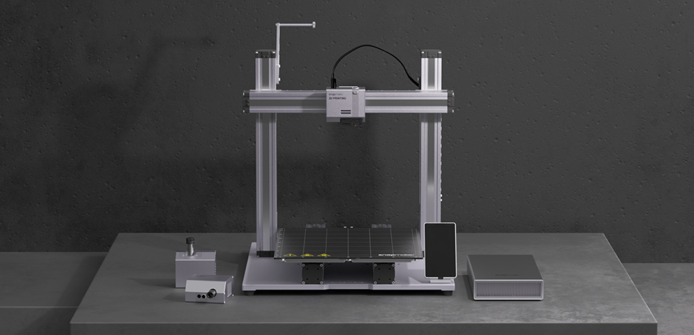

<!-- title -->

<!--lint ignore git-repo-age-->

# Awesome Snapmaker  

<!-- subtitle -->

The most up to date list of Snapmaker docs, talks, tools, examples & articles the internet has to offer.  
<a href="https://snapmaker.com/snapmaker-original" target="_blank" rel="noopener noreferrer">
Snapmaker Original</a> · 
<a href="https://snapmaker.com/snapmaker-2" target="_blank" rel="noopener noreferrer">
Snapmaker 2.0 (AT/F models)</a> · 
<a href="https://us.snapmaker.com/products/snapmaker-j1-independent-dual-extruder-3d-printer" target="_blank" rel="noopener noreferrer">
Snapmaker J1</a> · 
<a href="https://snapmaker.com/snapmaker-artisan" target="_blank" rel="noopener noreferrer">
Snapmaker Artisan</a>

<!-- image -->

<!-- description -->

High performance - 3D printer / Laser / CNC - with a large build volume.

<!-- TOC -->

## Contents

- [Official Docs & Quickstarts](#official-docs--quickstarts)
- [Official Communities](#official-communities)

Legend: 📝 blog posts · 💡 examples · 📚 docs · 🔌 libraries · 🔧 tools · 📹 talks/video
<!-- CONTENT -->

## Official Docs & Quickstarts

- [Snapmaker](https://snapmaker.com/) - Official website.
- 🔧 [Snapmaker Luban](https://snapmaker.com/snapmaker-luban) - Official software that works with all Snapmaker functions.
- Snapmaker Academy - learn your machine with official guides
  - 📚 [3D PRINTING](https://support.snapmaker.com/hc/en-us/articles/360041733553-Snapmaker-2-0-3D-Printing-V1-0-0) - quick start guide by Snapmaker team.
    - 📝 [3D Printing tips&tricks](https://support.snapmaker.com/hc/en-us/sections/360008076253-3D-Printing) - 3D Printing related tips and tricks by Snapmaker team.
  - 📚 [LASER ENGRAVING AND CUTTING](https://support.snapmaker.com/hc/en-us/articles/360041254874-Snapmaker-2-0-Laser-V1-0-0) -  quick start guide by Snapmaker team.
    - 📝 [Laser tips&tricks](https://support.snapmaker.com/hc/en-us/sections/360009734754-Laser) - Laser Engraving and Cutting tips&tricks by Snapmaker team.
  - 📚 [CNC](https://support.snapmaker.com/hc/en-us/articles/360041252474-CNC-Carving) -  quick start guide by Snapmaker team.
    - 📝 [CNC tips&tricks](https://support.snapmaker.com/hc/en-us/sections/360009349014-CNC) - CNC tips&tricks by Snapmaker team.

## Official Communities
- [Snapmaker Forum](https://forum.snapmaker.com/) - Library of deep knowledge about snapmaker machines.
- [Snapmaker Original/2.0 Owners](https://www.facebook.com/groups/snapmaker) - Facebook group of Snapmaker 2.0 & Snapmaker Original owners.
- [Snapmaker Artisan Owners](https://www.facebook.com/groups/591569232338285) - Facebook group of Artisan owners.
- [Snapmaker J1 Owners](https://www.facebook.com/groups/snapmakerj1) - Facebook group of Snapmaker J1 owners.
- [Snapmaker GitHub](https://github.com/Snapmaker) - Home of the Snapmaker source code.

<!-- END CONTENT

## Follow

Who else should we be following!?

## Contributing

[Contributions of any kind welcome, just follow the guidelines](contributing.md)!

### Contributors

[Thanks goes to these contributors](https://github.com/shurushetr/awesome-snapmaker/graphs/contributors)!
-->
