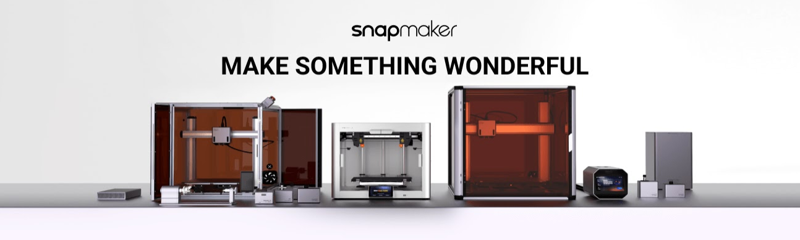

<!-- title -->

<!--lint ignore awesome-git-repo-age-->

# Awesome Snapmaker    

<!-- subtitle -->

The most up to date list of Snapmaker docs, talks, tools, examples & articles the internet has to offer.  
<a href="https://snapmaker.com/snapmaker-original" target="_blank" rel="noopener noreferrer">
Snapmaker Original</a> ·
<a href="https://snapmaker.com/snapmaker-2" target="_blank" rel="noopener noreferrer">
Snapmaker 2.0 (AT/F models)</a> ·
<a href="https://us.snapmaker.com/products/snapmaker-j1-independent-dual-extruder-3d-printer" target="_blank" rel="noopener noreferrer">
Snapmaker J1</a> ·
<a href="https://snapmaker.com/snapmaker-artisan" target="_blank" rel="noopener noreferrer">
Snapmaker Artisan</a> ·
<a href="https://snapmaker.com/snapmaker-ray-20w-40w-laser-engraver-and-cutter-with-air-assist" target="_blank" rel="noopener noreferrer">
Snapmaker Ray</a>

<!-- image -->

<!-- description -->

High performance - 3D printer / Laser / CNC - with a large build volume.
  

# SUPPORT

| If you encounter any problems, please submit a ticket first to Snapmaker.|
:---:
| [SUBMIT TICKET](https://snapmaker.formcrafts.com/support-ticket)  |

You could also seek help from like-minded within [official communities](#official-communities).
 
If you think that [official Wiki](https://wiki.snapmaker.com/) is missing something - [Wiki Content Request](https://formcrafts.com/a/qmvudac)
  

# HOW TO USE THIS LIST

Hit CTRL+F on your keyboard to search in page and type the keyword you are looking for. Try several and I'm sure you will find the thing you are looking for.

# THIS LIST IN OTHER LANGUAGES
 

 
<!-- TOC -->

# Contents

- 📚 [Official Docs & Firmware & Software](#official-docs--firmware--software)
  - [Snapmaker 2.0](#snapmaker-20)
  - [Snapmaker Artisan](#snapmaker-artisan)
  - [Snapmaker J1](#snapmaker-j1)
  - [Luban Software](#snapmaker-luban)
- 👋 [Official Communities](#official-communities)
- 📝 [Community Guides](#community-guides)
  - [How to set stuff up](#how-to-set-stuff-up)
  - [How to make stuff](#how-to-make-stuff)
    - [Online stuff generators](#online-stuff-generators)
  - [How to fix stuff](#how-to-fix-stuff)
  - [How to modify stuff](#how-to-modify-stuff)
  - [Settings Collection](#settings-collection)
    - [Laser](#laser-settings)
    - [3D Printing](#3d-printing-settings)
    - [CNC Settings](#cnc-settings)
- 🔧 [Tools](#tools) - software tools created by community members.
  - [Specific to Snapmaker machines](#specific-to-snapmaker-machines)
  - [Generic Tools](#generic-tools)
- 💾 [Handy Files & Models](#handy-files--models) - files hosted in this repo.
  - [Released By Community members - UNOFFICIAL](#released-by-community-members---unofficial)
  - [Released by Snapmaker Team - OFFICIAL](#released-by-snapmaker-team---official)
- 🛒 [Shopping list](#shopping-list)
  - 🛒 [Aftermarket Parts](#aftermarket-parts) -  Parts that were recommended by community members as spare/mods.
  - 🛒 [Tooling](#tooling)
  - 🛒 [Raw Material](#materials)
- 💡 [Contributing to this list](#contributing)

Legend: 📝 blog posts · 📚 docs · 🔧 tools · 📹 talks/video · 💾 files · 🛒 shopping items · 💻 coding
<!-- CONTENT -->

# Official Docs & Firmware & Software

- 📚 [G-Code Reference](https://snapmaker.github.io/Documentation/gcode/G000-G001) - G-Code reference guide. Snapmaker G-Code is Marlin compatible.
- 📚 [Snapmaker 2.0 Enclosure & Air Purifier Specs](https://snapmaker.com/filter-enclosure/specs)

## Snapmaker 2.0

- **Docs**
  - 📚 [SPECS](https://snapmaker.com/snapmaker-2/specs)
  - 📚 [Snapmaker 2.0 Wiki](https://wiki.snapmaker.com/en/Snapmaker_2) - all content [from support center](https://support.snapmaker.com/) will be moved to the wiki. Use [Wiki Content Request](https://formcrafts.com/a/qmvudac) to request updates.
    - 📚 [2.0 Wiki Content Updates](https://forum.snapmaker.com/t/2-0-wiki-content-updates/31757) - follow this thread to keep an eye on Wiki Updates from Snapmaker.
  - 📚 [3D PRINTING](https://support.snapmaker.com/hc/en-us/articles/360041733553-Snapmaker-2-0-3D-Printing-V1-0-0) - quick start guide by Snapmaker team.
    - 📝 [3D Printing tips&tricks](https://support.snapmaker.com/hc/en-us/sections/360008076253-3D-Printing) - 3D Printing related tips and tricks by Snapmaker team.
  - 📚 [LASER ENGRAVING AND CUTTING](https://support.snapmaker.com/hc/en-us/articles/360041254874-Snapmaker-2-0-Laser-V1-0-0) -  quick start guide by Snapmaker team.
    - 📝 [Laser tips&tricks](https://support.snapmaker.com/hc/en-us/sections/360009734754-Laser) - Laser Engraving and Cutting tips&tricks by Snapmaker team.
  - 📚 [CNC](https://support.snapmaker.com/hc/en-us/articles/360041252474-CNC-Carving) -  quick start guide by Snapmaker team.
    - 📝 [CNC tips&tricks](https://support.snapmaker.com/hc/en-us/sections/360009349014-CNC) - CNC tips&tricks by Snapmaker team.
  - 📚 [QuickSwap Kit](https://wiki.snapmaker.com/Snapmaker_2/manual/qsg_for_2_0_quick_swap_kit) - HTML and PDF versions available.

- **Firmware**
  - 💾 [Snapmaker 2.0 Firmware Updates and Downloads](https://forum.snapmaker.com/t/snapmaker-2-0-firmware-updates-and-downloads/5443/) - official forum thread where stable firmware releases are posted.
    - 👋 [Discussion of Snapmaker 2.0 Firmware Updates](https://forum.snapmaker.com/t/discussion-of-snapmaker-2-0-firmware-updates/5441) - dedicated discussion topic to stable firmware updates.
  - 💾 👋 [Vibration Compensation Beta Firmware for 2.0 Series: Stable Print Quality at Higher Speed](https://forum.snapmaker.com/t/now-compatible-with-8-lead-vibration-compensation-beta-firmware-for-2-0-series-stable-print-quality-at-higher-speed/29136) - forum thread dedicated to the new vibration compensation firmware by Snapmaker. Same as J1.

## Snapmaker Artisan

- **Docs**
  - 📚 [SPECS](https://snapmaker.com/snapmaker-artisan/specs)
  - 📚 [Artisan Guides Wiki](https://wiki.snapmaker.com/en/snapmaker_artisan) - Wiki for Artisan by Snapmaker Team.
    - 📚 [Artisan Wiki Content Updates](https://forum.snapmaker.com/t/artisan-wiki-content-updates/30892) - follow this thread to keep an eye on Wiki Updates from Snapmaker.
  - 📚 [Artisan FAQ](https://docs.google.com/document/d/1JVNMFgKufcrd4NxP66wY99-6UNxSoRhwG8EZyJzQZWI/) - Google doc with frequently asked questions gathered by Snapmaker Team to support the community. Updated through [Snapmaker Artisan Owners facebook group](https://www.facebook.com/groups/snapmakerartisan/)  by [Mandy Wu](https://www.facebook.com/groups/591569232338285/user/100092628331708/)
- **Firmware**
  - 💾 [Snapmaker Artisan Firmware Updates and Downloads](https://forum.snapmaker.com/t/snapmaker-artisan-firmware-updates-and-downloads/29975) - official forum thread where stable firmware releases are posted.
    - 👋 [Discussion of Snapmaker Artisan Firmware Updates](https://forum.snapmaker.com/t/discussion-of-snapmaker-artisan-firmware-updates/29974) - dedicated discussion topic to stable firmware updates.

### Snapmaker J1

- **Docs**
  - 📚 [SPECS](https://support.snapmaker.com/hc/en-us/articles/9773156785175-What-are-the-specs-of-J1-)
  - 📚 [Snapmaker J1 Wiki](https://wiki.snapmaker.com/en/snapmaker_j1) - WiKi for J1 by Snapmaker Team
    - 📚 [J1 Wiki Updates](https://forum.snapmaker.com/t/j1-wiki-updates/30973)- follow this thread to keep an eye on Wiki Updates from Snapmaker.
- **Firmware**
  - 💾 [Snapmaker J1 Firmware Updates and Downloads](https://forum.snapmaker.com/t/snapmaker-j1-firmware-updates-and-downloads/29972) - official forum thread where stable firmware releases are posted.
    - 👋 [Discussion of Snapmaker J1 Firmware Updates](https://forum.snapmaker.com/t/discussion-of-snapmaker-j1-firmware-updates/29973) - dedicated discussion topic to stable firmware updates.

## Snapmaker Ray

- **Docs**
  - 📚 [SPECS](https://snapmaker.com/snapmaker-ray-20w-40w-laser-engraver-and-cutter-with-air-assist/specs)
  - 📚 [Ray pre-sale FAQ](https://support.snapmaker.com/hc/en-us/articles/16411847512087-Pre-sale-FAQ-for-Ray-20W-40W-Laser-Engraver-and-Cutter)

## Snapmaker Luban

- 💾 [Snapmaker Luban Downloads and Updates](https://forum.snapmaker.com/t/snapmaker-luban-downloads-and-updates/4949) - official forum thread where stable Luban releases are posted.
- 📚 [Luban Wiki](https://wiki.snapmaker.com/en/Snapmaker_Luban)

# Official Communities

- [Snapmaker Forum](https://forum.snapmaker.com/) - Library of deep knowledge about snapmaker machines.
- [Snapmaker Original/2.0 Owners](https://www.facebook.com/groups/snapmaker) - Facebook group of Snapmaker 2.0 & Snapmaker Original owners.
- [Snapmaker Artisan Owners](https://www.facebook.com/groups/591569232338285) - Facebook group of Artisan owners.
- [Snapmaker J1 Owners](https://www.facebook.com/groups/snapmakerj1) - Facebook group of Snapmaker J1 owners.
- [Snapmaker GitHub](https://github.com/Snapmaker) - Home of the Snapmaker source code.
- [Snapmaker YouTube](https://www.youtube.com/c/snapmaker) - YouTube channel by Snapmaker team.
- [Snapmaker Community Page](https://snapmaker.com/community) - Contests, Creators spotlight etc.
- [Snapmaker Thingiverse repo](https://www.thingiverse.com/snapmakerinc) - Official Snapmaker profile on Thingiverse with bunch of models.

# Community Guides

## How to set stuff up

- **Connectivity**
  - 📝 [USB to Ethernet adapter](https://forum.snapmaker.com/t/works-usb-to-ethernet-adapter/8074/) - you can use usb adapter to connect via ethernet to your machine.
  - 📝 [Direct communication over serial port](https://forum.snapmaker.com/t/android-cell-phone-terminal-console/12838/6) - Using the MINI-USB port, you can connect to machines console (like with Luban) to run commands directly. This post shows settings for Putty - terminal app. Snapmaker has simple serial to USB converter inside.
  - 📝 [USB port forwarding](https://forum.snapmaker.com/t/usb-forwarding-of-the-snapmaker/32831) - has it's dangers, but you can trick you host machine into thinking that snapmaker is connected directly via usb, when it is actually connected to a different machine.
  - 🔧 [SM2Uploader](https://github.com/macdylan/sm2uploader) - [WIN/NIX/MAC] - A command-line tool for sending the files to Snapmaker machines via network connection. Can act as Octoprint to emulate upload for Cura/PrusaSlicer/SuperSlicer/ideaMaker. Use it with NC and CNC files on  Snapmaker 2 A150/250/350, J1, Artisan. Credit - [@macdylan](https://github.com/macdylan).
    - [How to setup sm2uploader with slicers](https://forum.snapmaker.com/t/great-sharing-prusaslicer-profiles-by-dylan-and-mcgybeer/28796/133).
    - [How to add sm2uploader to context menu of Windows 11](https://forum.snapmaker.com/t/upload-files-to-any-snapmaker-with-right-click-menu-windows-11-guide/33041)

- **3D Printing**
  - 📝 [Bed Leveling - Revisited & Detailed](https://forum.snapmaker.com/t/bed-leveling-revisited-detailed/30508) - Writeup by [@Mxbrnr](https://forum.snapmaker.com/u/Mxbrnr) about bed leveling and issues along the way.
    - 📝 [11x11 calibration with heated bed](https://forum.snapmaker.com/t/11x11-calibration-with-heated-bed-possible/22426) by [@Mxbrnr](https://forum.snapmaker.com/u/Mxbrnr).

- **Laser**
  - 📝 📹 [Safety first - what plastic is safe to work with](https://laserengravingtips.com/what-plastics-are-safe-to-laser-cut/) - also how to test plastic for chlorine.
  - 📝 [Lightburn Full Control Guide](https://forum.snapmaker.com/t/full-lightburn-control-guide/27638) - [SM2.0 / ARTISAN] - Writeup by [@Skreelink](https://forum.snapmaker.com/u/Skreelink) on how to make Lightburn talk to Snapmaker 2.0.
    - 💾 [PDF summary of the "Lightburn Full Control Guide"](files/pdf/Full_Lightburn_Control_Guide_v1.0.pdf) - created by [@Burgerboy](https://forum.snapmaker.com/u/Burgerboy) and published [on the forum](https://forum.snapmaker.com/t/full-lightburn-control-guide/27638/215) summary of all the knwoledge in the thread.
  - 📝 [Full Control Lightburn + Rotary Attachment Guide](https://forum.snapmaker.com/t/full-control-lightburn-rotary-guide/28584) - Writeup by [@Skreelink](https://forum.snapmaker.com/u/Skreelink).
  - 📝 [Working camera capture with Lightburn](https://forum.snapmaker.com/t/working-camera-capture-with-lightburn/28397) - thanks to [@Slynold](https://forum.snapmaker.com/u/Slynold) & [@Mayco](https://forum.snapmaker.com/u/mayco) - we have working camera.
- **CNC**
  - 📝 [Rotary Module with Fusion360: It works! (good enough)](https://forum.snapmaker.com/t/rotary-module-with-fusion360-it-works-good-enough/24367) - [SM2.0 / ARTISAN] - Writeup by [@brvdboss](https://forum.snapmaker.com/u/brvdboss) on how to setup Fusion360 with Rotary Module.
  - 📝📹[Snapmaker 2.0 by Koka-Bora Creations](https://www.youtube.com/playlist?list=PLWlW9PTm7_qvYvXytlfXZib--P-qIz3fp) - a 20 episode video series on using snapmaker 2.0 for projects. Bunch of CNC material.

### Home Assistant Automation

- 📝 [Send machine status to Home Assistant](https://www.steffr.ch/snapmaker-2-0-and-home-assistant/) - you can recieve notification when your job is finished to your phone! Published by [@NightCrawler](https://forum.snapmaker.com/u/NightCrawler) in this post - [forum.snapmaker.com](https://forum.snapmaker.com/t/do-snapmaker-2-0-devices-have-a-webpage/5455/55).
- 📝 [Enclosure mods including flame sensor](https://forum.snapmaker.com/t/facbook-post-repost-next-level-enclosure-mods/32637) - not a guide but demo of a what is possible setup made by a communty member.

## How to make stuff

- **3D Printing**
  - 📝 [Tabletop miniature with 0.2 mm nozzle and PVA support (Dual Extruder)](https://forum.snapmaker.com/t/tabletop-miniature-with-0-2-mm-nozzle-and-pva-support-dual-extruder/33809?u=hauke) - Great results with printing miniatures using 2.0 nozzle [@hauke](https://forum.snapmaker.com/u/hauke).

- **Laser**
  - 📝 [Laser on Ceramics (tiles): How to Make It Not Only Black on White](https://support.snapmaker.com/hc/en-us/articles/9589024708759-Laser-on-Ceramics-How-to-Make-It-Not-Only-Black-on-White) - an awesome tutorial written by community member [@Eugene Fedorov](https://www.facebook.com/groups/371401856611467/user/1608278798/) and posted on snapmaker website.
  - 📝 [Guide: Easier Titanium Coverage for Tile](https://forum.snapmaker.com/t/guide-easier-titanium-coverage-for-tile/30863) - Huge time saving tip from [@Skreelink](https://forum.snapmaker.com/u/Skreelink).
  - 📝 [Shadow board or tool cutouts - Ultimate guide](https://www.youtube.com/watch?v=Wcxh1lLltAE) - this is the proper way of making the tool organizers known as shadow boards. Can also be used with CNC.
  - 📝 [Tapered glasses engraving](https://forum.snapmaker.com/t/rotary-10w-laser-tapered-16oz-beer-glasses/33577) - detailed instructions on how to engrave beer glasses by [@Mads0100](https://forum.snapmaker.com/u/Mads0100).
  - 📝 [Guide: Etching Glass with 10 Watt Laser with Dry Moly](https://forum.snapmaker.com/t/guide-etching-glass-with-10-watt-laser-with-dry-moly/33914?u=gil.a.ramirez) - Using 10W laser to etch glass with DryMoly [@gil.a.ramirez](https://forum.snapmaker.com/u/gil.a.ramirez).
- **CNC**
  - 📝 [PCB milling process](https://github.com/tommy-vaux/Snapmaker_2_PCB_Milling_Process) - Detailed writeup by [@tommy-vaux](https://github.com/tommy-vaux).

### Online stuff generators

- **Universal**
  - [Caligrapher](https://www.calligrapher.ai/) - [LASER / CNC / 3DP]- handwriting generator with SVG export.
  - [STL2PNG heightmap (depth map) generator](https://fenrus75.github.io/FenrusCNCtools/javascript/stl2png.html) - [LASER / CNC] This website lets you convert STL files to PNG height images. You can do things like this with laser for example - [How To... 3D Grayscale](https://www.youtube.com/watch?v=O01POwqfMbQ)
  - [HeightMaps to STL](https://imagetostl.com/) - [CNC / 3DP] - Use this free and fast online tool to convert your PNG and JPG 2D heightmap images or logo into 3D STL (stereolithography) mesh/model files suitable for printing with a 3D printer, CNC machining or for loading into your favourite 3D editing package.
- **3D Printing**
  - [Watertight outdoor enclosure generator](https://bruceborrett.github.io/easy-enclosure/) - EasyEnclosure is an open-source 3D modeling software tailored specifically for designing 3D-printable enclosures.
  - [Dildo generator](http://dildo-generator.com/) - to make molds, lined with wax and pouring silicone dildos or other objects.
  - [Parametric models only](https://models.makewithtech.com/) - you can customize every model. Even print some velcro. [How it works.](https://www.youtube.com/watch?v=r5YJxmw6lKQ).
  - [Lithophanes](https://lithophanemaker.com/) - all you need for lithophanes in one place.
  - [ItsLitho](https://itslitho.com/) - another lithophanes generator.
  - [Full control G-Code](http://fullcontrolgcode.com/) - this is not for the faint of heart. God level 3d models generator. [Check this video out.](https://www.youtube.com/watch?v=ZgytQDoaD5M&t=584s)
  - [Tray generator](https://deckinabox.sgenoud.com/) - make up any tray in a few minutes with or without lids.
- **Laser**
  - [Create boxes and more! - One site to rule them all](https://www.festi.info/boxes.py/) - amazing online vector generator for designing boxes, shelfes, bins, tests and much more.
  - [Keychaines, Name-Snowflakes, Connected Text and more](https://cuttle.xyz/templates) - some are free for personal use, some are pro only.
  - [Stencil Generator](https://www.stencilcreator.org/) - The interface on this website can support you to generate a multi-layer stencil from an input image.
  - [Treasure trove of templates generators](https://www.blocklayer.com/calculatordirectory) - a huge number of various calculators and template generators that you can export in SVG. Diameter Tape, Compass, Spirals, Bolt Patterns and much much more.
  - [Snowflakes generator](https://github.com/bleeptrack/fr0zen-system-laser) - made by [Bleeptrack](https://github.com/bleeptrack) - Fr0zenSystem is a little snowflake generator. This version is optimized to be used with lasercutters but might also be used with pen- or cutter plotters. The idea is to cut out two different layers that in combination form a nice snowflake shape.
  - [Numerical Dial Generator and more](https://www.oliverboorman.biz/projects/tools/dial.php) - This interactive generator produces an image of a numerical dial, based on your settings and requirements. They have more generators related to dials.
  - [Paper box generator](https://deckinabox.sgenoud.com/) - ever wanted to cut a foldable box?
  - [Wave pattern generator](https://tinkersynth.com/slopes) - get an SVG with wave pattern.
- **CNC**
  - [Japanese joints - "Tsugite" -  generator](http://ma-la.com/tsugite.html) - Interactive system for designing and fabricating wood joints for frame structures.

## How to fix stuff

- **AXIS**
  - [Snapmaker 2 milling kit for the brass nut in the linear axis](https://www.thingiverse.com/thing:4491190) - For all Snapmaker 2 users who have problems with the wear of the plastic nut in the linear guides, the milling program in conjunction with the clamping device offers the possibility of milling freely available brass trapezoidal nuts TR8x8 with anti Backslash so that they can be machined into the Snapmaker 2 compatible nut. By [@gojoetofly](https://www.thingiverse.com/gojoetofly)
  - [DIY step motor drive repair](https://forum.snapmaker.com/t/i-have-successfully-repaired-my-dead-linear-module-fried-driver-chip/34459?u=cyb0124) - nice writeup about installing aftermarket drive for step motor.

- **3D Printing related**
  - 📝 [Hot End Clogs - The How & Why](https://forum.snapmaker.com/t/hot-end-clogs-the-how-why/30376) - Writeup by [@Mxbrnr](https://forum.snapmaker.com/u/Mxbrnr) about all metal heat break. Find one in [parts list below](#aftermarket-parts).
  - 💾 [E-Step calibration](/files/pdf/e-step_calibration.pdf) - Writeup by [@Mxbrnr](https://forum.snapmaker.com/u/Mxbrnr) for e-steps calibration.
  - 📝 📹 [GUIDE: Resuming a failed 3D print](https://www.cnckitchen.com/blog/guide-resuming-a-failed-3d-print) - a way to save your 3d print. Printer got clogged and printed air for a while or the model got loose - it can be saved.
  - Dual Extruder related - [SM2.0 / ARTISAN]
    - 📝 [Dual Extruder design / Dry box setups](https://forum.snapmaker.com/t/dual-extruder-design-dry-box-setups/29697) - [@Spaced](https://forum.snapmaker.com/u/Spaced) discussing why you might have inconsistent nozzle heights and rough prints when you feed filament via bowden tube.
    - 📚 [Dual Extruder heatcreep temporary solution provided by Snapmaker](https://forum.snapmaker.com/t/dual-extrusion-head-heat-creep-discussion-thread/30010/140) - post by [@Jade](https://forum.snapmaker.com/u/Jade) in response to big discussion started by community in [Dual Extrusion Head: Heat creep discussion thread](https://forum.snapmaker.com/t/dual-extrusion-head-heat-creep-discussion-thread/30010). Sounds like there will be a shipment from snapmaker to owners of dual extruder for permanent proper fix.
    - 📚 [The extruder buckle of the Dual Extrusion Module gets loose](https://forum.snapmaker.com/t/temporary-solution-buckle-wedge-stl-file-for-extruder-buckle-issues/31716) - forum topic with temp. wedge solution,  addressing a widespread problem described by community members across Facebook groups and snapmaker forum. Sounds like there will be a shipment from snapmaker to owners of dual extruder for permanent proper fix.
    - 📚 [Troubleshooting articles related to Dual Extruder issues](https://wiki.snapmaker.com/t/dual%20extrusion)
    - 📝 [Replacing the leveling sensor](https://www.facebook.com/groups/snapmaker/posts/1853853658366272/) - [@Claire Elliot Matthews](https://www.facebook.com/groups/371401856611467/user/100000288498499/).
- CNC
  - 📝 [CNC routing arbitrary circles](https://forum.snapmaker.com/t/cnc-routing-arbitrary-circles/32055) - if you have issues with milling simple circles on CNC take a look at this thread.

## How to modify stuff

### Snapmaker 2.0 Mods

- **Firmware**
  - Tools
    - 💻 [Snapmaker2 update bundle tools](https://github.com/zauguin/SnapmakerUpdate) - toolkit to assemble snapmaker firmware, created by [@zauguin](https://github.com/zauguin)
  - Firmware mods
    - 💾 📝 [Use Dual Extruder to autolevel on any surface](https://github.com/Maycuz/Snapmaker2-Controller) - read the readme. Credit to [@Mayco](https://forum.snapmaker.com/u/Mayco). Forum thread where this firmware was first published - [Dual Extruder: bed leveling with nozzle i.s.o. proximity sensor](https://forum.snapmaker.com/t/dual-extruder-bed-leveling-with-nozzle-i-s-o-proximity-sensor/31613/16).

- **Overall Platform related**
  - 💾 [Take a look at 3d Models from this list](#handy-files--models) - they have some mods modeled on them.
  - 📝 [CNC Bracing For Added Rigidity & Other Mods](https://forum.snapmaker.com/t/cnc-bracing-for-added-rigidity-other-mods/29444) - Collection of mods designed by [@Elliot](https://forum.snapmaker.com/u/Elliot).
  - 📝 [Snapmaker 2.0 Cable Chain Brackets](https://www.thingiverse.com/thing:4909694) - Stop your cables from flopping around during the print - reduce kinks and damage.
  - 📝 [Minimize bed rocking along Y axis at the forum](https://forum.snapmaker.com/t/minimize-rocking/19215/) - the biggest problem with the platform is it's unstable bed that get's worse overtime. Illustrated in [this video from Facebook post among many others](https://www.facebook.com/groups/snapmaker/posts/1706559253095714/).
    - Purchase SBR16-800mm rails will solve this issue. Links for exact rail - [Shopping list](#shopping-list).
    - [3D Print these adapters](https://www.thingiverse.com/thing:6104662) - Best way to install (minimal modifications and no drilling).
  - 📚 [Related to bed rocking - adjusting bearings in linear module](https://support.snapmaker.com/hc/en-us/articles/1500000110341-What-should-I-do-when-the-slider-of-the-Linear-Module-comes-loose-) - official guide on how to disassemble the linear module and adjust bearings.

- **Enclosure**
  - 📝 [DIY Fumes Filtration system - BentoBox](https://www.printables.com/model/272525-bentobox-v20-carbon-filter-for-bambu-lab-x1c-enclo) - Closedloop, combines HEPA filter and activated carbon filter.
  - 📝 [DIY Fumes Filtration system - NeverMore](https://github.com/nevermore3d/Nevermore_Micro) - Opensource closedloop activated carbon filtration system. Also check out other sizes in the same repository.
  - 📝 [DIY Fumes Filtration system - 3D Printer Enclosure Air Filter ](https://www.printables.com/model/445976-3d-printer-enclosure-air-filter) - Largest filtration media size - 400hrs of print with one filter, advanced module for efficient filtration.
  - 📝 [DIY Enclosure controls](https://forum.snapmaker.com/t/diy-enclosure-controller-prototype-on-arduino/22094) - Awesome project by [@Ronin](https://forum.snapmaker.com/u/Ronin). Files available in description of the [video](https://www.youtube.com/watch?v=9gOlhEzB8m4).

- **3D Printing**
  - **Snapmaker 2.0 mods**
    - 📝 [All metal hot end simple mod](https://forum.snapmaker.com/t/fyi-snapmaker-2-all-metal-hotend-simple-mod/10046/63) - Writeup by [@Franky](https://forum.snapmaker.com/u/Franky) followed by discussion about installing all metal heat break.
    
    - **Leveling**
      - 💾 📝 [Klicky probe - bed leveling on anything! Stealth mod for single extruder](https://forum.snapmaker.com/t/klicky-probe-bed-leveling-on-anything-stealth-mod-for-single-extruder/32229) - Klicky probe for snapmaker single extruder. Level on anything, simple, no firmware changes. You can find parts in the [Shopping list](#shopping-list)
      - 💾 [Glass bed leveling probe - FiFix Mod](files/models/FiFix_glass_probe_mod_by_stefix.zip) - Clever way by [@Stefix](https://forum.snapmaker.com/u/stefix/) to allow leveling on glass using OEM probe. Find more information about it [here](https://forum.snapmaker.com/t/for-all-who-want-level-on-glass/12437). No Firmware modification required.
      - 📝 [Automatic bed leveling on glass](https://forum.snapmaker.com/t/automatic-bed-leveling-on-glass/29601) - Another mod by [@TobIY](https://forum.snapmaker.com/u/TobIY). No Firmware modification required. Check the [Shopping list](#shopping-list) for exact part.
      - 📝 [Advanced leveling mod](https://forum.snapmaker.com/t/for-all-who-want-level-on-glass/12437/129) - By [@stewl](https://forum.snapmaker.com/u/stewl). Instructions here - [Google drive link](https://drive.google.com/drive/folders/1JTZ811Tx-dTD35J4a-u2fsokln20INpR). Firmware modification required. Ultimate accuracy.
    - 📝 [The (mostly) Complete Guide to Bondtech, Slice, and the Snapmaker 2.0](https://forum.snapmaker.com/t/the-mostly-complete-guide-to-bondtech-slice-and-the-snapmaker-2-0/29762) - if you want ultimate performance upgrade - this is an awesome mod by [@nsclemmer](https://forum.snapmaker.com/u/nsclemmer)
    - 📝 [Snapmaker-2 A350 Heated Bed Cable Adapter (Chain) (Hidden)](https://forum.snapmaker.com/t/snapmaker-2-a350-heated-bed-cable-adapter-chain-hidden/19952) - advanced but 100% fixes all issues related to the heated bed cable being prematurely worn out / damaged, due to bed movement.
  
  - **Snapmaker J1/J1s mods**
    - 📝 [J1/J1s nozzle & heatbreak upgrade - anti clogging solution](https://forum.snapmaker.com/t/findings-and-solution-for-the-snapmaker-j1-clogging-problem/30472/190) - parts gathered by [@StephenM](https://forum.snapmaker.com/u/StephenM).

- **Laser**
  - 📝 💾 [Add airassist to your 10W laser](https://www.facebook.com/groups/snapmaker/posts/1694540740964232/) - [SM2.0 / ARTISAN] -  a facebook post that shows an implementation of internal air assist with external air pump, cheap and effective mod to make your laser path clean. STL file is in the [handy files list below](#handy-files--models). Original design by [@Raagnarix](https://www.youtube.com/@Raagnarix) form [this video](https://www.youtube.com/watch?v=zg8jiem-8v8)

- **CNC**
  - 📝 [CNC self-impelled vacuum dust shoe (no external vacuum required)](https://forum.snapmaker.com/t/cnc-self-impelled-vacuum-dust-shoe-no-external-vacuum-required/24972) - Design by [gil.a.ramirez](https://forum.snapmaker.com/u/gil.a.ramirez).

# Settings Collection

This is a collection of settings/hacks for processing various materials with various tools shared by community members.

## Laser settings

- 📚 [Recommended Parameters for Snapmaker 20W and 40W Laser Modules](https://wiki.snapmaker.com/Snapmaker_2/manual/recommended_parameters_for_20w_and_40w_laser_modules)
- 📚 [The Definitive Guide to Laser Engraving and Cutting with the 10W High Power Laser Module.](https://support.snapmaker.com/hc/en-us/articles/8072478934935-The-Definitive-Guide-to-Laser-Engraving-and-Cutting-with-the-10W-High-Power-Laser-Module-)
- 📚 [The Definitive Guide to Laser Engraving and Cutting with the 200mW and 1600mW Laser Module](https://support.snapmaker.com/hc/en-us/articles/360019025954-The-Definitive-Guide-to-Laser-Engraving-and-Cutting-with-the-200mW-and-1600mW-Laser-Module)
- 📝[List of materials you shouldn't be lasering](https://cpl.org/wp-content/uploads/NEVER-CUT-THESE-MATERIALS.pdf)

Air assist is recommended for any laser module you use. Some mods are listed in here.

| Material | Laser Module | Operation | Thickness   (mm) | Method | Work Speed   (mm/min) | Power   (%) | Notes | Source |
| --- | :---: | --- | :---:  | --- | :---:  | :---:  | --- | --- |
| Acrilic Clear | 10W | Engrave | N/A | Fill   Line interval 0.25mm | 500 | 100 | Place sheet of paper on top of acrylic | [Facebook post](https://www.facebook.com/groups/snapmaker/posts/1794963157588656)
| Acrilic Clear | 10W | Dot-filled Engraving | N/A | Fill   Dot interval 0.14mm | 5ms/dot | 30 | Put liquid chalk on top (either marker or spray) | [Snapmaker forum](https://forum.snapmaker.com/t/10w-laser-clear-acrylic-engraved-logo-with-light-base/26105)
| Stainless Steal | 10W | Engrave | N/A | Fill   Line interval 0.1mm | 450 | 100 | Clean steel surface | [Marking SS with 10W laser](https://forum.snapmaker.com/t/marking-ss-with-10w-laser/25577)|
| YETTI cups | 10W | Engrave | N/A | Fill   Line interval 0.07 | 3500 | 40 | Quick rub with a magic eraser and then I use a chrome polish on a drill buffer to make it pop. Wash in the sink after| [Facebook post](https://www.facebook.com/groups/snapmaker/posts/1797922073959431/) |
| Rubber Stamps | 10W | Engrave | N/A | Fill   Line interval 0.15 | 880 | 100 | 1 pass | [Facebook comment by Darien Kruss](https://www.facebook.com/groups/snapmaker/posts/1851724585245846/) |
| Rubber Stamps | 10W | Cut | N/A | On the line| 400 | 100 | 4 pass   z-step 1.00 mm | [Facebook comment by Darien Kruss](https://www.facebook.com/groups/snapmaker/posts/1851724585245846/) |
|[Synthetic leather](https://www.jpplus.com/saddle-collection-sheet)| 1.6W | Engrave | N/A | Fill   Dot interval 0.1mm | Jog 1500   Dwell time 3ms/dot | 70 | 10W module was too strong for this | [Forum post by Shamuscg](https://forum.snapmaker.com/t/laser-settings-for-saddles-collection-laser-safe-synthetic-leather/34590?u=shamuscg) |
||||||||||

## 3D Printing settings

A collection of profiles for various slicers.

- 📝[Printing figurines with 0.2mm nozzle on Dual Extruder](https://forum.snapmaker.com/t/tabletop-miniature-with-0-2-mm-nozzle-and-pva-support-dual-extruder/33809?u=hauke)

| Supported   printers | Slicer | Support for Dual extruder (DE)   Single extruder (SE) | Author | Profiles download link | Link to publication post | Notes |
| --- | --- | :---:  | --- | --- | --- | --- |
|Snapmaker 2.0 A350|Ulltimaker Cura|SE|[@Kaouthia](https://github.com/Kaouthia)|[GitHub](https://github.com/Kaouthia/Snapmaker-2)|N/A||
|Snapmaker 2.0 A350   Snapmaker 2.0 A250|PrusaSlicer|SE|[@mrworf](https://forum.snapmaker.com/u/MrWorf)|[GitHub](https://github.com/mrworf/snapmaker-prusa)|N/A||
|Snapmaker 2.0 A350|PrusaSlicer|SE|[Snapmaker Team](https://forum.snapmaker.com/u/Edwin)|[Google Drive](https://drive.google.com/open?id=1xfBgXZzwjKaeZ3iqscdpe2xosgFV03G0)|[Snapmaker Forum](https://forum.snapmaker.com/t/prusa-slicer-profile/5657/7)||
|Snapmaker J1/J1s|PrusaSlicer|N/A|[@leandrolima-nyc ](https://github.com/leandrolima-nyc)|[GitHub](https://github.com/leandrolima-nyc/SnapmakerJ1)|N/A||
|Snapmaker 2.0 A250   Snapmaker 2.0 A350   Snapmaker J1/J1s|PrusaSlicer|SE|[@MacDylan](https://forum.snapmaker.com/u/macdylan)|[GitHub](https://github.com/macdylan/3dp-configs/blob/main/README-en.md)|N/A|[Additional description translated in Chinese](https://github.com/macdylan/3dp-configs/)|
|Snapmaker 2.0 A250|PrusaSLicer|DE|[@takeota](https://forum.snapmaker.com/u/takeota)|[Snapmaker Forum](https://forum.snapmaker.com/uploads/short-url/dRORxfm5l4wQNFRicH3umRi72HV.zip)|[Posted at Snapmaker Forum](https://forum.snapmaker.com/t/dual-extruder-and-prusaslicer/29792/62)|This is for A250, but Dual Extruder settings are easy to adopt for A350|
|Snapmaker 2.0 A250   Snapmaker 2.0 A350   Snapmaker J1/J1s|OrcaSlicer|SE|[@MacDylan](https://forum.snapmaker.com/u/macdylan)|[GitHub](https://github.com/macdylan/3dp-configs/blob/main/README-en.md)|N/A|[Additional description translated in Chinese](https://github.com/macdylan/3dp-configs/)|
||||||||
||||||||

## CNC Settings
| Material | Operation | Tool | Tool RPM | Feed rate   (mm/min) | Stepdown   (mm)| Notes | Source |
| --- | --- | :---:  | --- | :---:  | :---:  | --- | --- |
| Clear Acrylic | Milling | Standard 1.5mm 1 flute bit from Snapmaker | 12000 | 1000 | 0.5 | In plastic you are better off moving fast and taking small cuts otherwise you will get that melted blob of doom | [Facebook post](https://www.facebook.com/groups/371401856611467/user/100027477288104/)|
|||||||||

# Tools

## Specific to Snapmaker machines

- **3D PRINTING**
  - [CURA plugin made by Snapmaker](https://github.com/Snapmaker/SnapmakerCuraPlugin) - [SM2.0 / ARTISAN / J1].
  - [Dual Extruder and Prusaslicer](https://forum.snapmaker.com/t/dual-extruder-and-prusaslicer/29792/) - [SM2.0 / ARTISAN] - forum thread dedicated to setting up dual extruder with PrusaSlicer.
- **LASER CUTTING AND ENGRAVING**
  - 🔧 [Test Grid Generator](https://github.com/nunorvoliveira/Snapmaker-Laser-Test-Grid) - [WIN] - Generates G-Code to test your materials best speed/power ratio. Credit - @nunorvoliveira.
  - 🔧 [Laser Calibration Tool](https://github.com/daniel-starke/LaserCalibrationTool) - [WEB] - Laser calibration pattern generator.
- CNC
  - 🔧 [Fusion360 Post Processor](https://github.com/nunorvoliveira/snapmaker-2.0/tree/main/Fusion%20360) - [Fusion360] - Fusion360 postprocessor. Credit - @nunorvoliveira.
  - 🔧 [Snapmaker2Postprocessor](https://github.com/clsergent/Snapmaker2Postprocessor) - [FreeCad] - FreeCAD postporcessor. Credit - @clsergent.
  - 🔧 [CNC postprocessors for Snapmaker](https://github.com/Snapmaker/snapmaker_cnc_post_process) - [Fusion360 / FreeCAD / ArtCAM / Aspire / Vcarve] - collection of developed by [@whimsycwd](https://github.com/whimsycwd/)  - post processing tools.
    - [Forum post](https://forum.snapmaker.com/t/cnc-post-processor-ask-for-testing/5864)
  - [3D Touchprobe controller](https://github.com/brvdboss/3D-touchprobe-controller) - designed to work with a 3D touch probe on the SnapMaker 2 device and a 3D touchprobe. [DIY version can be found here](https://github.com/brvdboss/3d-touchprobe). Credit - [@brvdboss](https://forum.snapmaker.com/u/brvdboss).
- **G-CODE and machine control**
  - 🔧 [Snapmaker2Slic3rPostProcessor](https://github.com/macdylan/Snapmaker2Slic3rPostProcessor) - [WIN/NIX/MAC] - A Snapmaker G-Code Post Processor for PrusaSlicer and SuperSlicer to create compatible files for Snapmaker Touchscreen. Like thumbnail of the print on the screen. Supports PrusaSlicer and SuperSlicer with Snapmaker 2 A150/250/350, J1, Artisan. Credit - [@macdylan](https://github.com/macdylan).
  - 🔧 [A Snapmaker 2.0 PrusaSlicer Post-Processor to create compatible files for the Snapmaker terminal.](https://github.com/daniel-starke/sm2pspp) - Another g-code postprocessor for Prusaslicer. Credit - [@daniel-starke](https://github.com/daniel-starke).
  - 🔧 [Snapmaker 2.0 Lightburn post-Processor](https://github.com/daniel-starke/sm2lbpp) - Adding thumbnails to your g-code from Lightburn. Credit - [@daniel-starke](https://github.com/daniel-starke). This is hopefully will be implemented in Lightburn with v1.5.0 - [source](https://forum.snapmaker.com/t/lightburn-post-processor/31433/8).
  - 🔧 [Snapmaker Command Line Tool](https://github.com/hauti123/Snapmaker) - control your snapmaker via command line. Credit - [hauti123](https://github.com/hauti123).
  - 🔧 [Gamepad Controls for Snapmaker](https://github.com/PolymerPrints/snapmaker-gamepad-control) - control your machine with an xbox controller. Credit - [PolymerPrints](https://github.com/PolymerPrints)
  - 🔧 [Serial UART Connection to a Snapmaker 2.0 Controller - for adding rotary enocder and other physical buttons](https://forum.snapmaker.com/t/add-a-serial-uart-connection-to-a-snapmaker-2-0-controller/34030?u=seppo) - control your machine with an xbox controller. Credit - [Seppo](https://forum.snapmaker.com/t/add-a-serial-uart-connection-to-a-snapmaker-2-0-controller/34030?u=seppo)
## Generic Tools

- **CALIBRATION & PRINTER TUNING**
  - 📝 [Teaching Tech 3D Printer Calibration](https://teachingtechyt.github.io/calibration.html) - the go to for proper calibration. Use CAUTION.
  - 📝 [Ellis' Print Tuning Guide](https://ellis3dp.com/Print-Tuning-Guide/) - another awesome resource for calibration, using different approach.
  - 🔧 [3D Printer Auto Bed Leveling Mesh Visualizer](https://lokspace.eu/3d-printer-auto-bed-leveling-mesh-visualizer/) - you might need to bring the values down (i.e. subtract whole number from data points => +7.1892 to 0.1892) for it to function.  
  - 💾 [Calibration shapes](https://github.com/5axes/Calibration-Shapes) - collection of test shapes with Cura plugin to really dial in your printer. You can use STLs out of Cura too.
  - 🔧 [retractioncalibration.com](http://retractioncalibration.com/) - tool to dial in your retraction. [Discussed here](https://forum.snapmaker.com/t/retraction-calibration-tool/17894).
  - 📝 [3D Print Problems (w/Photos & Solutions)](https://forum.snapmaker.com/t/3d-print-problems-w-photos-solutions/29200) - collection of issues and possible solutions by [@Mxbrnr](https://forum.snapmaker.com/u/Mxbrnr).
- **MULTIFUNCTION SLICERS**
  - 🔧 [Snapmaker Luban](https://snapmaker.com/snapmaker-luban) - [WIN/NIX/MAC] - Official software that works with all Snapmaker functions.
  - 🔧 [Kiri:Moto](https://grid.space/kiri/) - [WEB] - 3DP/Laser/CNC slicer in browser. Has some unique features like slicing model in layers for laser cutting.
- **3DP SLICERS**
  - 🔧 [PrusaSlicer](https://github.com/prusa3d/PrusaSlicer) - [WIN/NIX/MAC] - Popular alternative to Luban for 3D printing. Alpha versions available with latest functionality via GitHub.
  - 🔧 [Ulltimaker Cura](https://ultimaker.com/software/ultimaker-cura) - [WIN/NIX/MAC] - Another popular alternative to Luban for 3D printing.
- **LASER CUTTING AND ENGRAVING**
  - 🔧 [Lightburn](https://lightburnsoftware.com/pages/trial-version-try-before-you-buy) - [WIN/NIX/MAC] - Ultimate solution for all your laser needs. Guides available in this list. Worth every penny.
  - 🔧 [1-Touch Laser Photo](https://www.ulsinc.com/discover-uls-innovations/1-touch-laser-photo) - very easy to use tool to convert photos to good quality engravings.
- **CNC**
  - 🔧 [Fusion360](https://www.autodesk.com/products/fusion-360/personal-form) - Cad system. CNC toolpath generating.
  - 🔧 [FreeCAD](https://www.freecad.org/downloads.php) - Free CAD system. Can be used for toolpath generation with postprocessors.
  - 📝 [CNC WOOD Feed & Speed Calculator](https://www.cnccookbook.com/feeds-speeds-cnc-wood-cutting/) - Cookbook with guide and Easy Tips.
- **G-CODE**
  - Learn G-Code
    - 📹 [Learn G-Code for 3D Printing](https://www.cnckitchen.com/blog/g-code-basics-for-3d-printing) - a good introduction to G-Code by CNC Kitchen YouTube channel.
    - 📚 [Snapmaker G-Code Reference Doc - up in this list](#official-docs--firmware--software)
  - 📝 [Online G-Code simulators & Visualizers](https://all3dp.com/2/gcode-viewer-3d-printer-simulator-best-tools/) - an article by All3DP reviewing different tools.
    - 🔧 [NCViewer](https://ncviewer.com/) - [WEB] - this one is recommended by Snapmaker for troubleshooting toolpath issues.

- **DESIGN**
  - 🔧 [Potrace](https://potrace.sourceforge.net/) - [WIN] - Genious and free little tool for transforming bitmaps into vector graphics.

# Handy Files & Models

## Released By Community members - UNOFFICIAL

### Pics of stock parts

- 💾 [Snapmaker 2.0 stock pictures](/images/Snapmaker_Parts/SP_2.0/) - hosted here collection of stock parts and internals of Snapmaker 2.0. You can find there measurements for hot end electrical components and other such things.
- 💾 [Snapmaker 2.0 1600mW laser autopsy](https://forum.snapmaker.com/t/snapmaker-2-0-laser-autopsy/19408) - detailed disassembly and analisys of internal componetns by [@Geared](https://forum.snapmaker.com/u/Geared).

### Lasering

- 💾 [10W Laser air assist insert](/files/models/10w_laser_air_assist_mod_by_Raagnarix.stl) - model by [@Raagnarix](https://www.youtube.com/@Raagnarix) form [this video](https://www.youtube.com/watch?v=zg8jiem-8v8)

### Snapmaker 2.0 A350 CAD Models - UNOFFICIAL

- 💾 [Model By Stefix](files/models/Snapmaker_2.5_A351_v34_v9_by_stefix.f3d) - Created by forum member [Stefix](https://forum.snapmaker.com/u/stefix/), he called his machine A351 after all the modes installed. Find more info [here](https://forum.snapmaker.com/t/my-new-snapmaker-2-0-a351/16502).
- 💾 [Model by Sebastien Deux Vagues](files/models/Snapmaker_2_a350_v32_By_Sebastien_Deux_Vagues.f3d) - Created by FB Group member [Sebastien](https://www.facebook.com/groups/371401856611467/user/1418260509/), based on model by [Stefix](https://forum.snapmaker.com/u/stefix/)
- 💾 [Snapmaker 2.0 A350 Model in OnSHape](https://cad.onshape.com/documents/62cf14c42bffce0a7b08acf9/w/30314df13cc0199e746100d2/e/7a6692332d9c4b7e83c673c4) - created by Ryan Tuscher in his video [Designing a Snapmaker 2.0 A350 3D Model](https://www.youtube.com/watch?v=nPmqX5T6Yts).
- 💾 [3D Models for A350,A250, A350T platforms and A350 Beds](https://cults3d.com/en/users/Namakemono/3d-models) - created by [Namakemono](https://forum.snapmaker.com/u/Namakemono) accurate models of platform and beds.
  - [Forum thread.](https://forum.snapmaker.com/t/3d-models-for-a350-a250-a350t-platforms-and-a350-beds/25281)

### Snapmaker 2.0 A250 CAD models - UNOFFICIAL

- 💾 [Snapmaker 2.0 A250T - Fusion360 model](https://grabcad.com/library/snapmaker-2-0-a250t-1) - hosted at GrabCAD model of A250T.

## Released by Snapmaker Team - OFFICIAL

- 💾 [Snapmaker 2.0 A350 platform drawing](files/files_from_snapmaker_team/Snapmake_2.0_A350_new_platform_design.dwg) - DWG file of the platform.

# Shopping List

## Aftermarket parts

- **SNAPMAKER 2.0**
  - Axis
    - 🛒 [Axis bearings](https://s.click.aliexpress.com/e/_DEBBddP) - SG10 Groove bearings.
    - To minimize bed rocking - details in [How to modify stuff](#how-to-modify-stuff):
      - 🛒 [SBR16-800mm rails link on AliExpress](https://s.click.aliexpress.com/e/_DBM4OqH).
      - 🛒 [SBR16-800mm rails link on Amazon US](https://amzn.to/3NEwHB1).
  - Single extruder 3D print head
    - 🛒 [Filament runout switch](https://www.digikey.com/short/5vw8wd9j) - Omron P/N D2F-01L3-D3.
    - 🛒 [OEM proximity sensor for leveling](https://www.digikey.com/en/products/detail/panasonic-industrial-automation-sales/GX-H8A/3899742) - Look for Panasonic GX-H8A - According to [this post](https://forum.snapmaker.com/t/anyone-have-the-proximity-sensor-part/14191/67).
    - 🛒 [Aftermarket Capacitive proximity sensor for glass leveling](https://amzn.to/3NXl75n) - as described in the writeup by [@TobIY](https://forum.snapmaker.com/u/TobIY). You can find the write up in [How to modify stuff](#how-to-modify-stuff) section. Part number provided by [Mxbrnr](https://forum.snapmaker.com/u/Mxbrnr) in his post [here](https://forum.snapmaker.com/t/automatic-bed-leveling-on-glass/29601/23).
    - 🛒 [All Metal Heat break](https://s.click.aliexpress.com/e/_DC7Vg8h) - All metal heatbreak. Look for CR6-SE heatbreak. Matches overall dimensions. You will need an insert cut for the throat.
    - 🛒 [Klicky Probe Snapmaker 2.0 components](https://www.ebay.com/itm/335056686393) - Klicky Probe components.
  - Build Surface
    - 🛒 [Garolite G10 build surface for A350/F350](https://www.ebay.com/itm/334898149660) - Better then glass? [G10 vs Ultrabase Build Plate | My FAVORITE 3D Printing Surface](https://www.youtube.com/watch?v=qHSe0Y0dF4M).

- **UNIVERSAL**
  - 10W Laser module
    - 🛒 [Antenna that sticks to top cover](https://s.click.aliexpress.com/e/_DeWSkup) - in case you print a custom cover for air assist. Look for P/N - TX2400-FPC-2509. Shared by [@Florian Wick](https://www.facebook.com/groups/snapmakerartisan/posts/820110829484123/).

## Tooling

- **CNC**
  - 🛒 [Collet ER11](https://www.maritool.com/Collets-And-Sleeves-ER-Collets-ER11-Collets/c21_56_60/index.html) - if you want to use 1/4 bits get a different collet. (not affiliated)
  - 🛒 [CNC Plastic cutting bits](https://www.amanatool.com/products/cnc-router-bits/plastic-cutting-cnc-router-bits.html) - Plastic Cutting Router Bits - Industrial, ZrN & Spektra Coated by Amana Tool. (not affiliated)
  - 🛒 [Lakeshore Carbide](https://www.lakeshorecarbide.com/) - good source of metalwork quality bits. (not affiliated)
  - 🛒 [Edge of Arlington Saw & Tool](https://www.eoasaw.com/) - good source of metalwork quality bits. (not affiliated)
  - 🛒 [IDC Woodcraft](https://idcwoodcraft.com/) - good source of woodwork quality bits. (not affiliated). Thanks to Robert Reade from FB group.

## Materials
 - 🛒 [Ocooch Hardwoods](https://ocoochhardwoods.com/) - good source of quality precut wood for your projects. (not affiliated)
## 3d Printing

- [Pick Filament by Color](https://filamentcolors.xyz)

# Contributing

[Contributions of any kind welcome, just follow the guidelines](contributing.md)!

## Contributors

[Thanks goes to these contributors](https://github.com/shurushetr/awesome-snapmaker/graphs/contributors)!
